# GRC Platform — Database Design

*Complete reference generated from the live SQLAlchemy models — **326 tables · 4489 columns**. The models are the schema (there is no Alembic); this document is generated directly from `grc.models.Base.metadata`, so it covers the database 100%.*

## 1. Architecture

**Database-per-tenant Postgres.** The platform does not use a shared schema with a `tenant_id` filter for isolation — it uses **physical database separation**:

- **Master catalog DB (`grc_master`)** — holds the tenant registry (`grc_tenants`) and the routing information used to resolve which tenant a request or login belongs to.
- **One database per tenant (`grc_{slug}`)** — every customer gets their *own* Postgres database, provisioned with the **full schema below**. A user in one workspace physically cannot reach another workspace's data because it lives in a different database.
- **Resolution** — `TenantMiddleware` reads the tenant slug from the subdomain or the `X-Tenant-Slug` header and puts it on `request.state.tenant_slug`; the FastAPI dependency `get_db` / `get_tenant_db` then yields a SQLAlchemy session bound to that tenant's engine (lazily created and cached per slug in `db.py`).

**The models are the schema (no migrations tool).** New tenant DBs are built with `Base.metadata.create_all`. Because `create_all` adds missing *tables* but not missing *columns*, tenants provisioned before a column was added are healed by an **idempotent self-heal** (`get_tenant_engine` runs guarded `ALTER TABLE ... ADD COLUMN IF NOT EXISTS` on first use, memoised per engine). Consequence: model classes and columns are never renamed or dropped — only added.

**Legacy note.** `grc/tenant_models.py` defines a *separate* declarative base (`TenantBase`) with unprefixed tables (`users`, `roles`, `permissions`, `audit_logs`) carrying a string `tenant_id` — a remnant of an earlier single-database / SQLite multi-tenancy design. It is **not** part of the main `Base.metadata` and is not the live per-tenant schema documented here (which uses the `grc_`-prefixed tables).

## 2. Conventions

- **Naming.** Every table is prefixed `grc_` (e.g. `grc_risks`, `grc_evidence`). Column names are snake_case; primary keys are integer `id`.
- **Tenant column.** Most tables still carry a `tenant_id` FK to `grc_tenants.id` even though the database is already per-tenant — it is retained for consistency, cross-checks, and the few master-side queries.
- **Timestamps.** `created_at` / `updated_at` (server-defaulted to `utcnow`, `updated_at` on-update) are near-universal.
- **Ownership.** `owner_id` / `*_by` columns are FKs to `grc_users.id`; richer modules add an ownership chain (primary/secondary/business owner, custodian, escalation contact).
- **Link (junction) tables.** Many-to-many relationships are modelled as explicit `*_link` / `*_links` tables (e.g. `grc_risk_control_links`, `grc_asset_evidence_links`) that often carry extra attributes (effectiveness, impact level, notes) — they are first-class, not bare join tables.
- **Provenance.** Cross-module records carry `source_type` + `source_reference` (and sometimes a resolved `source_label`) so a row knows which module created it (e.g. a risk promoted from a vendor finding).
- **Open JSON.** Flexible or template-driven data is stored in `JSON` columns (`template_fields`, `ubl_fields`, `settings`, `provider_config`, `report spec`) so the builder/templates can evolve without a migration.
- **Enums as strings.** Status/severity/type fields are `String` columns with the allowed values documented in code comments (not database ENUM types), which keeps them additive under the no-migrations rule.

## 3. Relationship hubs

A handful of tables are the anchors the rest of the schema hangs off — these receive the most foreign keys and are the natural centre of the ER graph:

| Anchor table | Incoming FKs | Role |
|---|---|---|
| `grc_users` | 343 | owners, assignees, reviewers, approvers, actors |
| `grc_tenants` | 196 | the tenant every row is scoped to |
| `grc_risks` | 31 | the risk register that controls, assets, KRIs, incidents, reviews, mitigations attach to |
| `grc_governance_documents` | 27 |  |
| `grc_evidence` | 25 | the shared evidence pool linked from controls, risks, assets, vendors, findings |
| `grc_normalized_controls` | 17 | the canonical control library |
| `grc_it_assets` | 17 | the asset inventory linked from risks, vulns, controls, evidence |
| `grc_vulnerabilities` | 17 |  |
| `grc_framework_controls` | 16 | framework requirements mapped to controls, risks, assets |
| `grc_parsed_framework_controls` | 15 |  |
| `grc_issues` | 13 |  |
| `grc_uploaded_frameworks` | 13 |  |
| `grc_vendors` | 13 | the vendor record the TPRA lifecycle hangs off |
| `grc_internal_controls` | 11 |  |

> Because isolation is physical (one DB per tenant), these FKs express *structure*, not the security boundary — the boundary is the database itself.

## 4. Domain map

The 326 tables are organised into 48 model files, grouped below into functional domains. Counts are tables per domain.

| # | Domain | Tables | Covers |
|---|---|---|---|
| 1 | **Platform & Tenancy** | 8 | tenants, org profile, security policy, departments |
| 2 | **Identity & Access** | 13 | users, RBAC, SSO, access reviews |
| 3 | **Audit & Telemetry** | 4 | audit log, metric snapshots/targets, scorecards |
| 4 | **Frameworks & Controls** | 52 | frameworks, normalised controls, common-control library, uploads, templates, programs, policy mapping/gap |
| 5 | **Evidence** | 14 | evidence library, versions, control mapping, approval workflow |
| 6 | **Risk (ERM)** | 44 | risk register, KRIs, incidents, reviews, appetite, mitigation, assessments, RCSA, internal controls |
| 7 | **Governance & Documents** | 54 | objectives, document lifecycle, attestations, regulatory change, board/committees |
| 8 | **IT Assets & Vulnerabilities** | 23 | asset inventory, vulnerabilities, vuln workflow, scanner connectors |
| 9 | **Vendor / Third-Party Risk** | 23 | vendors, questionnaires, TPRA 11-stage lifecycle |
| 10 | **Certification Journeys** | 7 | framework journeys, phases, control implementation, snapshots |
| 11 | **Workflow & Automation** | 18 | customisable workflow + config-driven automation engine |
| 12 | **Integrations & Cloud** | 12 | cloud-connector framework, connections, collected resources |
| 13 | **Projects & Tasks** | 20 | IS projects and the task/critical-task register |
| 14 | **Artifacts & Catalogs** | 24 | artifact catalog/templates, regulator (NCA) registers, assessment scaffolding |
| 15 | **Business Continuity** | 8 | continuity plans, BIA, drills, findings |
| 16 | **AI** | 1 | saved AI recommendations |
| 17 | **Reporting** | 1 | saved report definitions |

## 5. Domain reference (every table)

### Platform & Tenancy

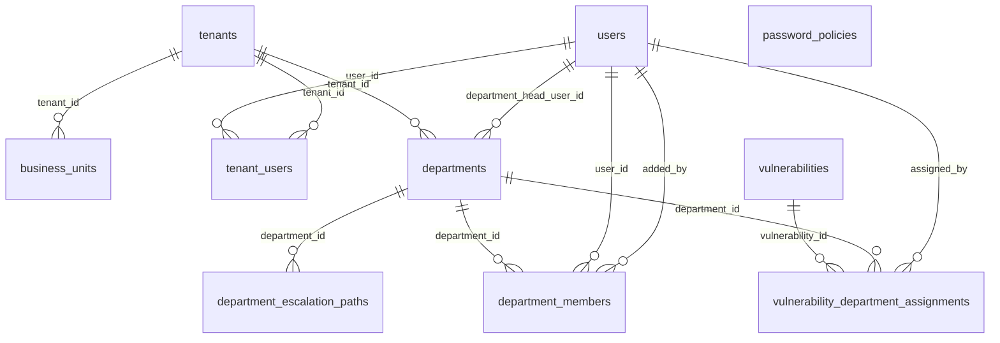

#### `_01_multi_tenancy_models.py` — 3 table(s)
*The tenant registry and organisation profile — the catalog that every other table is scoped to.*

- **`grc_business_units`** *(class `BusinessUnit`, 4 cols)*  · ⭐ hub (10 inbound FKs)
  - `id` — INTEGER · **PK** · NOT NULL
  - `tenant_id` — INTEGER · FK→`grc_tenants.id` · NOT NULL
  - `name` — VARCHAR(255) · NOT NULL
  - `parent_id` — INTEGER · FK→`grc_business_units.id`
- **`grc_tenant_users`** *(class `TenantUser`, 4 cols)*
  - `id` — INTEGER · **PK** · NOT NULL
  - `user_id` — INTEGER · FK→`grc_users.id` · NOT NULL
  - `tenant_id` — INTEGER · FK→`grc_tenants.id` · NOT NULL
  - `is_primary` — BOOLEAN
- **`grc_tenants`** *(class `Tenant`, 16 cols)*  · ⭐ hub (196 inbound FKs)
  - `id` — INTEGER · **PK** · NOT NULL
  - `name` — VARCHAR(255) · NOT NULL
  - `slug` — VARCHAR(100) · NOT NULL
  - `subdomain` — VARCHAR(100)
  - `schema_name` — VARCHAR(100)
  - `is_active` — BOOLEAN
  - `created_at` — DATETIME
  - `settings` — JSON
  - `legal_entity` — VARCHAR(255)
  - `industry` — VARCHAR(100)
  - `regulatory_scope` — VARCHAR(255)
  - `company_size` — VARCHAR(50)
  - `geography` — VARCHAR(100)
  - `primary_contact_name` — VARCHAR(255)
  - `primary_contact_email` — VARCHAR(255)
  - `primary_contact_phone` — VARCHAR(50)

#### `_02_password_session_policy_per_tenant_single_row.py` — 1 table(s)
*Per-tenant password and session security policy (one row per tenant).*

- **`grc_password_policies`** *(class `PasswordPolicy`, 13 cols)*
  - `id` — INTEGER · **PK** · NOT NULL
  - `min_length` — INTEGER · NOT NULL
  - `require_uppercase` — BOOLEAN · NOT NULL
  - `require_lowercase` — BOOLEAN · NOT NULL
  - `require_digit` — BOOLEAN · NOT NULL
  - `require_special` — BOOLEAN · NOT NULL
  - `lockout_threshold` — INTEGER · NOT NULL
  - `lockout_minutes` — INTEGER · NOT NULL
  - `session_idle_timeout_minutes` — INTEGER · NOT NULL
  - `password_history_count` — INTEGER · NOT NULL
  - `max_password_age_days` — INTEGER · NOT NULL
  - `created_at` — DATETIME
  - `updated_at` — DATETIME

#### `_24_department_management_models.py` — 4 table(s)
*Departments / teams and their membership, used for ownership and RACI across modules.*

- **`grc_department_escalation_paths`** *(class `GRCDepartmentEscalationPath`, 8 cols)*
  - `id` — INTEGER · **PK** · NOT NULL
  - `department_id` — INTEGER · FK→`grc_departments.id` · NOT NULL
  - `escalation_level` — INTEGER · NOT NULL
  - `target_role` — VARCHAR(50) · NOT NULL
  - `sla_threshold_percent` — INTEGER · NOT NULL
  - `auto_escalate` — BOOLEAN
  - `created_at` — DATETIME
  - `updated_at` — DATETIME
  - *unique:* (department_id, escalation_level)
- **`grc_department_members`** *(class `GRCDepartmentMember`, 9 cols)*
  - `id` — INTEGER · **PK** · NOT NULL
  - `department_id` — INTEGER · FK→`grc_departments.id` · NOT NULL
  - `user_id` — INTEGER · FK→`grc_users.id` · NOT NULL
  - `role` — VARCHAR(50) · NOT NULL
  - `email_notifications_enabled` — BOOLEAN
  - `escalation_order` — INTEGER
  - `added_at` — DATETIME
  - `added_by` — INTEGER · FK→`grc_users.id`
  - `is_active` — BOOLEAN
  - *unique:* (department_id, user_id)
- **`grc_departments`** *(class `GRCDepartment`, 10 cols)*  · ⭐ hub (8 inbound FKs)
  - `id` — INTEGER · **PK** · NOT NULL
  - `tenant_id` — INTEGER · FK→`grc_tenants.id` · NOT NULL
  - `name` — VARCHAR(255) · NOT NULL
  - `code` — VARCHAR(50) · NOT NULL
  - `description` — TEXT
  - `parent_department_id` — INTEGER · FK→`grc_departments.id`
  - `department_head_user_id` — INTEGER · FK→`grc_users.id`
  - `is_active` — BOOLEAN
  - `created_at` — DATETIME
  - `updated_at` — DATETIME
  - *unique:* (tenant_id, code); (tenant_id, name)
- **`grc_vulnerability_department_assignments`** *(class `GRCVulnerabilityDepartmentAssignment`, 9 cols)*
  - `id` — INTEGER · **PK** · NOT NULL
  - `vulnerability_id` — INTEGER · FK→`grc_vulnerabilities.id` · NOT NULL
  - `department_id` — INTEGER · FK→`grc_departments.id` · NOT NULL
  - `assigned_by` — INTEGER · FK→`grc_users.id`
  - `assigned_at` — DATETIME
  - `priority` — VARCHAR(20) · NOT NULL
  - `notes` — TEXT
  - `sla_override_days` — INTEGER
  - `notification_sent` — BOOLEAN
  - *unique:* (vulnerability_id, department_id)

### Identity & Access

```mermaid
erDiagram
  roles ||--o{ role_permissions : role_id
  permissions ||--o{ role_permissions : permission_id
  tenants ||--o{ roles : tenant_id
  users ||--o{ user_roles : user_id
  roles ||--o{ user_roles : role_id
  tenants ||--o{ user_roles : tenant_id
  business_units ||--o{ user_roles : business_unit_id
  users ||--o{ user_roles : assigned_by
  tenants ||--o{ identity_group_role_mappings : tenant_id
  identity_provider_configs ||--o{ identity_group_role_mappings : idp_config_id
  roles ||--o{ identity_group_role_mappings : role_id
  tenants ||--o{ identity_provider_configs : tenant_id
  users ||--o{ identity_provider_configs : connected_by_id
  users ||--o{ identity_provider_configs : created_by_id
  tenants ||--o{ access_review_campaigns : tenant_id
  users ||--o{ access_review_campaigns : created_by
  tenants ||--o{ access_review_escalations : tenant_id
  access_review_campaigns ||--o{ access_review_escalations : campaign_id
  users ||--o{ access_review_escalations : approver_id
  tenants ||--o{ access_review_findings : tenant_id
  access_review_campaigns ||--o{ access_review_findings : campaign_id
  access_review_items ||--o{ access_review_findings : item_id
  sod_rules ||--o{ access_review_findings : sod_rule_id
  tenants ||--o{ access_review_items : tenant_id
  access_review_campaigns ||--o{ access_review_items : campaign_id
  users ||--o{ access_review_items : user_id
  users ||--o{ access_review_items : decision_by
  users ||--o{ access_review_items : reviewer_id
  users ||--o{ access_review_items : escalated_to_id
  evidence ||--o{ access_review_items : evidence_id
  tenants ||--o{ access_review_rule_config : tenant_id
  tenants ||--o{ sod_rules : tenant_id
  roles ||--o{ sod_rules : role_a_id
  roles ||--o{ sod_rules : role_b_id
  users ||--o{ sod_rules : created_by
```

#### `_03_rbac_models.py` — 4 table(s)
*Role-based access control: roles, permissions, and role/permission/user assignments.*

- **`grc_permissions`** *(class `Permission`, 4 cols)*
  - `id` — INTEGER · **PK** · NOT NULL
  - `name` — VARCHAR(100) · NOT NULL
  - `resource` — VARCHAR(100) · NOT NULL
  - `action` — VARCHAR(50) · NOT NULL
  - *unique:* (name)
- **`grc_role_permissions`** *(class `RolePermission`, 3 cols)*
  - `id` — INTEGER · **PK** · NOT NULL
  - `role_id` — INTEGER · FK→`grc_roles.id` · NOT NULL
  - `permission_id` — INTEGER · FK→`grc_permissions.id` · NOT NULL
- **`grc_roles`** *(class `Role`, 7 cols)*  · ⭐ hub (9 inbound FKs)
  - `id` — INTEGER · **PK** · NOT NULL
  - `tenant_id` — INTEGER · FK→`grc_tenants.id`
  - `name` — VARCHAR(100) · NOT NULL
  - `description` — TEXT
  - `is_system_role` — BOOLEAN
  - `created_at` — DATETIME
  - `updated_at` — DATETIME
- **`grc_user_roles`** *(class `UserRole`, 8 cols)*
  - `id` — INTEGER · **PK** · NOT NULL
  - `user_id` — INTEGER · FK→`grc_users.id` · NOT NULL
  - `role_id` — INTEGER · FK→`grc_roles.id` · NOT NULL
  - `tenant_id` — INTEGER · FK→`grc_tenants.id` · NOT NULL
  - `business_unit_id` — INTEGER · FK→`grc_business_units.id`
  - `assigned_by` — INTEGER · FK→`grc_users.id`
  - `assigned_at` — DATETIME
  - `source` — VARCHAR(16)

#### `_04_user_model_extended.py` — 1 table(s)
*The core user record (GRCUser) and its profile extensions.*

- **`grc_users`** *(class `GRCUser`, 25 cols)*  · ⭐ hub (343 inbound FKs)
  - `id` — INTEGER · **PK** · NOT NULL
  - `username` — VARCHAR(100) · NOT NULL
  - `email` — VARCHAR(255) · NOT NULL
  - `password_hash` — VARCHAR(255)
  - `display_name` — VARCHAR(255)
  - `department` — VARCHAR(255)
  - `group` — VARCHAR(255)
  - `division` — VARCHAR(255)
  - `designation` — VARCHAR(255)
  - `is_active` — BOOLEAN
  - `created_at` — DATETIME
  - `last_login` — DATETIME
  - `external_provider` — VARCHAR(32)
  - `external_id` — VARCHAR(128)
  - `account_enabled` — BOOLEAN
  - `mfa_enabled` — BOOLEAN
  - `mfa_methods` — JSON
  - `hire_date` — DATE
  - `termination_date` — DATE
  - `entra_last_sign_in` — DATETIME
  - `access_synced_at` — DATETIME
  - `failed_login_attempts` — INTEGER
  - `locked_until` — DATETIME
  - `last_activity_at` — DATETIME
  - `password_changed_at` — DATETIME

#### `_05_identity_provider_integration_microsoft_entra_id_etc.py` — 2 table(s)
*SSO / external identity provider configuration (Entra ID, Google, etc.).*

- **`grc_identity_group_role_mappings`** *(class `IdentityGroupRoleMapping`, 7 cols)*
  - `id` — INTEGER · **PK** · NOT NULL
  - `tenant_id` — INTEGER · FK→`grc_tenants.id` · NOT NULL
  - `idp_config_id` — INTEGER · FK→`grc_identity_provider_configs.id` · NOT NULL
  - `entra_group_id` — VARCHAR(64) · NOT NULL
  - `entra_group_name` — VARCHAR(255)
  - `role_id` — INTEGER · FK→`grc_roles.id` · NOT NULL
  - `created_at` — DATETIME
  - *unique:* (idp_config_id, entra_group_id, role_id)
- **`grc_identity_provider_configs`** *(class `IdentityProviderConfig`, 24 cols)*
  - `id` — INTEGER · **PK** · NOT NULL
  - `tenant_id` — INTEGER · FK→`grc_tenants.id` · NOT NULL
  - `provider` — VARCHAR(32) · NOT NULL
  - `is_enabled` — BOOLEAN · NOT NULL
  - `entra_directory_id` — VARCHAR(64)
  - `connected_at` — DATETIME
  - `connected_by_id` — INTEGER · FK→`grc_users.id`
  - `okta_domain` — VARCHAR(255)
  - `ldap_server` — VARCHAR(255)
  - `ldap_base_dn` — VARCHAR(500)
  - `iga_base_url` — VARCHAR(255)
  - `iga_vendor` — VARCHAR(32)
  - `azure_tenant_id` — VARCHAR(64)
  - `client_id` — VARCHAR(64)
  - `client_secret_encrypted` — BLOB
  - `redirect_uri` — VARCHAR(500)
  - `auto_provision_on_signin` — BOOLEAN · NOT NULL
  - `allowed_email_domains` — JSON
  - `last_tested_at` — DATETIME
  - `last_test_status` — VARCHAR(32)
  - `last_test_message` — TEXT
  - `created_by_id` — INTEGER · FK→`grc_users.id`
  - `created_at` — DATETIME
  - `updated_at` — DATETIME
  - *unique:* (tenant_id, provider)

#### `_40_access_review_models.py` — 6 table(s)
*Periodic user-access certification campaigns, reviewers, and per-user decisions.*

- **`grc_access_review_campaigns`** *(class `AccessReviewCampaign`, 24 cols)*
  - `id` — INTEGER · **PK** · NOT NULL
  - `tenant_id` — INTEGER · FK→`grc_tenants.id` · NOT NULL
  - `name` — VARCHAR(255) · NOT NULL
  - `description` — TEXT
  - `review_type` — VARCHAR(40) · NOT NULL
  - `status` — VARCHAR(30) · NOT NULL
  - `population_size` — INTEGER
  - `sampling_method` — VARCHAR(20)
  - `requested_sample_size` — INTEGER
  - `risk_filters` — JSON
  - `period_start` — DATE
  - `period_end` — DATE
  - `due_date` — DATETIME
  - `escalation_enabled` — BOOLEAN
  - `reminder_days_before` — INTEGER
  - `escalation_days_after` — INTEGER
  - `exceptions_found` — INTEGER
  - `items_reviewed` — INTEGER
  - `ai_summary` — TEXT
  - `ai_summary_at` — DATETIME
  - `created_by` — INTEGER · FK→`grc_users.id`
  - `created_at` — DATETIME
  - `updated_at` — DATETIME
  - `closed_at` — DATETIME
- **`grc_access_review_escalations`** *(class `AccessReviewEscalation`, 8 cols)*
  - `id` — INTEGER · **PK** · NOT NULL
  - `tenant_id` — INTEGER · FK→`grc_tenants.id` · NOT NULL
  - `campaign_id` — INTEGER · FK→`grc_access_review_campaigns.id` · NOT NULL
  - `tier` — INTEGER · NOT NULL
  - `tier_name` — VARCHAR(100)
  - `approver_id` — INTEGER · FK→`grc_users.id`
  - `escalation_delay_days` — INTEGER
  - `created_at` — DATETIME
  - *unique:* (campaign_id, tier)
- **`grc_access_review_findings`** *(class `AccessReviewFinding`, 13 cols)*
  - `id` — INTEGER · **PK** · NOT NULL
  - `tenant_id` — INTEGER · FK→`grc_tenants.id` · NOT NULL
  - `campaign_id` — INTEGER · FK→`grc_access_review_campaigns.id` · NOT NULL
  - `item_id` — INTEGER · FK→`grc_access_review_items.id` · NOT NULL
  - `finding_type` — VARCHAR(40) · NOT NULL
  - `severity` — VARCHAR(20) · NOT NULL
  - `title` — VARCHAR(255) · NOT NULL
  - `detail` — TEXT
  - `sod_rule_id` — INTEGER · FK→`grc_sod_rules.id`
  - `status` — VARCHAR(20) · NOT NULL
  - `remediation_note` — TEXT
  - `created_at` — DATETIME
  - `updated_at` — DATETIME
- **`grc_access_review_items`** *(class `AccessReviewItem`, 34 cols)*
  - `id` — INTEGER · **PK** · NOT NULL
  - `tenant_id` — INTEGER · FK→`grc_tenants.id` · NOT NULL
  - `campaign_id` — INTEGER · FK→`grc_access_review_campaigns.id` · NOT NULL
  - `user_id` — INTEGER · FK→`grc_users.id`
  - `username` — VARCHAR(100)
  - `email` — VARCHAR(255)
  - `display_name` — VARCHAR(255)
  - `department` — VARCHAR(255)
  - `designation` — VARCHAR(255)
  - `roles_snapshot` — JSON
  - `mfa_enabled` — BOOLEAN
  - `account_enabled` — BOOLEAN
  - `last_sign_in` — DATETIME
  - `is_terminated` — BOOLEAN
  - `termination_date` — DATE
  - `is_privileged` — BOOLEAN
  - `decision` — VARCHAR(20) · NOT NULL
  - `decision_comment` — TEXT
  - `decision_by` — INTEGER · FK→`grc_users.id`
  - `decision_at` — DATETIME
  - `ai_recommendation` — VARCHAR(20)
  - `ai_reason` — TEXT
  - `ai_recommended_at` — DATETIME
  - `risk_score` — INTEGER
  - `is_anomaly` — BOOLEAN
  - `anomaly_note` — TEXT
  - `reviewer_id` — INTEGER · FK→`grc_users.id`
  - `escalation_tier` — INTEGER
  - `escalated_to_id` — INTEGER · FK→`grc_users.id`
  - `reminder_sent_at` — DATETIME
  - `escalation_sent_at` — DATETIME
  - `evidence_id` — INTEGER · FK→`grc_evidence.id`
  - `created_at` — DATETIME
  - `updated_at` — DATETIME
  - *unique:* (campaign_id, user_id)
- **`grc_access_review_rule_config`** *(class `AccessReviewRuleConfig`, 6 cols)*
  - `id` — INTEGER · **PK** · NOT NULL
  - `tenant_id` — INTEGER · FK→`grc_tenants.id` · NOT NULL
  - `rule_id` — VARCHAR(40) · NOT NULL
  - `enabled` — BOOLEAN · NOT NULL
  - `severity` — VARCHAR(20)
  - `updated_at` — DATETIME
  - *unique:* (tenant_id, rule_id)
- **`grc_sod_rules`** *(class `SoDRule`, 10 cols)*
  - `id` — INTEGER · **PK** · NOT NULL
  - `tenant_id` — INTEGER · FK→`grc_tenants.id` · NOT NULL
  - `name` — VARCHAR(255) · NOT NULL
  - `description` — TEXT
  - `role_a_id` — INTEGER · FK→`grc_roles.id` · NOT NULL
  - `role_b_id` — INTEGER · FK→`grc_roles.id` · NOT NULL
  - `severity` — VARCHAR(20) · NOT NULL
  - `is_active` — BOOLEAN
  - `created_by` — INTEGER · FK→`grc_users.id`
  - `created_at` — DATETIME
  - *unique:* (tenant_id, role_a_id, role_b_id)

### Audit & Telemetry

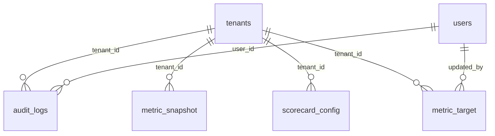

#### `_06_audit_trail.py` — 1 table(s)
*The immutable audit log of every state-changing action.*

- **`grc_audit_logs`** *(class `AuditLog`, 9 cols)*
  - `id` — INTEGER · **PK** · NOT NULL
  - `tenant_id` — INTEGER · FK→`grc_tenants.id` · NOT NULL
  - `user_id` — INTEGER · FK→`grc_users.id`
  - `action` — VARCHAR(100) · NOT NULL
  - `resource_type` — VARCHAR(100) · NOT NULL
  - `resource_id` — INTEGER
  - `changes` — JSON
  - `ip_address` — VARCHAR(50)
  - `timestamp` — DATETIME

#### `_42_metric_snapshots.py` — 1 table(s)
*Time-series snapshots of module metrics for trend charts.*

- **`grc_metric_snapshot`** *(class `MetricSnapshot`, 10 cols)*
  - `id` — INTEGER · **PK** · NOT NULL
  - `tenant_id` — INTEGER · FK→`grc_tenants.id` · NOT NULL
  - `metric` — VARCHAR(60) · NOT NULL
  - `dimension` — VARCHAR(40) · NOT NULL
  - `dimension_value` — VARCHAR(120) · NOT NULL
  - `as_of_date` — DATE · NOT NULL
  - `value` — FLOAT
  - `meta` — JSON
  - `created_at` — DATETIME
  - `updated_at` — DATETIME
  - *unique:* (tenant_id, metric, dimension, dimension_value, as_of_date)

#### `_43_scorecard_config.py` — 1 table(s)
*Per-tenant scorecard weight/target overrides for the module score engine.*

- **`grc_scorecard_config`** *(class `ScorecardConfig`, 6 cols)*
  - `id` — INTEGER · **PK** · NOT NULL
  - `tenant_id` — INTEGER · FK→`grc_tenants.id` · NOT NULL
  - `module` — VARCHAR(40) · NOT NULL
  - `config` — JSON
  - `updated_at` — DATETIME
  - `updated_by` — INTEGER
  - *unique:* (tenant_id, module)

#### `_46_metric_targets.py` — 1 table(s)
*Per-tenant metric targets/goals that dashboards measure against.*

- **`grc_metric_target`** *(class `MetricTarget`, 11 cols)*
  - `id` — INTEGER · **PK** · NOT NULL
  - `tenant_id` — INTEGER · FK→`grc_tenants.id` · NOT NULL
  - `metric` — VARCHAR(60) · NOT NULL
  - `dimension` — VARCHAR(40) · NOT NULL
  - `dimension_value` — VARCHAR(120) · NOT NULL
  - `target` — FLOAT
  - `warn` — FLOAT
  - `critical` — FLOAT
  - `updated_by` — INTEGER · FK→`grc_users.id`
  - `created_at` — DATETIME
  - `updated_at` — DATETIME
  - *unique:* (tenant_id, metric, dimension, dimension_value)

### Frameworks & Controls

```mermaid
erDiagram
  framework_domains ||--o{ control_objectives : domain_id
  control_objectives ||--o{ framework_controls : objective_id
  frameworks ||--o{ framework_domains : framework_id
  framework_controls ||--o{ framework_sub_controls : control_id
  normalized_controls ||--o{ control_mappings : normalized_control_id
  framework_controls ||--o{ control_mappings : framework_control_id
  normalized_controls ||--o{ normalized_control_links : normalized_control_id
  parsed_framework_controls ||--o{ normalized_control_links : parsed_control_id
  framework_controls ||--o{ normalized_control_links : framework_control_id
  normalization_runs ||--o{ normalized_controls : run_id
  common_control_groups ||--o{ normalized_controls : common_group_id
  normalized_controls ||--o{ required_evidence : normalized_control_id
  tenants ||--o{ ai_evidence_recommendations : tenant_id
  common_control_groups ||--o{ ai_evidence_recommendations : group_id
  normalized_controls ||--o{ ai_evidence_recommendations : normalized_control_id
  framework_controls ||--o{ ai_evidence_recommendations : framework_control_id
  parsed_framework_controls ||--o{ ai_evidence_recommendations : parsed_control_id
  common_control_groups ||--o{ common_control_group_mappings : group_id
  normalized_controls ||--o{ common_control_group_mappings : normalized_control_id
  framework_controls ||--o{ common_control_group_mappings : framework_control_id
  parsed_framework_controls ||--o{ common_control_group_mappings : parsed_control_id
  tenants ||--o{ common_control_groups : tenant_id
  normalization_runs ||--o{ common_control_groups : run_id
  users ||--o{ common_control_groups : created_by
  control_comparison_runs ||--o{ control_comparison_mappings : run_id
  parsed_framework_controls ||--o{ control_comparison_mappings : source_control_id
  parsed_framework_controls ||--o{ control_comparison_mappings : dest_control_id
  tenants ||--o{ control_comparison_runs : tenant_id
  uploaded_frameworks ||--o{ control_comparison_runs : source_framework_id
  uploaded_frameworks ||--o{ control_comparison_runs : dest_framework_id
  users ||--o{ control_comparison_runs : created_by_id
  tenants ||--o{ control_inheritance : tenant_id
  users ||--o{ control_inheritance : created_by
  tenants ||--o{ control_mapping_analysis : tenant_id
  users ||--o{ control_mapping_analysis : created_by
  tenants ||--o{ control_similarity_mappings : tenant_id
  users ||--o{ control_similarity_mappings : verified_by
  compliance_programs ||--o{ compliance_assessments : program_id
  normalized_controls ||--o{ compliance_assessments : normalized_control_id
  users ||--o{ compliance_assessments : assessed_by
  tenants ||--o{ compliance_programs : tenant_id
  frameworks ||--o{ compliance_programs : framework_id
  users ||--o{ compliance_programs : owner_id
  assessment_items ||--o{ assessment_evidence : assessment_item_id
  evidence ||--o{ assessment_evidence : linked_evidence_id
  users ||--o{ assessment_evidence : reviewed_by
  users ||--o{ assessment_evidence : uploaded_by
  framework_assessments ||--o{ assessment_items : assessment_id
  parsed_framework_controls ||--o{ assessment_items : parsed_control_id
  users ||--o{ assessment_items : owner_id
  users ||--o{ assessment_items : assessed_by
  assessment_items ||--o{ assessment_remediations : assessment_item_id
  users ||--o{ assessment_remediations : owner_id
  users ||--o{ assessment_remediations : created_by
  tenants ||--o{ clause_applicability : tenant_id
  uploaded_frameworks ||--o{ clause_applicability : uploaded_framework_id
  parsed_framework_controls ||--o{ clause_applicability : control_id
  users ||--o{ clause_applicability : owner_id
  users ||--o{ clause_applicability : requested_by
  users ||--o{ clause_applicability : reviewed_by
  parsed_framework_controls ||--o{ control_evidence_mappings : parsed_control_id
  uploaded_frameworks ||--o{ control_evidence_requirements : framework_id
  parsed_framework_controls ||--o{ control_evidence_requirements : parsed_control_id
  users ||--o{ control_evidence_requirements : created_by
  users ||--o{ control_evidence_requirements : submitted_by
  users ||--o{ control_evidence_requirements : reviewer_id
  users ||--o{ control_evidence_requirements : approver_id
  control_evidence_requirements ||--o{ evidence_requirement_history : evidence_requirement_id
  users ||--o{ evidence_requirement_history : performed_by
  tenants ||--o{ framework_assessments : tenant_id
  uploaded_frameworks ||--o{ framework_assessments : uploaded_framework_id
  users ||--o{ framework_assessments : lead_assessor_id
  users ||--o{ framework_assessments : created_by
  parsed_framework_controls ||--o{ framework_control_alignments : parsed_control_id
  normalized_controls ||--o{ framework_control_alignments : normalized_control_id
  framework_controls ||--o{ framework_control_alignments : framework_control_id
  users ||--o{ framework_control_alignments : confirmed_by
  parsed_framework_controls ||--o{ framework_control_ownership : parsed_control_id
  uploaded_frameworks ||--o{ parsed_framework_controls : uploaded_framework_id
  users ||--o{ parsed_framework_controls : verified_by
  tenants ||--o{ uploaded_frameworks : tenant_id
  frameworks ||--o{ uploaded_frameworks : published_framework_id
  users ||--o{ uploaded_frameworks : uploaded_by
  tenants ||--o{ policy_statement_compliance : tenant_id
  policy_statements ||--o{ policy_statement_compliance : statement_id
  users ||--o{ policy_statement_compliance : owner_id
  users ||--o{ policy_statement_compliance : assessed_by
  tenants ||--o{ policy_statement_versions : tenant_id
  policy_statements ||--o{ policy_statement_versions : statement_id
  users ||--o{ policy_statement_versions : changed_by
  compliance_assessment_document_items {
  }
  compliance_assessment_documents {
  }
  compliance_sla_policy {
  }
  control_assurance_snapshots {
  }
  control_work_escalations {
  }
  control_work_evidence {
  }
  control_work_items {
  }
  control_work_risk_links {
  }
  control_work_test_procedures {
  }
  control_work_tests {
  }
  control_work_workflow_actions {
  }
  framework_documents {
  }
  framework_register_entries {
  }
  policy_attestations {
  }
  policy_gap_analysis_runs {
  }
  policy_gap_findings {
  }
  statement_control_mappings {
  }
```

#### `_07_framework_normalization_models.py` — 5 table(s)
*The normalised framework model — frameworks, domains, and framework controls.*

- **`grc_control_objectives`** *(class `ControlObjective`, 6 cols)*
  - `id` — INTEGER · **PK** · NOT NULL
  - `domain_id` — INTEGER · FK→`grc_framework_domains.id` · NOT NULL
  - `code` — VARCHAR(50) · NOT NULL
  - `name` — VARCHAR(255) · NOT NULL
  - `description` — TEXT
  - `order` — INTEGER
- **`grc_framework_controls`** *(class `FrameworkControl`, 12 cols)*  · ⭐ hub (16 inbound FKs)
  - `id` — INTEGER · **PK** · NOT NULL
  - `objective_id` — INTEGER · FK→`grc_control_objectives.id` · NOT NULL
  - `code` — VARCHAR(50) · NOT NULL
  - `name` — VARCHAR(255) · NOT NULL
  - `statement` — TEXT
  - `control_objective` — TEXT
  - `is_mandatory` — BOOLEAN
  - `risk_category` — VARCHAR(50)
  - `evidence_type` — VARCHAR(50)
  - `implementation_guidance` — TEXT
  - `testing_guidance` — TEXT
  - `order` — INTEGER
- **`grc_framework_domains`** *(class `FrameworkDomain`, 6 cols)*
  - `id` — INTEGER · **PK** · NOT NULL
  - `framework_id` — INTEGER · FK→`grc_frameworks.id` · NOT NULL
  - `code` — VARCHAR(50) · NOT NULL
  - `name` — VARCHAR(255) · NOT NULL
  - `description` — TEXT
  - `order` — INTEGER
- **`grc_framework_sub_controls`** *(class `FrameworkSubControl`, 9 cols)*
  - `id` — INTEGER · **PK** · NOT NULL
  - `control_id` — INTEGER · FK→`grc_framework_controls.id` · NOT NULL
  - `code` — VARCHAR(50) · NOT NULL
  - `name` — VARCHAR(255) · NOT NULL
  - `statement` — TEXT
  - `description` — TEXT
  - `order` — INTEGER
  - `evidence_recommendations` — JSON
  - `ai_matching_keywords` — JSON
- **`grc_frameworks`** *(class `Framework`, 12 cols)*  · ⭐ hub (9 inbound FKs)
  - `id` — INTEGER · **PK** · NOT NULL
  - `name` — VARCHAR(255) · NOT NULL
  - `short_code` — VARCHAR(50) · NOT NULL
  - `regulator` — VARCHAR(255)
  - `jurisdiction` — VARCHAR(100)
  - `region` — VARCHAR(100)
  - `version` — VARCHAR(50)
  - `description` — TEXT
  - `is_mandatory` — BOOLEAN
  - `enforcement_type` — VARCHAR(100)
  - `is_active` — BOOLEAN
  - `is_custom` — BOOLEAN

#### `_08_normalized_control_model.py` — 5 table(s)
*The normalised control library — one canonical control mapped to many framework requirements.*

- **`grc_control_mappings`** *(class `ControlMapping`, 4 cols)*
  - `id` — INTEGER · **PK** · NOT NULL
  - `normalized_control_id` — INTEGER · FK→`grc_normalized_controls.id` · NOT NULL
  - `framework_control_id` — INTEGER · FK→`grc_framework_controls.id` · NOT NULL
  - `mapping_type` — VARCHAR(20) · NOT NULL
- **`grc_normalization_runs`** *(class `NormalizationRun`, 11 cols)*
  - `id` — INTEGER · **PK** · NOT NULL
  - `tenant_id` — INTEGER · NOT NULL
  - `label` — VARCHAR(255)
  - `scope` — VARCHAR(20)
  - `framework_ids` — JSON
  - `status` — VARCHAR(20)
  - `is_baseline` — BOOLEAN
  - `created_by` — INTEGER
  - `started_at` — DATETIME
  - `completed_at` — DATETIME
  - `summary` — JSON
- **`grc_normalized_control_links`** *(class `NormalizedControlLink`, 6 cols)*
  - `id` — INTEGER · **PK** · NOT NULL
  - `normalized_control_id` — INTEGER · FK→`grc_normalized_controls.id` · NOT NULL
  - `parsed_control_id` — INTEGER · FK→`grc_parsed_framework_controls.id`
  - `framework_control_id` — INTEGER · FK→`grc_framework_controls.id`
  - `mapping_type` — VARCHAR(20)
  - `created_at` — DATETIME
- **`grc_normalized_controls`** *(class `NormalizedControl`, 18 cols)*  · ⭐ hub (17 inbound FKs)
  - `id` — INTEGER · **PK** · NOT NULL
  - `run_id` — INTEGER · FK→`grc_normalization_runs.id`
  - `code` — VARCHAR(50) · NOT NULL
  - `name` — VARCHAR(255) · NOT NULL
  - `statement` — TEXT
  - `objective` — TEXT
  - `control_owner` — VARCHAR(255)
  - `implementation_guidance` — TEXT
  - `testing_guidance` — TEXT
  - `maturity_level` — INTEGER
  - `domain` — VARCHAR(255)
  - `source` — VARCHAR(50)
  - `common_group_id` — INTEGER · FK→`grc_common_control_groups.id`
  - `recommended_evidence` — JSON
  - `review_status` — VARCHAR(20)
  - `reviewed_by` — INTEGER
  - `reviewed_at` — DATETIME
  - `created_at` — DATETIME
- **`grc_required_evidence`** *(class `GRCRequiredEvidence`, 6 cols)*
  - `id` — INTEGER · **PK** · NOT NULL
  - `normalized_control_id` — INTEGER · FK→`grc_normalized_controls.id` · NOT NULL
  - `name` — VARCHAR(255) · NOT NULL
  - `description` — TEXT
  - `evidence_type` — VARCHAR(100) · NOT NULL
  - `validation_criteria` — TEXT

#### `_09_1_unified_common_control_library_models.py` — 8 table(s)
*Common-control grouping, similarity mapping, comparison runs, and inheritance.*

- **`grc_ai_evidence_recommendations`** *(class `AIEvidenceRecommendation`, 13 cols)*
  - `id` — INTEGER · **PK** · NOT NULL
  - `tenant_id` — INTEGER · FK→`grc_tenants.id` · NOT NULL
  - `group_id` — INTEGER · FK→`grc_common_control_groups.id`
  - `normalized_control_id` — INTEGER · FK→`grc_normalized_controls.id`
  - `framework_control_id` — INTEGER · FK→`grc_framework_controls.id`
  - `parsed_control_id` — INTEGER · FK→`grc_parsed_framework_controls.id`
  - `evidence_type` — VARCHAR(100) · NOT NULL
  - `evidence_description` — TEXT
  - `priority` — VARCHAR(20) · NOT NULL
  - `ai_confidence` — FLOAT
  - `ai_reasoning` — TEXT
  - `sample_evidence_names` — JSON
  - `created_at` — DATETIME
- **`grc_common_control_group_mappings`** *(class `CommonControlGroupMapping`, 8 cols)*
  - `id` — INTEGER · **PK** · NOT NULL
  - `group_id` — INTEGER · FK→`grc_common_control_groups.id` · NOT NULL
  - `normalized_control_id` — INTEGER · FK→`grc_normalized_controls.id`
  - `framework_control_id` — INTEGER · FK→`grc_framework_controls.id`
  - `parsed_control_id` — INTEGER · FK→`grc_parsed_framework_controls.id`
  - `mapping_confidence` — FLOAT
  - `mapping_source` — VARCHAR(50) · NOT NULL
  - `created_at` — DATETIME
  - *unique:* (group_id, framework_control_id); (group_id, normalized_control_id); (group_id, parsed_control_id)
- **`grc_common_control_groups`** *(class `CommonControlGroup`, 14 cols)*
  - `id` — INTEGER · **PK** · NOT NULL
  - `tenant_id` — INTEGER · FK→`grc_tenants.id`
  - `run_id` — INTEGER · FK→`grc_normalization_runs.id`
  - `code` — VARCHAR(50) · NOT NULL
  - `name` — VARCHAR(255) · NOT NULL
  - `description` — TEXT
  - `category` — VARCHAR(100)
  - `domain` — VARCHAR(100)
  - `keywords` — JSON
  - `ai_summary` — TEXT
  - `evidence_types` — JSON
  - `created_at` — DATETIME
  - `updated_at` — DATETIME
  - `created_by` — INTEGER · FK→`grc_users.id`
  - *unique:* (tenant_id, code)
- **`grc_control_comparison_mappings`** *(class `ControlComparisonMapping`, 9 cols)*
  - `id` — INTEGER · **PK** · NOT NULL
  - `run_id` — INTEGER · FK→`grc_control_comparison_runs.id` · NOT NULL
  - `source_control_id` — INTEGER · FK→`grc_parsed_framework_controls.id` · NOT NULL
  - `dest_control_id` — INTEGER · FK→`grc_parsed_framework_controls.id` · NOT NULL
  - `confidence` — FLOAT · NOT NULL
  - `rationale` — TEXT
  - `evidence_recommendations` — JSON
  - `rank` — INTEGER
  - `created_at` — DATETIME
- **`grc_control_comparison_runs`** *(class `ControlComparisonRun`, 15 cols)*
  - `id` — INTEGER · **PK** · NOT NULL
  - `tenant_id` — INTEGER · FK→`grc_tenants.id` · NOT NULL
  - `source_framework_id` — INTEGER · FK→`grc_uploaded_frameworks.id` · NOT NULL
  - `dest_framework_id` — INTEGER · FK→`grc_uploaded_frameworks.id` · NOT NULL
  - `status` — VARCHAR(32) · NOT NULL
  - `progress_total` — INTEGER
  - `progress_done` — INTEGER
  - `error_message` — TEXT
  - `model_used` — VARCHAR(100)
  - `started_at` — DATETIME
  - `completed_at` — DATETIME
  - `created_by_id` — INTEGER · FK→`grc_users.id`
  - `task_id` — VARCHAR(100)
  - `created_at` — DATETIME
  - `updated_at` — DATETIME
  - *unique:* (tenant_id, source_framework_id, dest_framework_id)
- **`grc_control_inheritance`** *(class `ControlInheritance`, 11 cols)*
  - `id` — INTEGER · **PK** · NOT NULL
  - `tenant_id` — INTEGER · FK→`grc_tenants.id` · NOT NULL
  - `parent_type` — VARCHAR(20) · NOT NULL
  - `parent_control_id` — INTEGER · NOT NULL
  - `child_type` — VARCHAR(20) · NOT NULL
  - `child_control_id` — INTEGER · NOT NULL
  - `inheritance_type` — VARCHAR(50) · NOT NULL
  - `condition_description` — TEXT
  - `coverage_percentage` — INTEGER
  - `created_at` — DATETIME
  - `created_by` — INTEGER · FK→`grc_users.id`
- **`grc_control_mapping_analysis`** *(class `ControlMappingAnalysis`, 12 cols)*
  - `id` — INTEGER · **PK** · NOT NULL
  - `tenant_id` — INTEGER · FK→`grc_tenants.id` · NOT NULL
  - `analysis_type` — VARCHAR(50) · NOT NULL
  - `status` — VARCHAR(20) · NOT NULL
  - `frameworks_analyzed` — JSON
  - `total_controls_analyzed` — INTEGER
  - `mappings_created` — INTEGER
  - `groups_created` — INTEGER
  - `started_at` — DATETIME
  - `completed_at` — DATETIME
  - `error_message` — TEXT
  - `created_by` — INTEGER · FK→`grc_users.id` · NOT NULL
- **`grc_control_similarity_mappings`** *(class `ControlSimilarityMapping`, 12 cols)*
  - `id` — INTEGER · **PK** · NOT NULL
  - `tenant_id` — INTEGER · FK→`grc_tenants.id` · NOT NULL
  - `source_type` — VARCHAR(20) · NOT NULL
  - `source_control_id` — INTEGER · NOT NULL
  - `target_type` — VARCHAR(20) · NOT NULL
  - `target_control_id` — INTEGER · NOT NULL
  - `similarity_score` — FLOAT · NOT NULL
  - `similarity_type` — VARCHAR(50) · NOT NULL
  - `ai_reasoning` — TEXT
  - `verified` — BOOLEAN
  - `verified_by` — INTEGER · FK→`grc_users.id`
  - `created_at` — DATETIME

#### `_15_compliance_programs.py` — 2 table(s)
*Compliance programs that group frameworks/controls into an engagement.*

- **`grc_compliance_assessments`** *(class `GRCComplianceAssessment`, 8 cols)*
  - `id` — INTEGER · **PK** · NOT NULL
  - `program_id` — INTEGER · FK→`grc_compliance_programs.id` · NOT NULL
  - `normalized_control_id` — INTEGER · FK→`grc_normalized_controls.id`
  - `status` — VARCHAR(50)
  - `maturity_level` — INTEGER
  - `notes` — TEXT
  - `assessed_by` — INTEGER · FK→`grc_users.id`
  - `assessed_at` — DATETIME
- **`grc_compliance_programs`** *(class `ComplianceProgram`, 9 cols)*
  - `id` — INTEGER · **PK** · NOT NULL
  - `tenant_id` — INTEGER · FK→`grc_tenants.id` · NOT NULL
  - `framework_id` — INTEGER · FK→`grc_frameworks.id` · NOT NULL
  - `name` — VARCHAR(255) · NOT NULL
  - `description` — TEXT
  - `status` — VARCHAR(50)
  - `start_date` — DATETIME
  - `target_date` — DATETIME
  - `owner_id` — INTEGER · FK→`grc_users.id`

#### `_17_framework_upload_parsing_models.py` — 12 table(s)
*Uploaded framework files and the AI parsing pipeline that normalises them.*

- **`grc_assessment_evidence`** *(class `AssessmentEvidence`, 16 cols)*
  - `id` — INTEGER · **PK** · NOT NULL
  - `assessment_item_id` — INTEGER · FK→`grc_assessment_items.id` · NOT NULL
  - `linked_evidence_id` — INTEGER · FK→`grc_evidence.id`
  - `evidence_type` — VARCHAR(50) · NOT NULL
  - `file_name` — VARCHAR(255) · NOT NULL
  - `file_path` — VARCHAR(500) · NOT NULL
  - `file_size` — INTEGER
  - `mime_type` — VARCHAR(100)
  - `description` — TEXT
  - `collection_date` — DATETIME
  - `review_status` — VARCHAR(50)
  - `reviewed_by` — INTEGER · FK→`grc_users.id`
  - `reviewed_at` — DATETIME
  - `review_notes` — TEXT
  - `uploaded_by` — INTEGER · FK→`grc_users.id` · NOT NULL
  - `uploaded_at` — DATETIME
- **`grc_assessment_items`** *(class `AssessmentItem`, 13 cols)*
  - `id` — INTEGER · **PK** · NOT NULL
  - `assessment_id` — INTEGER · FK→`grc_framework_assessments.id` · NOT NULL
  - `parsed_control_id` — INTEGER · FK→`grc_parsed_framework_controls.id` · NOT NULL
  - `compliance_status` — VARCHAR(50)
  - `compliance_score` — FLOAT
  - `owner_id` — INTEGER · FK→`grc_users.id`
  - `department` — VARCHAR(255)
  - `assessment_notes` — TEXT
  - `gap_description` — TEXT
  - `assessed_by` — INTEGER · FK→`grc_users.id`
  - `assessed_at` — DATETIME
  - `created_at` — DATETIME
  - `updated_at` — DATETIME
  - *unique:* (assessment_id, parsed_control_id)
- **`grc_assessment_remediations`** *(class `AssessmentRemediation`, 15 cols)*
  - `id` — INTEGER · **PK** · NOT NULL
  - `assessment_item_id` — INTEGER · FK→`grc_assessment_items.id` · NOT NULL
  - `title` — VARCHAR(255) · NOT NULL
  - `description` — TEXT
  - `priority` — VARCHAR(20)
  - `status` — VARCHAR(50)
  - `due_date` — DATETIME
  - `completed_at` — DATETIME
  - `owner_id` — INTEGER · FK→`grc_users.id`
  - `estimated_effort` — VARCHAR(50)
  - `actual_effort` — VARCHAR(50)
  - `completion_notes` — TEXT
  - `created_by` — INTEGER · FK→`grc_users.id` · NOT NULL
  - `created_at` — DATETIME
  - `updated_at` — DATETIME
- **`grc_clause_applicability`** *(class `ClauseApplicability`, 18 cols)*
  - `id` — INTEGER · **PK** · NOT NULL
  - `tenant_id` — INTEGER · FK→`grc_tenants.id` · NOT NULL
  - `uploaded_framework_id` — INTEGER · FK→`grc_uploaded_frameworks.id` · NOT NULL
  - `control_id` — INTEGER · FK→`grc_parsed_framework_controls.id` · NOT NULL
  - `is_applicable` — BOOLEAN
  - `justification` — TEXT
  - `status` — VARCHAR(50)
  - `owner_id` — INTEGER · FK→`grc_users.id`
  - `owner_name` — VARCHAR(255)
  - `implementation_status` — VARCHAR(50)
  - `linked_evidence_id` — INTEGER
  - `requested_by` — INTEGER · FK→`grc_users.id`
  - `requested_at` — DATETIME
  - `reviewed_by` — INTEGER · FK→`grc_users.id`
  - `reviewed_at` — DATETIME
  - `review_comment` — TEXT
  - `created_at` — DATETIME
  - `updated_at` — DATETIME
- **`grc_control_evidence_mappings`** *(class `ControlEvidenceMapping`, 7 cols)*
  - `id` — INTEGER · **PK** · NOT NULL
  - `parsed_control_id` — INTEGER · FK→`grc_parsed_framework_controls.id` · NOT NULL
  - `evidence_type` — VARCHAR(50) · NOT NULL
  - `evidence_description` — TEXT
  - `is_required` — BOOLEAN
  - `suggested_by_ai` — BOOLEAN
  - `created_at` — DATETIME
  - *unique:* (parsed_control_id, evidence_type)
- **`grc_control_evidence_requirements`** *(class `ControlEvidenceRequirement`, 33 cols)*
  - `id` — INTEGER · **PK** · NOT NULL
  - `framework_id` — INTEGER · FK→`grc_uploaded_frameworks.id` · NOT NULL
  - `parsed_control_id` — INTEGER · FK→`grc_parsed_framework_controls.id` · NOT NULL
  - `evidence_title` — VARCHAR(500) · NOT NULL
  - `evidence_description` — TEXT · NOT NULL
  - `evidence_type` — VARCHAR(100) · NOT NULL
  - `evidence_format` — VARCHAR(100)
  - `exact_requirements` — JSON
  - `acceptance_criteria` — JSON
  - `sample_evidence` — TEXT
  - `collection_guidance` — TEXT
  - `collection_frequency` — VARCHAR(50)
  - `retention_period` — VARCHAR(100)
  - `ai_confidence` — FLOAT
  - `ai_reasoning` — TEXT
  - `status` — VARCHAR(50)
  - `created_by` — INTEGER · FK→`grc_users.id`
  - `created_at` — DATETIME
  - `submitted_by` — INTEGER · FK→`grc_users.id`
  - `submitted_at` — DATETIME
  - `submission_notes` — TEXT
  - `reviewer_id` — INTEGER · FK→`grc_users.id`
  - `reviewed_at` — DATETIME
  - `review_notes` — TEXT
  - `approver_id` — INTEGER · FK→`grc_users.id`
  - `approved_at` — DATETIME
  - `approval_notes` — TEXT
  - `rejection_reason` — TEXT
  - `priority` — VARCHAR(20)
  - `display_order` — INTEGER
  - `is_mandatory` — BOOLEAN
  - `is_active` — BOOLEAN
  - `updated_at` — DATETIME
- **`grc_evidence_requirement_history`** *(class `EvidenceRequirementHistory`, 9 cols)*
  - `id` — INTEGER · **PK** · NOT NULL
  - `evidence_requirement_id` — INTEGER · FK→`grc_control_evidence_requirements.id` · NOT NULL
  - `action` — VARCHAR(50) · NOT NULL
  - `previous_status` — VARCHAR(50)
  - `new_status` — VARCHAR(50)
  - `performed_by` — INTEGER · FK→`grc_users.id` · NOT NULL
  - `performed_at` — DATETIME
  - `notes` — TEXT
  - `changes` — JSON
- **`grc_framework_assessments`** *(class `FrameworkAssessment`, 16 cols)*
  - `id` — INTEGER · **PK** · NOT NULL
  - `tenant_id` — INTEGER · FK→`grc_tenants.id` · NOT NULL
  - `uploaded_framework_id` — INTEGER · FK→`grc_uploaded_frameworks.id` · NOT NULL
  - `name` — VARCHAR(255) · NOT NULL
  - `description` — TEXT
  - `assessment_date` — DATETIME
  - `target_completion_date` — DATETIME
  - `status` — VARCHAR(50)
  - `overall_compliance_score` — FLOAT
  - `lead_assessor_id` — INTEGER · FK→`grc_users.id`
  - `department` — VARCHAR(255)
  - `scope` — TEXT
  - `created_by` — INTEGER · FK→`grc_users.id` · NOT NULL
  - `created_at` — DATETIME
  - `updated_at` — DATETIME
  - `completed_at` — DATETIME
- **`grc_framework_control_alignments`** *(class `FrameworkControlAlignment`, 11 cols)*
  - `id` — INTEGER · **PK** · NOT NULL
  - `parsed_control_id` — INTEGER · FK→`grc_parsed_framework_controls.id` · NOT NULL
  - `normalized_control_id` — INTEGER · FK→`grc_normalized_controls.id`
  - `framework_control_id` — INTEGER · FK→`grc_framework_controls.id`
  - `alignment_type` — VARCHAR(50) · NOT NULL
  - `match_score` — FLOAT
  - `match_reason` — TEXT
  - `is_confirmed` — BOOLEAN
  - `confirmed_by` — INTEGER · FK→`grc_users.id`
  - `confirmed_at` — DATETIME
  - `created_at` — DATETIME
- **`grc_framework_control_ownership`** *(class `FrameworkControlOwnership`, 8 cols)*
  - `id` — INTEGER · **PK** · NOT NULL
  - `parsed_control_id` — INTEGER · FK→`grc_parsed_framework_controls.id` · NOT NULL
  - `status` — VARCHAR(50)
  - `assigned_user_ids` — JSON
  - `implementation_date` — DATETIME
  - `verified_date` — DATETIME
  - `created_at` — DATETIME
  - `updated_at` — DATETIME
- **`grc_parsed_framework_controls`** *(class `ParsedFrameworkControl`, 29 cols)*  · ⭐ hub (15 inbound FKs)
  - `id` — INTEGER · **PK** · NOT NULL
  - `uploaded_framework_id` — INTEGER · FK→`grc_uploaded_frameworks.id` · NOT NULL
  - `control_id` — VARCHAR(100) · NOT NULL
  - `original_reference` — VARCHAR(255)
  - `title` — VARCHAR(500) · NOT NULL
  - `description` — TEXT
  - `full_text` — TEXT
  - `domain` — VARCHAR(100)
  - `category` — VARCHAR(100)
  - `is_mandatory` — BOOLEAN
  - `priority` — VARCHAR(20)
  - `priority_level` — VARCHAR(10)
  - `dependencies` — JSON
  - `version_history` — JSON
  - `control_description` — TEXT
  - `assessment_criteria` — JSON
  - `section_number` — VARCHAR(50)
  - `parent_section` — VARCHAR(255)
  - `ai_confidence` — FLOAT
  - `ai_notes` — TEXT
  - `evidence_requirements` — JSON
  - `is_verified` — BOOLEAN
  - `verified_by` — INTEGER · FK→`grc_users.id`
  - `verified_at` — DATETIME
  - `is_critical` — BOOLEAN
  - `criticality_reason` — TEXT
  - `criticality_analyzed_at` — DATETIME
  - `created_at` — DATETIME
  - `updated_at` — DATETIME
- **`grc_uploaded_frameworks`** *(class `UploadedFramework`, 40 cols)*  · ⭐ hub (13 inbound FKs)
  - `id` — INTEGER · **PK** · NOT NULL
  - `tenant_id` — INTEGER · FK→`grc_tenants.id`
  - `name` — VARCHAR(255) · NOT NULL
  - `description` — TEXT
  - `file_name` — VARCHAR(255) · NOT NULL
  - `file_path` — VARCHAR(500) · NOT NULL
  - `file_size` — INTEGER
  - `file_type` — VARCHAR(50) · NOT NULL
  - `upload_status` — VARCHAR(50)
  - `parse_error` — TEXT
  - `parsed_at` — DATETIME
  - `published_framework_id` — INTEGER · FK→`grc_frameworks.id`
  - `published_at` — DATETIME
  - `framework_type` — VARCHAR(100)
  - `source_organization` — VARCHAR(255)
  - `version` — VARCHAR(50)
  - `effective_date` — DATETIME
  - `classification` — VARCHAR(50)
  - `classification_confidence` — FLOAT
  - `classification_reasoning` — TEXT
  - `framework_purpose` — TEXT
  - `framework_scope` — TEXT
  - `framework_objectives` — JSON
  - `target_audience` — TEXT
  - `certification_body` — VARCHAR(255)
  - `certification_validity_period` — VARCHAR(100)
  - `certification_levels` — JSON
  - `certification_lifecycle` — JSON
  - `required_artifacts` — JSON
  - `regulatory_authority` — VARCHAR(255)
  - `compliance_deadline` — DATETIME
  - `penalty_for_non_compliance` — TEXT
  - `adoption_approach` — JSON
  - `hierarchy_structure` — JSON
  - `is_shared` — BOOLEAN
  - `is_active` — BOOLEAN
  - `document_structure` — JSON
  - `uploaded_by` — INTEGER · FK→`grc_users.id` · NOT NULL
  - `created_at` — DATETIME
  - `updated_at` — DATETIME

#### `_18_policy_statement_compliance_models.py` — 4 table(s)
*Policy statements and their compliance mapping to controls.*

- **`grc_policy_statement_compliance`** *(class `PolicyStatementCompliance`, 17 cols)*
  - `id` — INTEGER · **PK** · NOT NULL
  - `tenant_id` — INTEGER · FK→`grc_tenants.id` · NOT NULL
  - `statement_id` — INTEGER · FK→`grc_policy_statements.id` · NOT NULL
  - `compliance_status` — VARCHAR(50)
  - `compliance_score` — FLOAT
  - `owner_id` — INTEGER · FK→`grc_users.id`
  - `department` — VARCHAR(100)
  - `assessment_date` — DATETIME
  - `assessed_by` — INTEGER · FK→`grc_users.id`
  - `next_assessment_date` — DATETIME
  - `findings` — TEXT
  - `remediation_notes` — TEXT
  - `remediation_due_date` — DATETIME
  - `evidence_ids` — JSON
  - `control_ids` — JSON
  - `created_at` — DATETIME
  - `updated_at` — DATETIME
- **`grc_policy_statement_versions`** *(class `PolicyStatementVersion`, 19 cols)*
  - `id` — INTEGER · **PK** · NOT NULL
  - `tenant_id` — INTEGER · FK→`grc_tenants.id` · NOT NULL
  - `statement_id` — INTEGER · FK→`grc_policy_statements.id` · NOT NULL
  - `version_number` — INTEGER · NOT NULL
  - `statement_text` — TEXT · NOT NULL
  - `statement_summary` — VARCHAR(500)
  - `category` — VARCHAR(100)
  - `sub_category` — VARCHAR(100)
  - `priority` — VARCHAR(20)
  - `is_mandatory` — BOOLEAN
  - `source_section` — VARCHAR(255)
  - `source_page` — INTEGER
  - `ai_confidence` — FLOAT
  - `ai_extracted_keywords` — JSON
  - `status` — VARCHAR(50)
  - `change_type` — VARCHAR(20)
  - `change_reason` — TEXT
  - `changed_by` — INTEGER · FK→`grc_users.id`
  - `changed_at` — DATETIME
- **`grc_policy_statements`** *(class `PolicyStatement`, 23 cols)*  · ⭐ hub (7 inbound FKs)
  - `id` — INTEGER · **PK** · NOT NULL
  - `tenant_id` — INTEGER · FK→`grc_tenants.id` · NOT NULL
  - `document_id` — INTEGER · FK→`grc_governance_documents.id` · NOT NULL
  - `document_version_id` — INTEGER · FK→`grc_governance_document_versions.id`
  - `statement_code` — VARCHAR(50)
  - `statement_text` — TEXT · NOT NULL
  - `statement_summary` — VARCHAR(500)
  - `category` — VARCHAR(100)
  - `sub_category` — VARCHAR(100)
  - `priority` — VARCHAR(20)
  - `is_mandatory` — BOOLEAN
  - `ai_confidence` — FLOAT
  - `ai_extracted_keywords` — JSON
  - `ai_suggested_controls` — JSON
  - `source_section` — VARCHAR(255)
  - `source_page` — INTEGER
  - `status` — VARCHAR(50)
  - `effective_date` — DATETIME
  - `review_date` — DATETIME
  - `created_at` — DATETIME
  - `updated_at` — DATETIME
  - `created_by` — INTEGER · FK→`grc_users.id`
  - `assigned_to_user_id` — INTEGER · FK→`grc_users.id`
- **`grc_statement_control_mappings`** *(class `StatementControlMapping`, 19 cols)*
  - `id` — INTEGER · **PK** · NOT NULL
  - `tenant_id` — INTEGER · FK→`grc_tenants.id` · NOT NULL
  - `statement_id` — INTEGER · FK→`grc_policy_statements.id` · NOT NULL
  - `control_kind` — VARCHAR(20) · NOT NULL
  - `normalized_control_id` — INTEGER
  - `framework_control_id` — INTEGER
  - `parsed_control_id` — INTEGER
  - `internal_control_id` — INTEGER
  - `control_code` — VARCHAR(100)
  - `control_title` — VARCHAR(500)
  - `framework_name` — VARCHAR(255)
  - `domain` — VARCHAR(100)
  - `confidence` — FLOAT
  - `coverage_type` — VARCHAR(30)
  - `rationale` — TEXT
  - `link_source` — VARCHAR(20)
  - `is_locked` — BOOLEAN
  - `created_by_ai` — BOOLEAN
  - `created_at` — DATETIME

#### `_19_policy_gap_analysis_models.py` — 3 table(s)
*Policy gap-analysis registers and findings.*

- **`grc_policy_attestations`** *(class `PolicyAttestation`, 21 cols)*
  - `id` — INTEGER · **PK** · NOT NULL
  - `tenant_id` — INTEGER · FK→`grc_tenants.id` · NOT NULL
  - `document_id` — INTEGER · FK→`grc_governance_documents.id` · NOT NULL
  - `document_version_id` — INTEGER · FK→`grc_governance_document_versions.id`
  - `user_id` — INTEGER · FK→`grc_users.id` · NOT NULL
  - `attestation_type` — VARCHAR(50)
  - `status` — VARCHAR(50)
  - `requested_at` — DATETIME
  - `requested_by` — INTEGER · FK→`grc_users.id`
  - `due_date` — DATETIME
  - `completed_at` — DATETIME
  - `expires_at` — DATETIME
  - `attestation_text` — TEXT
  - `user_comments` — TEXT
  - `ip_address` — VARCHAR(50)
  - `user_agent` — VARCHAR(500)
  - `is_recurring` — BOOLEAN
  - `recurrence_months` — INTEGER
  - `parent_attestation_id` — INTEGER · FK→`grc_policy_attestations.id`
  - `created_at` — DATETIME
  - `updated_at` — DATETIME
- **`grc_policy_gap_analysis_runs`** *(class `PolicyGapAnalysisRun`, 21 cols)*
  - `id` — INTEGER · **PK** · NOT NULL
  - `tenant_id` — INTEGER · FK→`grc_tenants.id` · NOT NULL
  - `document_id` — INTEGER · FK→`grc_governance_documents.id` · NOT NULL
  - `uploaded_framework_id` — INTEGER · FK→`grc_uploaded_frameworks.id`
  - `framework_name` — VARCHAR(255)
  - `status` — VARCHAR(50)
  - `run_type` — VARCHAR(50)
  - `total_clauses_analyzed` — INTEGER
  - `fully_compliant_count` — INTEGER
  - `partially_compliant_count` — INTEGER
  - `not_addressed_count` — INTEGER
  - `not_applicable_count` — INTEGER
  - `compliance_percentage` — FLOAT
  - `clauses_total` — INTEGER
  - `clauses_processed` — INTEGER
  - `ai_model_used` — VARCHAR(100)
  - `error_message` — TEXT
  - `started_at` — DATETIME
  - `completed_at` — DATETIME
  - `created_by` — INTEGER · FK→`grc_users.id`
  - `created_at` — DATETIME
- **`grc_policy_gap_findings`** *(class `PolicyGapFinding`, 53 cols)*
  - `id` — INTEGER · **PK** · NOT NULL
  - `tenant_id` — INTEGER · FK→`grc_tenants.id` · NOT NULL
  - `analysis_run_id` — INTEGER · FK→`grc_policy_gap_analysis_runs.id` · NOT NULL
  - `document_id` — INTEGER · FK→`grc_governance_documents.id` · NOT NULL
  - `uploaded_framework_id` — INTEGER · FK→`grc_uploaded_frameworks.id`
  - `framework_name` — VARCHAR(255)
  - `clause_reference` — VARCHAR(255)
  - `clause_title` — VARCHAR(500)
  - `clause_requirement_text` — TEXT
  - `policy_section_reference` — VARCHAR(255)
  - `policy_section_text` — TEXT
  - `compliance_status` — VARCHAR(50)
  - `not_applicable_justification` — TEXT
  - `gap_description` — TEXT
  - `missing_requirement` — TEXT
  - `remediation_recommendation` — TEXT
  - `confidence_score` — FLOAT
  - `ai_reasoning` — TEXT
  - `risk_severity` — VARCHAR(50)
  - `impact_regulatory` — BOOLEAN
  - `impact_operational` — BOOLEAN
  - `impact_financial` — BOOLEAN
  - `impact_reputational` — BOOLEAN
  - `remediation_status` — VARCHAR(50)
  - `assigned_owner_id` — INTEGER · FK→`grc_users.id`
  - `target_remediation_date` — DATETIME
  - `actual_close_date` — DATETIME
  - `risk_accepted` — BOOLEAN
  - `risk_acceptance_justification` — TEXT
  - `risk_acceptance_approved_by` — INTEGER · FK→`grc_users.id`
  - `risk_acceptance_approved_at` — DATETIME
  - `risk_acceptance_expiry_date` — DATETIME
  - `risk_register_id` — INTEGER · FK→`grc_risks.id`
  - `evidence_ids` — JSON
  - `evidence_notes` — TEXT
  - `is_overridden` — BOOLEAN
  - `override_status` — VARCHAR(50)
  - `override_justification` — TEXT
  - `overridden_by` — INTEGER · FK→`grc_users.id`
  - `overridden_at` — DATETIME
  - `suggested_clause_text` — TEXT
  - `suggested_clause_generated_at` — DATETIME
  - `replacement_mode` — VARCHAR(20)
  - `original_clause_text` — TEXT
  - `applied_at` — DATETIME
  - `applied_by` — INTEGER · FK→`grc_users.id`
  - `applied_clause_text` — TEXT
  - `applied_version_id` — INTEGER · FK→`grc_governance_document_versions.id`
  - `applied_prev_status` — VARCHAR(50)
  - `applied_statement_id` — INTEGER · FK→`grc_policy_statements.id`
  - `applied_statement_prev_text` — TEXT
  - `created_at` — DATETIME
  - `updated_at` — DATETIME

#### `_30_compliance_assessment_documents_models.py` — 3 table(s)
*Assessment documents (audit plans, risk registers) attached to compliance assessments.*

- **`grc_compliance_assessment_document_items`** *(class `ComplianceAssessmentDocumentItem`, 27 cols)*
  - `id` — INTEGER · **PK** · NOT NULL
  - `assessment_id` — INTEGER · FK→`grc_compliance_assessment_documents.id` · NOT NULL
  - `tenant_id` — INTEGER · FK→`grc_tenants.id` · NOT NULL
  - `item_number` — VARCHAR(50)
  - `area_domain` — VARCHAR(500)
  - `control_description` — TEXT
  - `compliance_status` — VARCHAR(50)
  - `gaps_identified` — TEXT
  - `proposed_solution` — TEXT
  - `responsible_party` — VARCHAR(255)
  - `timeline` — VARCHAR(255)
  - `priority` — VARCHAR(50)
  - `evidence_reference` — TEXT
  - `remarks` — TEXT
  - `ai_evidence_recommendation` — TEXT
  - `ai_recommendation_generated_at` — DATETIME
  - `control_source` — VARCHAR(50)
  - `control_type` — VARCHAR(20)
  - `subdomain_name` — TEXT
  - `maturity_score` — INTEGER
  - `risk_rating` — VARCHAR(50)
  - `remediation_status` — VARCHAR(30)
  - `asset_status` — JSON
  - `target_date` — DATETIME
  - `closed_at` — DATETIME
  - `created_at` — DATETIME
  - `updated_at` — DATETIME
- **`grc_compliance_assessment_documents`** *(class `ComplianceAssessmentDocument`, 26 cols)*
  - `id` — INTEGER · **PK** · NOT NULL
  - `tenant_id` — INTEGER · FK→`grc_tenants.id` · NOT NULL
  - `name` — VARCHAR(500) · NOT NULL
  - `assessment_type` — VARCHAR(100) · NOT NULL
  - `source` — VARCHAR(255)
  - `file_name` — VARCHAR(500)
  - `file_path` — VARCHAR(1000)
  - `upload_date` — DATETIME
  - `status` — VARCHAR(50)
  - `due_date` — DATETIME
  - `assessor` — VARCHAR(255)
  - `overall_score` — FLOAT
  - `total_items` — INTEGER
  - `complied_count` — INTEGER
  - `partially_complied_count` — INTEGER
  - `not_complied_count` — INTEGER
  - `in_progress_count` — INTEGER
  - `na_count` — INTEGER
  - `notes` — TEXT
  - `assessment_format` — VARCHAR(50)
  - `xlsx_data` — JSON
  - `linked_asset_ids` — JSON
  - `asset_levels` — JSON
  - `created_at` — DATETIME
  - `updated_at` — DATETIME
  - `created_by` — INTEGER · FK→`grc_users.id`
- **`grc_compliance_sla_policy`** *(class `ComplianceSlaPolicy`, 14 cols)*
  - `id` — INTEGER · **PK** · NOT NULL
  - `tenant_id` — INTEGER · FK→`grc_tenants.id` · NOT NULL
  - `critical_days` — INTEGER
  - `high_days` — INTEGER
  - `medium_days` — INTEGER
  - `low_days` — INTEGER
  - `due_soon_days` — INTEGER
  - `score_closed_ontime` — INTEGER
  - `score_closed_late` — INTEGER
  - `score_on_track` — INTEGER
  - `score_due_soon` — INTEGER
  - `score_overdue` — INTEGER
  - `score_no_date` — INTEGER
  - `updated_at` — DATETIME

#### `_43_framework_templates_models.py` — 2 table(s)
*Framework template registers and template documents.*

- **`grc_framework_documents`** *(class `FrameworkDocument`, 25 cols)*
  - `id` — INTEGER · **PK** · NOT NULL
  - `tenant_id` — INTEGER · FK→`grc_tenants.id` · NOT NULL
  - `uploaded_framework_id` — INTEGER · FK→`grc_uploaded_frameworks.id`
  - `journey_id` — INTEGER
  - `doc_type` — VARCHAR(80) · NOT NULL
  - `title` — VARCHAR(255)
  - `control_ref` — VARCHAR(80)
  - `organization` — VARCHAR(255)
  - `owner_id` — INTEGER · FK→`grc_users.id`
  - `owner_name` — VARCHAR(255)
  - `classification` — VARCHAR(50)
  - `version` — VARCHAR(50)
  - `approved_by` — VARCHAR(255)
  - `approval_date` — DATETIME
  - `effective_date` — DATETIME
  - `next_review_date` — DATETIME
  - `status` — VARCHAR(50)
  - `reviewer_id` — INTEGER · FK→`grc_users.id`
  - `approver_id` — INTEGER · FK→`grc_users.id`
  - `submitted_for_review_at` — DATETIME
  - `submitted_by` — INTEGER · FK→`grc_users.id`
  - `sections` — JSON
  - `created_by` — INTEGER · FK→`grc_users.id`
  - `created_at` — DATETIME
  - `updated_at` — DATETIME
- **`grc_framework_register_entries`** *(class `FrameworkRegisterEntry`, 29 cols)*
  - `id` — INTEGER · **PK** · NOT NULL
  - `tenant_id` — INTEGER · FK→`grc_tenants.id` · NOT NULL
  - `uploaded_framework_id` — INTEGER · FK→`grc_uploaded_frameworks.id`
  - `journey_id` — INTEGER
  - `register_type` — VARCHAR(50) · NOT NULL
  - `seq` — INTEGER
  - `is_seed` — BOOLEAN
  - `reference` — VARCHAR(255)
  - `title` — TEXT
  - `status` — VARCHAR(80)
  - `result` — VARCHAR(80)
  - `finding_type` — VARCHAR(80)
  - `treatment_option` — VARCHAR(80)
  - `linked_control` — VARCHAR(255)
  - `action` — TEXT
  - `evidence_reviewed` — TEXT
  - `notes` — TEXT
  - `justification` — TEXT
  - `residual_risk` — VARCHAR(80)
  - `approved_by` — VARCHAR(255)
  - `owner_id` — INTEGER · FK→`grc_users.id`
  - `owner_name` — VARCHAR(255)
  - `target_date` — DATETIME
  - `risk_register_id` — INTEGER · FK→`grc_risks.id`
  - `evidence_id` — INTEGER
  - `data` — JSON
  - `created_by` — INTEGER · FK→`grc_users.id`
  - `created_at` — DATETIME
  - `updated_at` — DATETIME

#### `_44_control_workbench.py` — 8 table(s)
*The unified control-library work layer (testing, workbench state).*

- **`grc_control_assurance_snapshots`** *(class `ControlAssuranceSnapshot`, 13 cols)*
  - `id` — INTEGER · **PK** · NOT NULL
  - `tenant_id` — INTEGER · FK→`grc_tenants.id` · NOT NULL
  - `snapshot_date` — VARCHAR(10) · NOT NULL
  - `controls` — INTEGER
  - `tested` — INTEGER
  - `effective` — INTEGER
  - `partially_effective` — INTEGER
  - `ineffective` — INTEGER
  - `assigned` — INTEGER
  - `evidence_pending` — INTEGER
  - `overdue` — INTEGER
  - `per_domain` — JSON
  - `created_at` — DATETIME
  - *unique:* (tenant_id, snapshot_date)
- **`grc_control_work_escalations`** *(class `ControlWorkEscalation`, 14 cols)*
  - `id` — INTEGER · **PK** · NOT NULL
  - `work_item_id` — INTEGER · FK→`grc_control_work_items.id` · NOT NULL
  - `tenant_id` — INTEGER · FK→`grc_tenants.id` · NOT NULL
  - `escalation_level` — INTEGER
  - `escalation_name` — VARCHAR(100) · NOT NULL
  - `trigger_condition` — VARCHAR(100) · NOT NULL
  - `trigger_threshold` — INTEGER
  - `escalate_to_user_id` — INTEGER · FK→`grc_users.id`
  - `escalate_to_role` — VARCHAR(100)
  - `escalate_to_department_id` — INTEGER · FK→`grc_business_units.id`
  - `escalation_timeframe_hours` — INTEGER
  - `notification_required` — BOOLEAN
  - `is_active` — BOOLEAN
  - `created_at` — DATETIME
- **`grc_control_work_evidence`** *(class `ControlWorkEvidence`, 15 cols)*
  - `id` — INTEGER · **PK** · NOT NULL
  - `work_item_id` — INTEGER · FK→`grc_control_work_items.id` · NOT NULL
  - `tenant_id` — INTEGER · FK→`grc_tenants.id` · NOT NULL
  - `test_procedure_id` — INTEGER · FK→`grc_control_work_test_procedures.id`
  - `evidence_id` — INTEGER · FK→`grc_evidence.id`
  - `file_name` — VARCHAR(255)
  - `file_path` — VARCHAR(500)
  - `file_size` — INTEGER
  - `mime_type` — VARCHAR(100)
  - `uploaded_at` — DATETIME
  - `uploaded_by` — INTEGER · FK→`grc_users.id`
  - `review_status` — VARCHAR(50)
  - `reviewed_by` — INTEGER · FK→`grc_users.id`
  - `reviewed_at` — DATETIME
  - `review_notes` — TEXT
- **`grc_control_work_items`** *(class `ControlWorkItem`, 30 cols)*  · ⭐ hub (6 inbound FKs)
  - `id` — INTEGER · **PK** · NOT NULL
  - `tenant_id` — INTEGER · FK→`grc_tenants.id` · NOT NULL
  - `source_type` — VARCHAR(20) · NOT NULL
  - `source_id` — INTEGER · NOT NULL
  - `code` — VARCHAR(100)
  - `name` — VARCHAR(500)
  - `description` — TEXT
  - `domain` — VARCHAR(255)
  - `category` — VARCHAR(255)
  - `framework_name` — VARCHAR(255)
  - `member_count` — INTEGER
  - `owner_id` — INTEGER · FK→`grc_users.id`
  - `assigned_to_user_id` — INTEGER · FK→`grc_users.id`
  - `assigned_user_ids` — JSON
  - `status` — VARCHAR(50)
  - `workflow_status` — VARCHAR(50)
  - `implementation_status` — VARCHAR(50)
  - `design_effectiveness` — VARCHAR(50)
  - `operating_effectiveness` — VARCHAR(50)
  - `last_tested_at` — DATETIME
  - `next_test_date` — DATETIME
  - `frequency` — VARCHAR(50)
  - `priority` — VARCHAR(20)
  - `is_key_control` — BOOLEAN
  - `notes` — TEXT
  - `created_at` — DATETIME
  - `updated_at` — DATETIME
  - `created_by` — INTEGER · FK→`grc_users.id`
  - `approved_by` — INTEGER · FK→`grc_users.id`
  - `approved_at` — DATETIME
  - *unique:* (tenant_id, source_type, source_id)
- **`grc_control_work_risk_links`** *(class `ControlWorkRiskLink`, 9 cols)*
  - `id` — INTEGER · **PK** · NOT NULL
  - `work_item_id` — INTEGER · FK→`grc_control_work_items.id` · NOT NULL
  - `tenant_id` — INTEGER · FK→`grc_tenants.id` · NOT NULL
  - `risk_id` — INTEGER · FK→`grc_risks.id` · NOT NULL
  - `link_type` — VARCHAR(50)
  - `effectiveness_rating` — VARCHAR(50)
  - `notes` — TEXT
  - `created_at` — DATETIME
  - `created_by` — INTEGER · FK→`grc_users.id`
  - *unique:* (work_item_id, risk_id)
- **`grc_control_work_test_procedures`** *(class `ControlWorkTestProcedure`, 13 cols)*
  - `id` — INTEGER · **PK** · NOT NULL
  - `work_item_id` — INTEGER · FK→`grc_control_work_items.id` · NOT NULL
  - `tenant_id` — INTEGER · FK→`grc_tenants.id` · NOT NULL
  - `seq` — INTEGER
  - `procedure_type` — VARCHAR(50)
  - `description` — TEXT · NOT NULL
  - `frequency` — VARCHAR(100)
  - `sample_size` — VARCHAR(100)
  - `source` — VARCHAR(20)
  - `is_checked` — BOOLEAN
  - `checked_by` — INTEGER · FK→`grc_users.id`
  - `checked_at` — DATETIME
  - `created_at` — DATETIME
- **`grc_control_work_tests`** *(class `ControlWorkTest`, 19 cols)*
  - `id` — INTEGER · **PK** · NOT NULL
  - `work_item_id` — INTEGER · FK→`grc_control_work_items.id` · NOT NULL
  - `tenant_id` — INTEGER · FK→`grc_tenants.id` · NOT NULL
  - `test_type` — VARCHAR(50) · NOT NULL
  - `test_date` — DATETIME
  - `test_period_start` — DATETIME
  - `test_period_end` — DATETIME
  - `tester_id` — INTEGER · FK→`grc_users.id`
  - `reviewer_id` — INTEGER · FK→`grc_users.id`
  - `sample_size` — INTEGER
  - `exceptions_found` — INTEGER
  - `result` — VARCHAR(50) · NOT NULL
  - `findings` — TEXT
  - `recommendations` — TEXT
  - `management_response` — TEXT
  - `evidence_references` — JSON
  - `status` — VARCHAR(50)
  - `reviewed_at` — DATETIME
  - `created_at` — DATETIME
- **`grc_control_work_workflow_actions`** *(class `ControlWorkWorkflowAction`, 9 cols)*
  - `id` — INTEGER · **PK** · NOT NULL
  - `work_item_id` — INTEGER · FK→`grc_control_work_items.id` · NOT NULL
  - `tenant_id` — INTEGER · FK→`grc_tenants.id` · NOT NULL
  - `action` — VARCHAR(50) · NOT NULL
  - `action_by` — INTEGER · FK→`grc_users.id` · NOT NULL
  - `action_at` — DATETIME
  - `from_status` — VARCHAR(50)
  - `to_status` — VARCHAR(50)
  - `comments` — TEXT

### Evidence

```mermaid
erDiagram
  audit_packages ||--o{ audit_package_access_logs : package_id
  users ||--o{ audit_package_access_logs : user_id
  audit_packages ||--o{ audit_package_evidence : package_id
  evidence ||--o{ audit_package_evidence : evidence_id
  users ||--o{ audit_package_evidence : added_by
  tenants ||--o{ audit_packages : tenant_id
  frameworks ||--o{ audit_packages : framework_id
  users ||--o{ audit_packages : created_by
  users ||--o{ audit_packages : finalized_by
  tenants ||--o{ evidence : tenant_id
  users ||--o{ evidence : uploaded_by
  users ||--o{ evidence : owner_id
  users ||--o{ evidence : submitted_by
  users ||--o{ evidence : reviewed_by
  users ||--o{ evidence : approved_by
  evidence ||--o{ evidence_ai_assessments : evidence_id
  users ||--o{ evidence_ai_assessments : locked_by
  users ||--o{ evidence_ai_assessments : created_by
  tenants ||--o{ evidence_assessment_cache : tenant_id
  evidence ||--o{ evidence_control_mappings : evidence_id
  normalized_controls ||--o{ evidence_control_mappings : normalized_control_id
  framework_controls ||--o{ evidence_control_mappings : framework_control_id
  parsed_framework_controls ||--o{ evidence_control_mappings : parsed_control_id
  uploaded_frameworks ||--o{ evidence_control_mappings : uploaded_framework_id
  users ||--o{ evidence_control_mappings : locked_by
  evidence_ai_assessments ||--o{ evidence_control_mappings : assessment_id
  evidence ||--o{ evidence_incident_links : evidence_id
  risk_incidents ||--o{ evidence_incident_links : incident_id
  users ||--o{ evidence_incident_links : created_by
  evidence ||--o{ evidence_policy_links : evidence_id
  policy_statements ||--o{ evidence_policy_links : policy_statement_id
  users ||--o{ evidence_policy_links : created_by
  evidence ||--o{ evidence_versions : evidence_id
  users ||--o{ evidence_versions : created_by
  assessment_item_evidence ||--o{ assessment_evidence_approval_history : assessment_item_evidence
  assessment_evidence_approval_tiers ||--o{ assessment_evidence_approval_history : tier_id
  users ||--o{ assessment_evidence_approval_history : performed_by
  users ||--o{ assessment_evidence_approval_history : delegated_to
  assessment_evidence_approval_workflows ||--o{ assessment_evidence_approval_tiers : workflow_id
  roles ||--o{ assessment_evidence_approval_tiers : approver_role_id
  users ||--o{ assessment_evidence_approval_tiers : approver_user_id
  tenants ||--o{ assessment_evidence_approval_workflows : tenant_id
  users ||--o{ assessment_evidence_approval_workflows : created_by
  compliance_assessment_document_items ||--o{ assessment_item_evidence : assessment_item_id
  evidence ||--o{ assessment_item_evidence : evidence_id
  tenants ||--o{ assessment_item_evidence : tenant_id
  assessment_evidence_approval_workflows ||--o{ assessment_item_evidence : workflow_id
  users ||--o{ assessment_item_evidence : submitted_by
```

#### `_10_evidence_management.py` — 10 table(s)
*The central evidence library, versions, control mappings, and AI assessment.*

- **`grc_audit_package_access_logs`** *(class `AuditPackageAccessLog`, 7 cols)*
  - `id` — INTEGER · **PK** · NOT NULL
  - `package_id` — INTEGER · FK→`grc_audit_packages.id` · NOT NULL
  - `user_id` — INTEGER · FK→`grc_users.id` · NOT NULL
  - `action` — VARCHAR(50) · NOT NULL
  - `accessed_at` — DATETIME
  - `ip_address` — VARCHAR(50)
  - `user_agent` — TEXT
- **`grc_audit_package_evidence`** *(class `AuditPackageEvidence`, 7 cols)*
  - `id` — INTEGER · **PK** · NOT NULL
  - `package_id` — INTEGER · FK→`grc_audit_packages.id` · NOT NULL
  - `evidence_id` — INTEGER · FK→`grc_evidence.id` · NOT NULL
  - `sequence` — INTEGER
  - `notes` — TEXT
  - `added_at` — DATETIME
  - `added_by` — INTEGER · FK→`grc_users.id`
- **`grc_audit_packages`** *(class `AuditPackage`, 17 cols)*
  - `id` — INTEGER · **PK** · NOT NULL
  - `tenant_id` — INTEGER · FK→`grc_tenants.id` · NOT NULL
  - `name` — VARCHAR(255) · NOT NULL
  - `description` — TEXT
  - `framework_id` — INTEGER · FK→`grc_frameworks.id`
  - `audit_period_start` — DATETIME
  - `audit_period_end` — DATETIME
  - `status` — VARCHAR(50)
  - `created_by` — INTEGER · FK→`grc_users.id` · NOT NULL
  - `created_at` — DATETIME
  - `finalized_at` — DATETIME
  - `finalized_by` — INTEGER · FK→`grc_users.id`
  - `export_path` — VARCHAR(500)
  - `exported_at` — DATETIME
  - `retention_until` — DATETIME
  - `is_legal_hold` — BOOLEAN
  - `package_metadata` — JSON
- **`grc_evidence`** *(class `Evidence`, 31 cols)*  · ⭐ hub (25 inbound FKs)
  - `id` — INTEGER · **PK** · NOT NULL
  - `tenant_id` — INTEGER · FK→`grc_tenants.id` · NOT NULL
  - `name` — VARCHAR(255) · NOT NULL
  - `description` — TEXT
  - `file_path` — VARCHAR(500)
  - `file_name` — VARCHAR(255)
  - `file_type` — VARCHAR(100)
  - `version` — INTEGER
  - `uploaded_by` — INTEGER · FK→`grc_users.id`
  - `uploaded_at` — DATETIME
  - `status` — VARCHAR(50)
  - `ocr_content` — TEXT
  - `ocr_status` — VARCHAR(50)
  - `ocr_processed_at` — DATETIME
  - `evidence_type` — VARCHAR(100)
  - `collection_date` — DATETIME
  - `validity_period_days` — INTEGER
  - `expiry_date` — DATETIME
  - `recertification_date` — DATETIME
  - `is_stale` — BOOLEAN
  - `source_system` — VARCHAR(255)
  - `content_summary` — TEXT
  - `quality_score` — FLOAT
  - `owner_id` — INTEGER · FK→`grc_users.id`
  - `submitted_by` — INTEGER · FK→`grc_users.id`
  - `submitted_at` — DATETIME
  - `reviewed_by` — INTEGER · FK→`grc_users.id`
  - `reviewed_at` — DATETIME
  - `review_comments` — TEXT
  - `approved_by` — INTEGER · FK→`grc_users.id`
  - `approved_at` — DATETIME
- **`grc_evidence_ai_assessments`** *(class `EvidenceAIAssessment`, 25 cols)*
  - `id` — INTEGER · **PK** · NOT NULL
  - `evidence_id` — INTEGER · FK→`grc_evidence.id` · NOT NULL
  - `relevance_score` — FLOAT
  - `adequacy_score` — FLOAT
  - `confidence_score` — FLOAT
  - `gap_analysis` — JSON
  - `audit_readiness` — FLOAT
  - `assessed_at` — DATETIME
  - `content_summary` — TEXT
  - `recommendations` — JSON
  - `detected_controls` — JSON
  - `compliance_gaps` — JSON
  - `content_hash` — VARCHAR(64)
  - `model_version` — VARCHAR(50)
  - `prompt_version` — VARCHAR(20)
  - `assessment_mode` — VARCHAR(50)
  - `is_locked` — BOOLEAN
  - `locked_at` — DATETIME
  - `locked_by` — INTEGER · FK→`grc_users.id`
  - `lock_reason` — VARCHAR(255)
  - `clause_mappings` — JSON
  - `matched_text_excerpts` — JSON
  - `rule_validations` — JSON
  - `created_by` — INTEGER · FK→`grc_users.id`
  - `assessment_duration_ms` — INTEGER
- **`grc_evidence_assessment_cache`** *(class `EvidenceAssessmentCache`, 9 cols)*
  - `id` — INTEGER · **PK** · NOT NULL
  - `content_hash` — VARCHAR(64) · NOT NULL
  - `tenant_id` — INTEGER · FK→`grc_tenants.id` · NOT NULL
  - `cached_response` — JSON · NOT NULL
  - `model_version` — VARCHAR(50) · NOT NULL
  - `prompt_version` — VARCHAR(20)
  - `created_at` — DATETIME
  - `last_used_at` — DATETIME
  - `use_count` — INTEGER
- **`grc_evidence_control_mappings`** *(class `EvidenceControlMapping`, 23 cols)*
  - `id` — INTEGER · **PK** · NOT NULL
  - `evidence_id` — INTEGER · FK→`grc_evidence.id` · NOT NULL
  - `normalized_control_id` — INTEGER · FK→`grc_normalized_controls.id`
  - `framework_control_id` — INTEGER · FK→`grc_framework_controls.id`
  - `parsed_control_id` — INTEGER · FK→`grc_parsed_framework_controls.id`
  - `uploaded_framework_id` — INTEGER · FK→`grc_uploaded_frameworks.id`
  - `framework_name` — VARCHAR(255)
  - `control_code` — VARCHAR(100)
  - `clause_reference` — VARCHAR(255)
  - `control_title` — VARCHAR(500)
  - `matching_rationale` — TEXT
  - `confidence_score` — FLOAT
  - `coverage_type` — VARCHAR(50)
  - `matched_text_snippets` — JSON
  - `matched_control_language` — TEXT
  - `similarity_score` — FLOAT
  - `rule_based_validation` — BOOLEAN
  - `is_locked` — BOOLEAN
  - `locked_at` — DATETIME
  - `locked_by` — INTEGER · FK→`grc_users.id`
  - `created_at` — DATETIME
  - `created_by_ai` — BOOLEAN
  - `assessment_id` — INTEGER · FK→`grc_evidence_ai_assessments.id`
- **`grc_evidence_incident_links`** *(class `EvidenceIncidentLink`, 6 cols)*
  - `id` — INTEGER · **PK** · NOT NULL
  - `evidence_id` — INTEGER · FK→`grc_evidence.id` · NOT NULL
  - `incident_id` — INTEGER · FK→`grc_risk_incidents.id` · NOT NULL
  - `link_type` — VARCHAR(100)
  - `created_at` — DATETIME
  - `created_by` — INTEGER · FK→`grc_users.id`
- **`grc_evidence_policy_links`** *(class `EvidencePolicyLink`, 6 cols)*
  - `id` — INTEGER · **PK** · NOT NULL
  - `evidence_id` — INTEGER · FK→`grc_evidence.id` · NOT NULL
  - `policy_statement_id` — INTEGER · FK→`grc_policy_statements.id` · NOT NULL
  - `link_type` — VARCHAR(100)
  - `created_at` — DATETIME
  - `created_by` — INTEGER · FK→`grc_users.id`
- **`grc_evidence_versions`** *(class `EvidenceVersion`, 7 cols)*
  - `id` — INTEGER · **PK** · NOT NULL
  - `evidence_id` — INTEGER · FK→`grc_evidence.id` · NOT NULL
  - `version_number` — INTEGER · NOT NULL
  - `file_path` — VARCHAR(500)
  - `changes` — TEXT
  - `created_at` — DATETIME
  - `created_by` — INTEGER · FK→`grc_users.id`

#### `_31_assessment_evidence_approval_workflow_models.py` — 4 table(s)
*Evidence submission and approval workflow for assessments.*

- **`grc_assessment_evidence_approval_history`** *(class `AssessmentEvidenceApprovalHistory`, 9 cols)*
  - `id` — INTEGER · **PK** · NOT NULL
  - `assessment_item_evidence_id` — INTEGER · FK→`grc_assessment_item_evidence.id` · NOT NULL
  - `tier_id` — INTEGER · FK→`grc_assessment_evidence_approval_tiers.id`
  - `action` — VARCHAR(50) · NOT NULL
  - `tier_number` — INTEGER · NOT NULL
  - `performed_by` — INTEGER · FK→`grc_users.id` · NOT NULL
  - `delegated_to` — INTEGER · FK→`grc_users.id`
  - `comments` — TEXT
  - `performed_at` — DATETIME
- **`grc_assessment_evidence_approval_tiers`** *(class `AssessmentEvidenceApprovalTier`, 9 cols)*
  - `id` — INTEGER · **PK** · NOT NULL
  - `workflow_id` — INTEGER · FK→`grc_assessment_evidence_approval_workflows.id` · NOT NULL
  - `tier_order` — INTEGER · NOT NULL
  - `tier_name` — VARCHAR(100) · NOT NULL
  - `approver_type` — VARCHAR(50) · NOT NULL
  - `approver_role_id` — INTEGER · FK→`grc_roles.id`
  - `approver_user_id` — INTEGER · FK→`grc_users.id`
  - `can_delegate` — BOOLEAN
  - `auto_approve_days` — INTEGER
- **`grc_assessment_evidence_approval_workflows`** *(class `AssessmentEvidenceApprovalWorkflow`, 9 cols)*
  - `id` — INTEGER · **PK** · NOT NULL
  - `tenant_id` — INTEGER · FK→`grc_tenants.id` · NOT NULL
  - `name` — VARCHAR(255) · NOT NULL
  - `description` — TEXT
  - `is_default` — BOOLEAN
  - `is_active` — BOOLEAN
  - `created_by` — INTEGER · FK→`grc_users.id`
  - `created_at` — DATETIME
  - `updated_at` — DATETIME
- **`grc_assessment_item_evidence`** *(class `AssessmentItemEvidence`, 13 cols)*
  - `id` — INTEGER · **PK** · NOT NULL
  - `assessment_item_id` — INTEGER · FK→`grc_compliance_assessment_document_items.id` · NOT NULL
  - `evidence_id` — INTEGER · FK→`grc_evidence.id`
  - `tenant_id` — INTEGER · FK→`grc_tenants.id` · NOT NULL
  - `workflow_id` — INTEGER · FK→`grc_assessment_evidence_approval_workflows.id`
  - `current_tier` — INTEGER
  - `status` — VARCHAR(50)
  - `ai_recommendation` — TEXT
  - `ai_recommendation_generated_at` — DATETIME
  - `submitted_by` — INTEGER · FK→`grc_users.id`
  - `submitted_at` — DATETIME
  - `created_at` — DATETIME
  - `updated_at` — DATETIME

### Risk (ERM)

```mermaid
erDiagram
  tenants ||--o{ framework_risk_assessments : tenant_id
  frameworks ||--o{ framework_risk_assessments : framework_id
  uploaded_frameworks ||--o{ framework_risk_assessments : uploaded_framework_id
  users ||--o{ framework_risk_assessments : created_by
  framework_risk_questions ||--o{ framework_risk_question_evidence : question_id
  users ||--o{ framework_risk_question_evidence : uploaded_by
  framework_risk_assessments ||--o{ framework_risk_questions : assessment_id
  users ||--o{ framework_risk_questions : assigned_user_id
  risks ||--o{ framework_risk_questions : linked_risk_id
  users ||--o{ framework_risk_questions : created_by
  tenants ||--o{ likelihood_impact_scales : tenant_id
  tenants ||--o{ risk_appetite_config : tenant_id
  users ||--o{ risk_appetite_config : escalation_owner_id
  risk_assessment_risks ||--o{ risk_assessment_incidents : assessment_risk_id
  risk_incidents ||--o{ risk_assessment_incidents : incident_id
  risk_assessment_risks ||--o{ risk_assessment_kris : assessment_risk_id
  risk_kris ||--o{ risk_assessment_kris : kri_id
  risk_assessment_risks ||--o{ risk_assessment_rcsa_findings : assessment_risk_id
  rcsa_findings ||--o{ risk_assessment_rcsa_findings : rcsa_finding_id
  risk_assessments ||--o{ risk_assessment_risks : assessment_id
  risks ||--o{ risk_assessment_risks : risk_id
  users ||--o{ risk_assessment_risks : assessed_by
  tenants ||--o{ risk_assessments : tenant_id
  users ||--o{ risk_assessments : lead_assessor_id
  business_units ||--o{ risk_assessments : business_unit_id
  frameworks ||--o{ risk_assessments : framework_id
  users ||--o{ risk_assessments : approved_by
  risks ||--o{ risk_asset_links : risk_id
  it_assets ||--o{ risk_asset_links : asset_id
  risks ||--o{ risk_control_links : risk_id
  normalized_controls ||--o{ risk_control_links : normalized_control_id
  risks ||--o{ risk_dependencies : source_risk_id
  risks ||--o{ risk_dependencies : target_risk_id
  risks ||--o{ risk_evidence_links : risk_id
  evidence ||--o{ risk_evidence_links : evidence_id
  risks ||--o{ risk_framework_control_links : risk_id
  framework_controls ||--o{ risk_framework_control_links : framework_control_id
  risks ||--o{ risk_governance_links : risk_id
  governance_objectives ||--o{ risk_governance_links : governance_objective_id
  tenants ||--o{ risk_incidents : tenant_id
  risks ||--o{ risk_incidents : risk_id
  users ||--o{ risk_incidents : reported_by
  users ||--o{ risk_incidents : assigned_to
  risk_kris ||--o{ risk_kri_measurements : kri_id
  users ||--o{ risk_kri_measurements : measured_by
  risks ||--o{ risk_kris : risk_id
  users ||--o{ risk_kris : owner_id
  risk_mitigation_actions ||--o{ risk_mitigation_action_evidence : mitigation_action_id
  evidence ||--o{ risk_mitigation_action_evidence : evidence_id
  tenants ||--o{ risk_mitigation_action_evidence : tenant_id
  users ||--o{ risk_mitigation_action_evidence : linked_by
  risks ||--o{ risk_mitigation_actions : risk_id
  users ||--o{ risk_mitigation_actions : owner_id
  evidence ||--o{ risk_mitigation_actions : evidence_id
  tenants ||--o{ risk_reports : tenant_id
  users ||--o{ risk_reports : generated_by
  risks ||--o{ risk_reviews : risk_id
  users ||--o{ risk_reviews : reviewer_id
  users ||--o{ risk_reviews : approver_id
  risks ||--o{ risk_score_history : risk_id
  users ||--o{ risk_score_history : changed_by
  tenants ||--o{ risks : tenant_id
  business_units ||--o{ risks : business_unit_id
  users ||--o{ risks : owner_id
  users ||--o{ risks : business_owner_id
  users ||--o{ risks : closed_by
  risk_assessments ||--o{ risks : source_assessment_id
  risk_incidents ||--o{ risks : source_incident_id
  internal_controls ||--o{ internal_control_escalations : control_id
  tenants ||--o{ internal_control_escalations : tenant_id
  users ||--o{ internal_control_escalations : escalate_to_user_id
  business_units ||--o{ internal_control_escalations : escalate_to_department_i
  internal_controls ||--o{ internal_control_evidence : internal_control_id
  evidence ||--o{ internal_control_evidence : evidence_id
  tenants ||--o{ internal_control_evidence : tenant_id
  users ||--o{ internal_control_evidence : linked_by
  internal_controls ||--o{ internal_control_framework_links : internal_control_id
  framework_controls ||--o{ internal_control_framework_links : framework_control_id
  normalized_controls ||--o{ internal_control_framework_links : normalized_control_id
  users ||--o{ internal_control_framework_links : created_by
  internal_controls ||--o{ internal_control_risk_links : control_id
  risks ||--o{ internal_control_risk_links : risk_id
  users ||--o{ internal_control_risk_links : created_by
  internal_controls ||--o{ internal_control_tests : control_id
  tenants ||--o{ internal_control_tests : tenant_id
  users ||--o{ internal_control_tests : tester_id
  users ||--o{ internal_control_tests : reviewer_id
  internal_controls ||--o{ internal_control_workflow_actions : control_id
  users ||--o{ internal_control_workflow_actions : action_by
  tenants ||--o{ internal_controls : tenant_id
  ai_risk_assessment_entries {
  }
  ai_risk_assessment_evidence_links {
  }
  rcsa_approval_history {
  }
  rcsa_approval_tiers {
  }
  rcsa_approval_workflows {
  }
  rcsa_assessments {
  }
  rcsa_campaigns {
  }
  rcsa_questions {
  }
  rcsa_response_evidence {
  }
  rcsa_responses {
  }
  rcsa_templates {
  }
```

#### `_11_enterprise_risk_management.py` — 25 table(s)
*The enterprise risk register and everything around it — scoring, KRIs, incidents, reviews, appetite, mitigation, assessments.*

- **`grc_framework_risk_assessments`** *(class `FrameworkRiskAssessment`, 10 cols)*
  - `id` — INTEGER · **PK** · NOT NULL
  - `tenant_id` — INTEGER · FK→`grc_tenants.id` · NOT NULL
  - `framework_id` — INTEGER · FK→`grc_frameworks.id`
  - `uploaded_framework_id` — INTEGER · FK→`grc_uploaded_frameworks.id`
  - `name` — VARCHAR(255) · NOT NULL
  - `description` — TEXT
  - `status` — VARCHAR(50)
  - `created_by` — INTEGER · FK→`grc_users.id` · NOT NULL
  - `created_at` — DATETIME
  - `updated_at` — DATETIME
- **`grc_framework_risk_question_evidence`** *(class `FrameworkRiskQuestionEvidence`, 9 cols)*
  - `id` — INTEGER · **PK** · NOT NULL
  - `question_id` — INTEGER · FK→`grc_framework_risk_questions.id` · NOT NULL
  - `file_name` — VARCHAR(255) · NOT NULL
  - `file_path` — VARCHAR(500) · NOT NULL
  - `file_size` — INTEGER
  - `mime_type` — VARCHAR(100)
  - `description` — TEXT
  - `uploaded_by` — INTEGER · FK→`grc_users.id` · NOT NULL
  - `uploaded_at` — DATETIME
- **`grc_framework_risk_questions`** *(class `FrameworkRiskQuestion`, 24 cols)*
  - `id` — INTEGER · **PK** · NOT NULL
  - `assessment_id` — INTEGER · FK→`grc_framework_risk_assessments.id` · NOT NULL
  - `question_text` — TEXT · NOT NULL
  - `status` — VARCHAR(50)
  - `assigned_user_id` — INTEGER · FK→`grc_users.id`
  - `inherent_likelihood` — INTEGER
  - `inherent_impact` — INTEGER
  - `inherent_score` — FLOAT
  - `residual_likelihood` — INTEGER
  - `residual_impact` — INTEGER
  - `residual_score` — FLOAT
  - `is_risk_accepted` — BOOLEAN
  - `acceptance_notes` — TEXT
  - `linked_risk_id` — INTEGER · FK→`grc_risks.id`
  - `moved_to_risk_register_at` — DATETIME
  - `order_index` — INTEGER
  - `methodology_code` — VARCHAR(50)
  - `phase_code` — VARCHAR(50)
  - `clause_reference` — VARCHAR(100)
  - `methodology_fields` — JSON
  - `source_quote` — TEXT
  - `created_by` — INTEGER · FK→`grc_users.id` · NOT NULL
  - `created_at` — DATETIME
  - `updated_at` — DATETIME
- **`grc_likelihood_impact_scales`** *(class `LikelihoodImpactScale`, 10 cols)*
  - `id` — INTEGER · **PK** · NOT NULL
  - `tenant_id` — INTEGER · FK→`grc_tenants.id` · NOT NULL
  - `scale_type` — VARCHAR(20) · NOT NULL
  - `level` — INTEGER · NOT NULL
  - `label` — VARCHAR(100) · NOT NULL
  - `description` — TEXT
  - `score_value` — FLOAT · NOT NULL
  - `color` — VARCHAR(20)
  - `is_default` — BOOLEAN
  - `created_at` — DATETIME
  - *unique:* (tenant_id, scale_type, level)
- **`grc_risk_appetite_config`** *(class `RiskAppetiteConfig`, 10 cols)*
  - `id` — INTEGER · **PK** · NOT NULL
  - `tenant_id` — INTEGER · FK→`grc_tenants.id` · NOT NULL
  - `category` — VARCHAR(50) · NOT NULL
  - `appetite_level` — VARCHAR(50)
  - `max_acceptable_score` — FLOAT
  - `tolerance_threshold` — FLOAT
  - `escalation_owner_id` — INTEGER · FK→`grc_users.id`
  - `alert_enabled` — BOOLEAN
  - `description` — TEXT
  - `updated_at` — DATETIME
  - *unique:* (tenant_id, category)
- **`grc_risk_assessment_incidents`** *(class `RiskAssessmentIncident`, 5 cols)*
  - `id` — INTEGER · **PK** · NOT NULL
  - `assessment_risk_id` — INTEGER · FK→`grc_risk_assessment_risks.id` · NOT NULL
  - `incident_id` — INTEGER · FK→`grc_risk_incidents.id` · NOT NULL
  - `impact_on_rating` — VARCHAR(50)
  - `created_at` — DATETIME
- **`grc_risk_assessment_kris`** *(class `RiskAssessmentKRI`, 7 cols)*
  - `id` — INTEGER · **PK** · NOT NULL
  - `assessment_risk_id` — INTEGER · FK→`grc_risk_assessment_risks.id` · NOT NULL
  - `kri_id` — INTEGER · FK→`grc_risk_kris.id` · NOT NULL
  - `observed_value` — FLOAT
  - `threshold_status` — VARCHAR(50)
  - `notes` — TEXT
  - `created_at` — DATETIME
- **`grc_risk_assessment_rcsa_findings`** *(class `RiskAssessmentRCSAFinding`, 5 cols)*
  - `id` — INTEGER · **PK** · NOT NULL
  - `assessment_risk_id` — INTEGER · FK→`grc_risk_assessment_risks.id` · NOT NULL
  - `rcsa_finding_id` — INTEGER · FK→`grc_rcsa_findings.id` · NOT NULL
  - `relevance_notes` — TEXT
  - `created_at` — DATETIME
- **`grc_risk_assessment_risks`** *(class `RiskAssessmentRisk`, 16 cols)*
  - `id` — INTEGER · **PK** · NOT NULL
  - `assessment_id` — INTEGER · FK→`grc_risk_assessments.id` · NOT NULL
  - `risk_id` — INTEGER · FK→`grc_risks.id` · NOT NULL
  - `inherent_likelihood` — INTEGER
  - `inherent_impact` — INTEGER
  - `inherent_score` — FLOAT
  - `residual_likelihood` — INTEGER
  - `residual_impact` — INTEGER
  - `residual_score` — FLOAT
  - `risk_rating` — VARCHAR(50)
  - `treatment_decision` — VARCHAR(50)
  - `rationale` — TEXT
  - `control_effectiveness` — VARCHAR(50)
  - `notes` — TEXT
  - `assessed_at` — DATETIME
  - `assessed_by` — INTEGER · FK→`grc_users.id`
  - *unique:* (assessment_id, risk_id)
- **`grc_risk_assessments`** *(class `RiskAssessment`, 19 cols)*
  - `id` — INTEGER · **PK** · NOT NULL
  - `tenant_id` — INTEGER · FK→`grc_tenants.id` · NOT NULL
  - `name` — VARCHAR(255) · NOT NULL
  - `description` — TEXT
  - `assessment_type` — VARCHAR(50)
  - `methodology` — VARCHAR(100)
  - `scope` — TEXT
  - `assessment_period_start` — DATETIME
  - `assessment_period_end` — DATETIME
  - `status` — VARCHAR(50)
  - `lead_assessor_id` — INTEGER · FK→`grc_users.id`
  - `business_unit_id` — INTEGER · FK→`grc_business_units.id`
  - `framework_id` — INTEGER · FK→`grc_frameworks.id`
  - `approved_by` — INTEGER · FK→`grc_users.id`
  - `approved_at` — DATETIME
  - `notes` — TEXT
  - `created_at` — DATETIME
  - `updated_at` — DATETIME
  - `completed_at` — DATETIME
- **`grc_risk_asset_links`** *(class `RiskAssetLink`, 3 cols)*
  - `id` — INTEGER · **PK** · NOT NULL
  - `risk_id` — INTEGER · FK→`grc_risks.id` · NOT NULL
  - `asset_id` — INTEGER · FK→`grc_it_assets.id` · NOT NULL
- **`grc_risk_control_links`** *(class `RiskControlLink`, 3 cols)*
  - `id` — INTEGER · **PK** · NOT NULL
  - `risk_id` — INTEGER · FK→`grc_risks.id` · NOT NULL
  - `normalized_control_id` — INTEGER · FK→`grc_normalized_controls.id` · NOT NULL
- **`grc_risk_dependencies`** *(class `RiskDependency`, 7 cols)*
  - `id` — INTEGER · **PK** · NOT NULL
  - `source_risk_id` — INTEGER · FK→`grc_risks.id` · NOT NULL
  - `target_risk_id` — INTEGER · FK→`grc_risks.id` · NOT NULL
  - `dependency_type` — VARCHAR(50)
  - `impact_factor` — FLOAT
  - `description` — TEXT
  - `created_at` — DATETIME
  - *unique:* (source_risk_id, target_risk_id)
- **`grc_risk_evidence_links`** *(class `RiskEvidenceLink`, 3 cols)*
  - `id` — INTEGER · **PK** · NOT NULL
  - `risk_id` — INTEGER · FK→`grc_risks.id` · NOT NULL
  - `evidence_id` — INTEGER · FK→`grc_evidence.id` · NOT NULL
- **`grc_risk_framework_control_links`** *(class `RiskFrameworkControlLink`, 5 cols)*
  - `id` — INTEGER · **PK** · NOT NULL
  - `risk_id` — INTEGER · FK→`grc_risks.id` · NOT NULL
  - `framework_control_id` — INTEGER · FK→`grc_framework_controls.id` · NOT NULL
  - `mitigation_effectiveness` — VARCHAR(50)
  - `notes` — TEXT
  - *unique:* (risk_id, framework_control_id)
- **`grc_risk_governance_links`** *(class `RiskGovernanceLink`, 4 cols)*
  - `id` — INTEGER · **PK** · NOT NULL
  - `risk_id` — INTEGER · FK→`grc_risks.id` · NOT NULL
  - `governance_objective_id` — INTEGER · FK→`grc_governance_objectives.id` · NOT NULL
  - `impact_level` — VARCHAR(50)
  - *unique:* (risk_id, governance_objective_id)
- **`grc_risk_incidents`** *(class `RiskIncident`, 19 cols)*  · ⭐ hub (4 inbound FKs)
  - `id` — INTEGER · **PK** · NOT NULL
  - `tenant_id` — INTEGER · FK→`grc_tenants.id` · NOT NULL
  - `risk_id` — INTEGER · FK→`grc_risks.id`
  - `title` — VARCHAR(255) · NOT NULL
  - `description` — TEXT
  - `incident_date` — DATETIME · NOT NULL
  - `discovered_date` — DATETIME
  - `severity` — VARCHAR(50)
  - `status` — VARCHAR(50)
  - `financial_impact` — FLOAT
  - `operational_impact` — TEXT
  - `root_cause` — TEXT
  - `corrective_actions` — TEXT
  - `lessons_learned` — TEXT
  - `reported_by` — INTEGER · FK→`grc_users.id`
  - `assigned_to` — INTEGER · FK→`grc_users.id`
  - `resolved_at` — DATETIME
  - `created_at` — DATETIME
  - `updated_at` — DATETIME
- **`grc_risk_kri_measurements`** *(class `RiskKRIMeasurement`, 7 cols)*
  - `id` — INTEGER · **PK** · NOT NULL
  - `kri_id` — INTEGER · FK→`grc_risk_kris.id` · NOT NULL
  - `value` — FLOAT · NOT NULL
  - `status` — VARCHAR(20)
  - `measured_at` — DATETIME
  - `measured_by` — INTEGER · FK→`grc_users.id`
  - `notes` — TEXT
- **`grc_risk_kris`** *(class `RiskKRI`, 16 cols)*
  - `id` — INTEGER · **PK** · NOT NULL
  - `risk_id` — INTEGER · FK→`grc_risks.id` · NOT NULL
  - `name` — VARCHAR(255) · NOT NULL
  - `description` — TEXT
  - `metric_type` — VARCHAR(50)
  - `unit` — VARCHAR(50)
  - `current_value` — FLOAT
  - `green_threshold` — FLOAT
  - `amber_threshold` — FLOAT
  - `threshold_direction` — VARCHAR(20)
  - `frequency` — VARCHAR(50)
  - `data_source` — VARCHAR(255)
  - `owner_id` — INTEGER · FK→`grc_users.id`
  - `is_active` — BOOLEAN
  - `last_measured_at` — DATETIME
  - `created_at` — DATETIME
- **`grc_risk_mitigation_action_evidence`** *(class `RiskMitigationActionEvidence`, 7 cols)*
  - `id` — INTEGER · **PK** · NOT NULL
  - `mitigation_action_id` — INTEGER · FK→`grc_risk_mitigation_actions.id` · NOT NULL
  - `evidence_id` — INTEGER · FK→`grc_evidence.id` · NOT NULL
  - `tenant_id` — INTEGER · FK→`grc_tenants.id`
  - `linked_by` — INTEGER · FK→`grc_users.id`
  - `linked_at` — DATETIME
  - `notes` — TEXT
- **`grc_risk_mitigation_actions`** *(class `RiskMitigationAction`, 16 cols)*
  - `id` — INTEGER · **PK** · NOT NULL
  - `risk_id` — INTEGER · FK→`grc_risks.id` · NOT NULL
  - `title` — VARCHAR(255) · NOT NULL
  - `description` — TEXT
  - `action_type` — VARCHAR(50)
  - `status` — VARCHAR(50)
  - `priority` — VARCHAR(20)
  - `owner_id` — INTEGER · FK→`grc_users.id`
  - `due_date` — DATETIME
  - `completed_at` — DATETIME
  - `expected_residual_reduction` — FLOAT
  - `actual_residual_reduction` — FLOAT
  - `evidence_id` — INTEGER · FK→`grc_evidence.id`
  - `notes` — TEXT
  - `created_at` — DATETIME
  - `updated_at` — DATETIME
- **`grc_risk_reports`** *(class `RiskReport`, 12 cols)*
  - `id` — INTEGER · **PK** · NOT NULL
  - `tenant_id` — INTEGER · FK→`grc_tenants.id` · NOT NULL
  - `report_type` — VARCHAR(50) · NOT NULL
  - `title` — VARCHAR(255) · NOT NULL
  - `description` — TEXT
  - `report_period_start` — DATETIME
  - `report_period_end` — DATETIME
  - `generated_at` — DATETIME
  - `generated_by` — INTEGER · FK→`grc_users.id`
  - `report_data` — JSON
  - `file_path` — VARCHAR(500)
  - `status` — VARCHAR(50)
- **`grc_risk_reviews`** *(class `RiskReview`, 18 cols)*
  - `id` — INTEGER · **PK** · NOT NULL
  - `risk_id` — INTEGER · FK→`grc_risks.id` · NOT NULL
  - `review_cycle` — VARCHAR(50)
  - `review_type` — VARCHAR(50)
  - `status` — VARCHAR(50)
  - `due_date` — DATETIME · NOT NULL
  - `started_at` — DATETIME
  - `completed_at` — DATETIME
  - `reviewer_id` — INTEGER · FK→`grc_users.id`
  - `approver_id` — INTEGER · FK→`grc_users.id`
  - `previous_inherent_score` — FLOAT
  - `previous_residual_score` — FLOAT
  - `new_inherent_score` — FLOAT
  - `new_residual_score` — FLOAT
  - `findings` — TEXT
  - `recommendations` — TEXT
  - `approval_notes` — TEXT
  - `created_at` — DATETIME
- **`grc_risk_score_history`** *(class `RiskScoreHistory`, 12 cols)*
  - `id` — INTEGER · **PK** · NOT NULL
  - `risk_id` — INTEGER · FK→`grc_risks.id` · NOT NULL
  - `inherent_likelihood` — INTEGER
  - `inherent_impact` — INTEGER
  - `inherent_score` — FLOAT
  - `residual_likelihood` — INTEGER
  - `residual_impact` — INTEGER
  - `residual_score` — FLOAT
  - `status` — VARCHAR(50)
  - `change_reason` — VARCHAR(255)
  - `changed_by` — INTEGER · FK→`grc_users.id`
  - `recorded_at` — DATETIME
- **`grc_risks`** *(class `Risk`, 39 cols)*  · ⭐ hub (31 inbound FKs)
  - `id` — INTEGER · **PK** · NOT NULL
  - `tenant_id` — INTEGER · FK→`grc_tenants.id` · NOT NULL
  - `business_unit_id` — INTEGER · FK→`grc_business_units.id`
  - `title` — VARCHAR(255) · NOT NULL
  - `description` — TEXT
  - `category` — VARCHAR(50) · NOT NULL
  - `risk_category` — VARCHAR(50)
  - `risk_sub_category` — VARCHAR(100)
  - `register_type` — VARCHAR(100)
  - `ubl_fields` — JSON
  - `template_fields` — JSON
  - `owner_id` — INTEGER · FK→`grc_users.id`
  - `business_owner_id` — INTEGER · FK→`grc_users.id`
  - `affected_department_ids` — JSON
  - `due_date` — DATETIME
  - `review_date` — DATETIME
  - `inherent_likelihood` — INTEGER
  - `inherent_impact` — INTEGER
  - `inherent_score` — FLOAT
  - `residual_likelihood` — INTEGER
  - `residual_impact` — INTEGER
  - `residual_score` — FLOAT
  - `risk_appetite` — VARCHAR(50)
  - `status` — VARCHAR(50)
  - `treatment_plan` — TEXT
  - `root_cause` — TEXT
  - `consequences` — TEXT
  - `recommendations` — TEXT
  - `closure_status` — VARCHAR(50)
  - `closed_at` — DATETIME
  - `closed_by` — INTEGER · FK→`grc_users.id`
  - `closure_notes` — TEXT
  - `source_type` — VARCHAR(50)
  - `source_assessment_id` — INTEGER · FK→`grc_risk_assessments.id`
  - `source_incident_id` — INTEGER · FK→`grc_risk_incidents.id`
  - `source_rcsa_finding_id` — INTEGER
  - `source_reference` — VARCHAR(255)
  - `created_at` — DATETIME
  - `updated_at` — DATETIME

#### `_21_internal_control_register_erm_sub_module.py` — 7 table(s)
*The internal-control register (ERM sub-module) and its control-testing state.*

- **`grc_internal_control_escalations`** *(class `InternalControlEscalation`, 14 cols)*
  - `id` — INTEGER · **PK** · NOT NULL
  - `control_id` — INTEGER · FK→`grc_internal_controls.id` · NOT NULL
  - `tenant_id` — INTEGER · FK→`grc_tenants.id` · NOT NULL
  - `escalation_level` — INTEGER
  - `escalation_name` — VARCHAR(100) · NOT NULL
  - `trigger_condition` — VARCHAR(100) · NOT NULL
  - `trigger_threshold` — INTEGER
  - `escalate_to_user_id` — INTEGER · FK→`grc_users.id`
  - `escalate_to_role` — VARCHAR(100)
  - `escalate_to_department_id` — INTEGER · FK→`grc_business_units.id`
  - `escalation_timeframe_hours` — INTEGER
  - `notification_required` — BOOLEAN
  - `is_active` — BOOLEAN
  - `created_at` — DATETIME
- **`grc_internal_control_evidence`** *(class `InternalControlEvidence`, 7 cols)*
  - `id` — INTEGER · **PK** · NOT NULL
  - `internal_control_id` — INTEGER · FK→`grc_internal_controls.id` · NOT NULL
  - `evidence_id` — INTEGER · FK→`grc_evidence.id` · NOT NULL
  - `tenant_id` — INTEGER · FK→`grc_tenants.id` · NOT NULL
  - `linked_by` — INTEGER · FK→`grc_users.id`
  - `linked_at` — DATETIME
  - `notes` — TEXT
  - *unique:* (internal_control_id, evidence_id)
- **`grc_internal_control_framework_links`** *(class `InternalControlFrameworkLink`, 9 cols)*
  - `id` — INTEGER · **PK** · NOT NULL
  - `internal_control_id` — INTEGER · FK→`grc_internal_controls.id` · NOT NULL
  - `framework_control_id` — INTEGER · FK→`grc_framework_controls.id`
  - `normalized_control_id` — INTEGER · FK→`grc_normalized_controls.id`
  - `mapping_type` — VARCHAR(50)
  - `coverage_percentage` — INTEGER
  - `notes` — TEXT
  - `created_at` — DATETIME
  - `created_by` — INTEGER · FK→`grc_users.id`
- **`grc_internal_control_risk_links`** *(class `InternalControlRiskLink`, 8 cols)*
  - `id` — INTEGER · **PK** · NOT NULL
  - `control_id` — INTEGER · FK→`grc_internal_controls.id` · NOT NULL
  - `risk_id` — INTEGER · FK→`grc_risks.id` · NOT NULL
  - `link_type` — VARCHAR(50)
  - `effectiveness_rating` — VARCHAR(50)
  - `notes` — TEXT
  - `created_at` — DATETIME
  - `created_by` — INTEGER · FK→`grc_users.id`
  - *unique:* (control_id, risk_id)
- **`grc_internal_control_tests`** *(class `InternalControlTest`, 19 cols)*
  - `id` — INTEGER · **PK** · NOT NULL
  - `control_id` — INTEGER · FK→`grc_internal_controls.id` · NOT NULL
  - `tenant_id` — INTEGER · FK→`grc_tenants.id` · NOT NULL
  - `test_type` — VARCHAR(50) · NOT NULL
  - `test_date` — DATETIME
  - `test_period_start` — DATETIME
  - `test_period_end` — DATETIME
  - `tester_id` — INTEGER · FK→`grc_users.id`
  - `reviewer_id` — INTEGER · FK→`grc_users.id`
  - `sample_size` — INTEGER
  - `exceptions_found` — INTEGER
  - `result` — VARCHAR(50) · NOT NULL
  - `findings` — TEXT
  - `recommendations` — TEXT
  - `management_response` — TEXT
  - `evidence_references` — JSON
  - `status` — VARCHAR(50)
  - `reviewed_at` — DATETIME
  - `created_at` — DATETIME
- **`grc_internal_control_workflow_actions`** *(class `InternalControlWorkflowAction`, 8 cols)*
  - `id` — INTEGER · **PK** · NOT NULL
  - `control_id` — INTEGER · FK→`grc_internal_controls.id` · NOT NULL
  - `action` — VARCHAR(50) · NOT NULL
  - `action_by` — INTEGER · FK→`grc_users.id` · NOT NULL
  - `action_at` — DATETIME
  - `from_status` — VARCHAR(50)
  - `to_status` — VARCHAR(50)
  - `comments` — TEXT
- **`grc_internal_controls`** *(class `InternalControl`, 31 cols)*  · ⭐ hub (11 inbound FKs)
  - `id` — INTEGER · **PK** · NOT NULL
  - `tenant_id` — INTEGER · FK→`grc_tenants.id` · NOT NULL
  - `control_id` — VARCHAR(50) · NOT NULL
  - `name` — VARCHAR(255) · NOT NULL
  - `description` — TEXT
  - `category` — VARCHAR(100)
  - `sub_category` — VARCHAR(100)
  - `control_type` — VARCHAR(50)
  - `control_nature` — VARCHAR(50)
  - `department_id` — INTEGER · FK→`grc_business_units.id`
  - `owner_id` — INTEGER · FK→`grc_users.id`
  - `backup_owner_id` — INTEGER · FK→`grc_users.id`
  - `frequency` — VARCHAR(50)
  - `regulatory_source` — VARCHAR(255)
  - `effective_date` — DATETIME
  - `review_date` — DATETIME
  - `status` — VARCHAR(50)
  - `workflow_status` — VARCHAR(50)
  - `design_effectiveness` — VARCHAR(50)
  - `operating_effectiveness` — VARCHAR(50)
  - `last_tested_at` — DATETIME
  - `next_test_date` — DATETIME
  - `priority` — VARCHAR(20)
  - `is_key_control` — BOOLEAN
  - `created_at` — DATETIME
  - `updated_at` — DATETIME
  - `created_by` — INTEGER · FK→`grc_users.id`
  - `approved_by` — INTEGER · FK→`grc_users.id`
  - `approved_at` — DATETIME
  - `source_document_id` — INTEGER · FK→`grc_governance_documents.id`
  - `source_statement_id` — INTEGER · FK→`grc_policy_statements.id`
  - *unique:* (tenant_id, control_id)

#### `_26_rcsa_risk_and_control_self_assessment_models.py` — 10 table(s)
*Risk & Control Self-Assessment — templates, campaigns, assessments, responses, approvals, findings.*

- **`grc_rcsa_approval_history`** *(class `RCSAApprovalHistory`, 9 cols)*
  - `id` — INTEGER · **PK** · NOT NULL
  - `assessment_id` — INTEGER · FK→`grc_rcsa_assessments.id` · NOT NULL
  - `tier_id` — INTEGER · FK→`grc_rcsa_approval_tiers.id`
  - `action` — VARCHAR(50) · NOT NULL
  - `tier_number` — INTEGER · NOT NULL
  - `performed_by` — INTEGER · FK→`grc_users.id` · NOT NULL
  - `delegated_to` — INTEGER · FK→`grc_users.id`
  - `comments` — TEXT
  - `performed_at` — DATETIME
- **`grc_rcsa_approval_tiers`** *(class `RCSAApprovalTier`, 9 cols)*
  - `id` — INTEGER · **PK** · NOT NULL
  - `workflow_id` — INTEGER · FK→`grc_rcsa_approval_workflows.id` · NOT NULL
  - `tier_order` — INTEGER · NOT NULL
  - `tier_name` — VARCHAR(100) · NOT NULL
  - `approver_type` — VARCHAR(50) · NOT NULL
  - `approver_role_id` — INTEGER · FK→`grc_roles.id`
  - `approver_user_id` — INTEGER · FK→`grc_users.id`
  - `can_delegate` — BOOLEAN
  - `auto_approve_days` — INTEGER
  - *unique:* (workflow_id, tier_order)
- **`grc_rcsa_approval_workflows`** *(class `RCSAApprovalWorkflow`, 9 cols)*
  - `id` — INTEGER · **PK** · NOT NULL
  - `tenant_id` — INTEGER · FK→`grc_tenants.id` · NOT NULL
  - `name` — VARCHAR(255) · NOT NULL
  - `description` — TEXT
  - `is_default` — BOOLEAN
  - `is_active` — BOOLEAN
  - `created_by` — INTEGER · FK→`grc_users.id`
  - `created_at` — DATETIME
  - `updated_at` — DATETIME
- **`grc_rcsa_assessments`** *(class `RCSAAssessment`, 19 cols)*
  - `id` — INTEGER · **PK** · NOT NULL
  - `tenant_id` — INTEGER · FK→`grc_tenants.id` · NOT NULL
  - `campaign_id` — INTEGER · FK→`grc_rcsa_campaigns.id` · NOT NULL
  - `business_unit_id` — INTEGER · FK→`grc_business_units.id` · NOT NULL
  - `status` — VARCHAR(50)
  - `current_approval_tier` — INTEGER
  - `assessor_id` — INTEGER · FK→`grc_users.id`
  - `assigned_at` — DATETIME
  - `started_at` — DATETIME
  - `submitted_at` — DATETIME
  - `completed_at` — DATETIME
  - `overall_risk_score` — FLOAT
  - `overall_control_score` — FLOAT
  - `ai_quality_score` — INTEGER
  - `ai_suggestions_used` — INTEGER
  - `ai_gaps_identified` — INTEGER
  - `notes` — TEXT
  - `created_at` — DATETIME
  - `updated_at` — DATETIME
  - *unique:* (campaign_id, business_unit_id)
- **`grc_rcsa_campaigns`** *(class `RCSACampaign`, 16 cols)*
  - `id` — INTEGER · **PK** · NOT NULL
  - `tenant_id` — INTEGER · FK→`grc_tenants.id` · NOT NULL
  - `template_id` — INTEGER · FK→`grc_rcsa_templates.id` · NOT NULL
  - `name` — VARCHAR(255) · NOT NULL
  - `description` — TEXT
  - `period_type` — VARCHAR(50)
  - `period_label` — VARCHAR(100)
  - `start_date` — DATETIME · NOT NULL
  - `due_date` — DATETIME · NOT NULL
  - `status` — VARCHAR(50)
  - `approval_workflow_id` — INTEGER · FK→`grc_rcsa_approval_workflows.id`
  - `reminder_days_before` — INTEGER
  - `escalation_days_after` — INTEGER
  - `created_by` — INTEGER · FK→`grc_users.id`
  - `created_at` — DATETIME
  - `updated_at` — DATETIME
- **`grc_rcsa_findings`** *(class `RCSAFinding`, 20 cols)*
  - `id` — INTEGER · **PK** · NOT NULL
  - `tenant_id` — INTEGER · FK→`grc_tenants.id` · NOT NULL
  - `assessment_id` — INTEGER · FK→`grc_rcsa_assessments.id` · NOT NULL
  - `finding_type` — VARCHAR(50) · NOT NULL
  - `severity` — VARCHAR(50)
  - `title` — VARCHAR(255) · NOT NULL
  - `description` — TEXT
  - `risk_category` — VARCHAR(100)
  - `affected_controls` — JSON
  - `ai_generated` — BOOLEAN
  - `ai_recommendation` — TEXT
  - `linked_risk_id` — INTEGER · FK→`grc_risks.id`
  - `linked_internal_control_id` — INTEGER · FK→`grc_internal_controls.id`
  - `linked_mitigation_action_id` — INTEGER · FK→`grc_risk_mitigation_actions.id`
  - `status` — VARCHAR(50)
  - `remediation_due_date` — DATETIME
  - `remediation_owner_id` — INTEGER · FK→`grc_users.id`
  - `created_at` — DATETIME
  - `updated_at` — DATETIME
  - `closed_at` — DATETIME
- **`grc_rcsa_questions`** *(class `RCSAQuestion`, 13 cols)*
  - `id` — INTEGER · **PK** · NOT NULL
  - `template_id` — INTEGER · FK→`grc_rcsa_templates.id` · NOT NULL
  - `section` — VARCHAR(255)
  - `question_order` — INTEGER
  - `question_text` — TEXT · NOT NULL
  - `question_type` — VARCHAR(50)
  - `is_required` — BOOLEAN
  - `options` — JSON
  - `risk_category` — VARCHAR(100)
  - `control_objective` — VARCHAR(255)
  - `guidance_text` — TEXT
  - `ai_suggestion_enabled` — BOOLEAN
  - `created_at` — DATETIME
- **`grc_rcsa_response_evidence`** *(class `RCSAResponseEvidence`, 5 cols)*
  - `id` — INTEGER · **PK** · NOT NULL
  - `response_id` — INTEGER · FK→`grc_rcsa_responses.id` · NOT NULL
  - `evidence_id` — INTEGER · FK→`grc_evidence.id` · NOT NULL
  - `uploaded_at` — DATETIME
  - `uploaded_by` — INTEGER · FK→`grc_users.id`
  - *unique:* (response_id, evidence_id)
- **`grc_rcsa_responses`** *(class `RCSAResponse`, 16 cols)*
  - `id` — INTEGER · **PK** · NOT NULL
  - `assessment_id` — INTEGER · FK→`grc_rcsa_assessments.id` · NOT NULL
  - `question_id` — INTEGER · FK→`grc_rcsa_questions.id` · NOT NULL
  - `response_value` — TEXT
  - `likelihood_rating` — INTEGER
  - `impact_rating` — INTEGER
  - `risk_score` — FLOAT
  - `control_effectiveness` — VARCHAR(50)
  - `control_description` — TEXT
  - `last_tested_date` — DATETIME
  - `ai_suggestion` — TEXT
  - `ai_suggestion_accepted` — BOOLEAN
  - `ai_gap_detected` — BOOLEAN
  - `ai_gap_description` — TEXT
  - `responded_by` — INTEGER · FK→`grc_users.id`
  - `responded_at` — DATETIME
  - *unique:* (assessment_id, question_id)
- **`grc_rcsa_templates`** *(class `RCSATemplate`, 14 cols)*
  - `id` — INTEGER · **PK** · NOT NULL
  - `tenant_id` — INTEGER · FK→`grc_tenants.id`
  - `name` — VARCHAR(255) · NOT NULL
  - `description` — TEXT
  - `category` — VARCHAR(100) · NOT NULL
  - `source` — VARCHAR(50)
  - `version` — VARCHAR(50)
  - `is_system_template` — BOOLEAN
  - `is_active` — BOOLEAN
  - `risk_categories` — JSON
  - `regulatory_mapping` — JSON
  - `created_by` — INTEGER · FK→`grc_users.id`
  - `created_at` — DATETIME
  - `updated_at` — DATETIME

#### `_39_ai_risk_assessment_template.py` — 2 table(s)
*AI-assisted risk-assessment template and its generated questions.*

- **`grc_ai_risk_assessment_entries`** *(class `AIRiskAssessmentEntry`, 31 cols)*
  - `id` — INTEGER · **PK** · NOT NULL
  - `tenant_id` — INTEGER · FK→`grc_tenants.id` · NOT NULL
  - `risk_id_external` — VARCHAR(50)
  - `ai_system_use_case` — VARCHAR(255)
  - `risk_description` — TEXT
  - `risk_category` — VARCHAR(100)
  - `likelihood` — INTEGER
  - `impact` — INTEGER
  - `risk_score` — INTEGER
  - `existing_controls` — TEXT
  - `residual_risk_level` — VARCHAR(20)
  - `mitigation_plan` — TEXT
  - `risk_owner` — VARCHAR(255)
  - `risk_owner_user_id` — INTEGER · FK→`grc_users.id`
  - `target_review_date` — DATE
  - `status` — VARCHAR(50)
  - `bridged_risk_id` — INTEGER · FK→`grc_risks.id`
  - `ai_suggested_mitigation` — TEXT
  - `ai_suggested_controls` — TEXT
  - `ai_suggested_likelihood` — INTEGER
  - `ai_suggested_impact` — INTEGER
  - `ai_suggested_residual_level` — VARCHAR(20)
  - `ai_rationale` — TEXT
  - `ai_generated_at` — DATETIME
  - `ai_model` — VARCHAR(80)
  - `ai_suggestion_accepted` — BOOLEAN
  - `source` — VARCHAR(50)
  - `source_file_name` — VARCHAR(255)
  - `created_by_user_id` — INTEGER · FK→`grc_users.id`
  - `created_at` — DATETIME
  - `updated_at` — DATETIME
- **`grc_ai_risk_assessment_evidence_links`** *(class `AIRiskAssessmentEvidenceLink`, 5 cols)*
  - `id` — INTEGER · **PK** · NOT NULL
  - `entry_id` — INTEGER · FK→`grc_ai_risk_assessment_entries.id` · NOT NULL
  - `evidence_id` — INTEGER · FK→`grc_evidence.id` · NOT NULL
  - `relationship_type` — VARCHAR(50)
  - `created_at` — DATETIME
  - *unique:* (entry_id, evidence_id)

### Governance & Documents

```mermaid
erDiagram
  tenants ||--o{ document_annotations : tenant_id
  governance_documents ||--o{ document_annotations : document_id
  users ||--o{ document_annotations : user_id
  tenants ||--o{ exceptions : tenant_id
  normalized_controls ||--o{ exceptions : normalized_control_id
  tenants ||--o{ governance_objectives : tenant_id
  users ||--o{ governance_objectives : owner_id
  issues ||--o{ issue_actions : issue_id
  users ||--o{ issue_actions : assignee_id
  users ||--o{ issue_actions : verified_by_id
  evidence ||--o{ issue_actions : evidence_id
  users ||--o{ issue_actions : created_by
  critical_tasks ||--o{ issue_actions : linked_critical_task_id
  issues ||--o{ issue_activity : issue_id
  users ||--o{ issue_activity : user_id
  issues ||--o{ issue_asset_links : issue_id
  it_assets ||--o{ issue_asset_links : asset_id
  users ||--o{ issue_asset_links : created_by
  tenants ||--o{ issue_automation_flags : tenant_id
  users ||--o{ issue_automation_flags : updated_by
  tenants ||--o{ issue_classification_matrix : tenant_id
  teams ||--o{ issue_classification_matrix : default_owner_team_id
  users ||--o{ issue_classification_matrix : default_owner_user_id
  users ||--o{ issue_classification_matrix : updated_by
  issues ||--o{ issue_comments : issue_id
  users ||--o{ issue_comments : user_id
  issues ||--o{ issue_control_links : issue_id
  framework_controls ||--o{ issue_control_links : framework_control_id
  parsed_framework_controls ||--o{ issue_control_links : parsed_framework_control
  normalized_controls ||--o{ issue_control_links : normalized_control_id
  internal_controls ||--o{ issue_control_links : internal_control_id
  users ||--o{ issue_control_links : created_by
  issues ||--o{ issue_evidence_links : issue_id
  evidence ||--o{ issue_evidence_links : evidence_id
  users ||--o{ issue_evidence_links : created_by
  issues ||--o{ issue_governance_links : issue_id
  governance_documents ||--o{ issue_governance_links : governance_document_id
  policy_statements ||--o{ issue_governance_links : policy_statement_id
  users ||--o{ issue_governance_links : created_by
  issues ||--o{ issue_is_project_links : issue_id
  is_projects ||--o{ issue_is_project_links : is_project_id
  users ||--o{ issue_is_project_links : created_by
  issues ||--o{ issue_risk_links : issue_id
  risks ||--o{ issue_risk_links : risk_id
  users ||--o{ issue_risk_links : created_by
  tenants ||--o{ issue_severity_matrix : tenant_id
  users ||--o{ issue_severity_matrix : updated_by
  issues ||--o{ issue_vendor_links : issue_id
  vendors ||--o{ issue_vendor_links : vendor_id
  users ||--o{ issue_vendor_links : created_by
  issues ||--o{ issue_vulnerability_links : issue_id
  vulnerabilities ||--o{ issue_vulnerability_links : vulnerability_id
  users ||--o{ issue_vulnerability_links : created_by
  tenants ||--o{ issues : tenant_id
  users ||--o{ issues : owner_id
  users ||--o{ issues : reporter_id
  users ||--o{ issues : assignee_id
  users ||--o{ issues : approved_by_id
  policy_exceptions ||--o{ policy_exception_comments : exception_id
  users ||--o{ policy_exception_comments : user_id
  tenants ||--o{ policy_exceptions : tenant_id
  governance_documents ||--o{ policy_exceptions : document_id
  users ||--o{ policy_exceptions : requested_by
  users ||--o{ policy_exceptions : approved_by
  users ||--o{ policy_exceptions : rejected_by
  governance_documents ||--o{ document_approval_steps : document_id
  governance_document_versions ||--o{ document_approval_steps : version_id
  users ||--o{ document_approval_steps : approver_id
  users ||--o{ document_approval_steps : delegated_to
  documents ||--o{ document_approval_workflows : document_id
  users ||--o{ document_approval_workflows : approver_id
  governance_documents ||--o{ document_asset_links : document_id
  it_assets ||--o{ document_asset_links : asset_id
  users ||--o{ document_asset_links : created_by
  tenants ||--o{ document_attestations : tenant_id
  documents ||--o{ document_attestations : document_id
  users ||--o{ document_attestations : user_id
  users ||--o{ document_attestations : requested_by
  governance_documents ||--o{ document_audit_logs : document_id
  tenants ||--o{ document_audit_logs : tenant_id
  users ||--o{ document_audit_logs : performed_by
  governance_documents ||--o{ document_control_links : document_id
  normalized_controls ||--o{ document_control_links : normalized_control_id
  users ||--o{ document_control_links : created_by
  governance_documents ||--o{ document_regulatory_links : document_id
  frameworks ||--o{ document_regulatory_links : framework_id
  framework_controls ||--o{ document_regulatory_links : framework_control_id
  users ||--o{ document_regulatory_links : created_by
  governance_documents ||--o{ document_reviewers : document_id
  users ||--o{ document_reviewers : user_id
  attestation_campaigns {
  }
  attestation_requests {
  }
  committee_charters {
  }
  committee_meetings {
  }
  committee_members {
  }
  document_risk_links {
  }
  document_signatures {
  }
  document_signoff_assignments {
  }
  document_versions {
  }
  escalation_chains {
  }
  governance_action_reviews {
  }
  governance_committees {
  }
  meeting_agenda_item_votes {
  }
  meeting_agenda_items {
  }
  meeting_attachments {
  }
  meeting_minutes {
  }
  oversight_actions {
  }
  policy_review_history {
  }
  regulatory_changes {
  }
  regulatory_feed_items {
  }
  regulatory_feed_sources {
  }
  regulatory_impact_assessments {
  }
  regulatory_implementation_tasks {
  }
```

#### `_12_governance.py` — 20 table(s)
*Governance objectives, issues, and the governance backbone.*

- **`grc_document_annotations`** *(class `DocumentAnnotation`, 10 cols)*
  - `id` — INTEGER · **PK** · NOT NULL
  - `tenant_id` — INTEGER · FK→`grc_tenants.id` · NOT NULL
  - `document_id` — INTEGER · FK→`grc_governance_documents.id` · NOT NULL
  - `user_id` — INTEGER · FK→`grc_users.id` · NOT NULL
  - `anchor_kind` — VARCHAR(50) · NOT NULL
  - `anchor_data` — JSON
  - `comment` — TEXT · NOT NULL
  - `status` — VARCHAR(20)
  - `created_at` — DATETIME
  - `updated_at` — DATETIME
- **`grc_exceptions`** *(class `Exception`, 9 cols)*
  - `id` — INTEGER · **PK** · NOT NULL
  - `tenant_id` — INTEGER · FK→`grc_tenants.id` · NOT NULL
  - `normalized_control_id` — INTEGER · FK→`grc_normalized_controls.id`
  - `title` — VARCHAR(255) · NOT NULL
  - `justification` — TEXT
  - `approved_by` — INTEGER
  - `approval_date` — DATETIME
  - `expiry_date` — DATETIME
  - `status` — VARCHAR(50)
- **`grc_governance_objectives`** *(class `GovernanceObjective`, 7 cols)*
  - `id` — INTEGER · **PK** · NOT NULL
  - `tenant_id` — INTEGER · FK→`grc_tenants.id` · NOT NULL
  - `name` — VARCHAR(255) · NOT NULL
  - `description` — TEXT
  - `owner_id` — INTEGER · FK→`grc_users.id`
  - `status` — VARCHAR(50)
  - `target_date` — DATETIME
- **`grc_issue_actions`** *(class `IssueAction`, 16 cols)*
  - `id` — INTEGER · **PK** · NOT NULL
  - `issue_id` — INTEGER · FK→`grc_issues.id` · NOT NULL
  - `action_type` — VARCHAR(30) · NOT NULL
  - `title` — VARCHAR(255) · NOT NULL
  - `description` — TEXT
  - `assignee_id` — INTEGER · FK→`grc_users.id`
  - `due_date` — DATETIME
  - `status` — VARCHAR(30) · NOT NULL
  - `completed_at` — DATETIME
  - `verified_by_id` — INTEGER · FK→`grc_users.id`
  - `verified_at` — DATETIME
  - `effectiveness_review_at` — DATETIME
  - `evidence_id` — INTEGER · FK→`grc_evidence.id`
  - `created_at` — DATETIME
  - `created_by` — INTEGER · FK→`grc_users.id`
  - `linked_critical_task_id` — INTEGER · FK→`grc_critical_tasks.id`
- **`grc_issue_activity`** *(class `IssueActivity`, 6 cols)*
  - `id` — INTEGER · **PK** · NOT NULL
  - `issue_id` — INTEGER · FK→`grc_issues.id` · NOT NULL
  - `user_id` — INTEGER · FK→`grc_users.id`
  - `type` — VARCHAR(40) · NOT NULL
  - `payload` — JSON
  - `created_at` — DATETIME
- **`grc_issue_asset_links`** *(class `IssueAssetLink`, 6 cols)*
  - `id` — INTEGER · **PK** · NOT NULL
  - `issue_id` — INTEGER · FK→`grc_issues.id` · NOT NULL
  - `asset_id` — INTEGER · FK→`grc_it_assets.id` · NOT NULL
  - `notes` — TEXT
  - `created_at` — DATETIME
  - `created_by` — INTEGER · FK→`grc_users.id`
  - *unique:* (issue_id, asset_id)
- **`grc_issue_automation_flags`** *(class `IssueAutomationFlags`, 8 cols)*
  - `tenant_id` — INTEGER · **PK** · FK→`grc_tenants.id` · NOT NULL
  - `refresh_document_review` — BOOLEAN · NOT NULL
  - `kri_red_breach` — BOOLEAN · NOT NULL
  - `overdue_mitigation` — BOOLEAN · NOT NULL
  - `control_evidence_rejected` — BOOLEAN · NOT NULL
  - `all_enabled` — BOOLEAN · NOT NULL
  - `updated_at` — DATETIME
  - `updated_by` — INTEGER · FK→`grc_users.id`
- **`grc_issue_classification_matrix`** *(class `IssueClassificationMatrix`, 10 cols)*
  - `id` — INTEGER · **PK** · NOT NULL
  - `tenant_id` — INTEGER · FK→`grc_tenants.id` · NOT NULL
  - `issue_type` — VARCHAR(40) · NOT NULL
  - `severity` — VARCHAR(20) · NOT NULL
  - `default_owner_team_id` — INTEGER · FK→`grc_teams.id`
  - `default_owner_user_id` — INTEGER · FK→`grc_users.id`
  - `response_sla_hours` — INTEGER
  - `escalation_sla_hours` — INTEGER
  - `updated_at` — DATETIME
  - `updated_by` — INTEGER · FK→`grc_users.id`
  - *unique:* (tenant_id, issue_type, severity)
- **`grc_issue_comments`** *(class `IssueComment`, 7 cols)*
  - `id` — INTEGER · **PK** · NOT NULL
  - `issue_id` — INTEGER · FK→`grc_issues.id` · NOT NULL
  - `user_id` — INTEGER · FK→`grc_users.id` · NOT NULL
  - `parent_id` — INTEGER · FK→`grc_issue_comments.id`
  - `body` — TEXT · NOT NULL
  - `created_at` — DATETIME
  - `edited_at` — DATETIME
- **`grc_issue_control_links`** *(class `IssueControlLink`, 10 cols)*
  - `id` — INTEGER · **PK** · NOT NULL
  - `issue_id` — INTEGER · FK→`grc_issues.id` · NOT NULL
  - `framework_control_id` — INTEGER · FK→`grc_framework_controls.id`
  - `parsed_framework_control_id` — INTEGER · FK→`grc_parsed_framework_controls.id`
  - `normalized_control_id` — INTEGER · FK→`grc_normalized_controls.id`
  - `internal_control_id` — INTEGER · FK→`grc_internal_controls.id`
  - `link_type` — VARCHAR(30)
  - `notes` — TEXT
  - `created_at` — DATETIME
  - `created_by` — INTEGER · FK→`grc_users.id`
- **`grc_issue_evidence_links`** *(class `IssueEvidenceLink`, 7 cols)*
  - `id` — INTEGER · **PK** · NOT NULL
  - `issue_id` — INTEGER · FK→`grc_issues.id` · NOT NULL
  - `evidence_id` — INTEGER · FK→`grc_evidence.id` · NOT NULL
  - `relationship_type` — VARCHAR(30)
  - `notes` — TEXT
  - `created_at` — DATETIME
  - `created_by` — INTEGER · FK→`grc_users.id`
  - *unique:* (issue_id, evidence_id)
- **`grc_issue_governance_links`** *(class `IssueGovernanceLink`, 8 cols)*
  - `id` — INTEGER · **PK** · NOT NULL
  - `issue_id` — INTEGER · FK→`grc_issues.id` · NOT NULL
  - `governance_document_id` — INTEGER · FK→`grc_governance_documents.id`
  - `policy_statement_id` — INTEGER · FK→`grc_policy_statements.id`
  - `link_type` — VARCHAR(30)
  - `notes` — TEXT
  - `created_at` — DATETIME
  - `created_by` — INTEGER · FK→`grc_users.id`
- **`grc_issue_is_project_links`** *(class `IssueISProjectLink`, 7 cols)*
  - `id` — INTEGER · **PK** · NOT NULL
  - `issue_id` — INTEGER · FK→`grc_issues.id` · NOT NULL
  - `is_project_id` — INTEGER · FK→`grc_is_projects.id` · NOT NULL
  - `role` — VARCHAR(30)
  - `notes` — TEXT
  - `created_at` — DATETIME
  - `created_by` — INTEGER · FK→`grc_users.id`
  - *unique:* (issue_id, is_project_id)
- **`grc_issue_risk_links`** *(class `IssueRiskLink`, 7 cols)*
  - `id` — INTEGER · **PK** · NOT NULL
  - `issue_id` — INTEGER · FK→`grc_issues.id` · NOT NULL
  - `risk_id` — INTEGER · FK→`grc_risks.id` · NOT NULL
  - `link_type` — VARCHAR(30)
  - `notes` — TEXT
  - `created_at` — DATETIME
  - `created_by` — INTEGER · FK→`grc_users.id`
  - *unique:* (issue_id, risk_id)
- **`grc_issue_severity_matrix`** *(class `IssueSeverityMatrix`, 9 cols)*
  - `id` — INTEGER · **PK** · NOT NULL
  - `tenant_id` — INTEGER · FK→`grc_tenants.id` · NOT NULL
  - `impact` — VARCHAR(20) · NOT NULL
  - `urgency` — VARCHAR(20) · NOT NULL
  - `computed_severity` — VARCHAR(20) · NOT NULL
  - `sla_ack_hours` — INTEGER · NOT NULL
  - `sla_resolve_hours` — INTEGER · NOT NULL
  - `updated_at` — DATETIME
  - `updated_by` — INTEGER · FK→`grc_users.id`
  - *unique:* (tenant_id, impact, urgency)
- **`grc_issue_vendor_links`** *(class `IssueVendorLink`, 8 cols)*
  - `id` — INTEGER · **PK** · NOT NULL
  - `issue_id` — INTEGER · FK→`grc_issues.id` · NOT NULL
  - `vendor_id` — INTEGER · FK→`grc_vendors.id` · NOT NULL
  - `contract_reference` — VARCHAR(255)
  - `breach_clause` — VARCHAR(255)
  - `notes` — TEXT
  - `created_at` — DATETIME
  - `created_by` — INTEGER · FK→`grc_users.id`
  - *unique:* (issue_id, vendor_id)
- **`grc_issue_vulnerability_links`** *(class `IssueVulnerabilityLink`, 6 cols)*
  - `id` — INTEGER · **PK** · NOT NULL
  - `issue_id` — INTEGER · FK→`grc_issues.id` · NOT NULL
  - `vulnerability_id` — INTEGER · FK→`grc_vulnerabilities.id` · NOT NULL
  - `notes` — TEXT
  - `created_at` — DATETIME
  - `created_by` — INTEGER · FK→`grc_users.id`
  - *unique:* (issue_id, vulnerability_id)
- **`grc_issues`** *(class `Issue`, 31 cols)*  · ⭐ hub (13 inbound FKs)
  - `id` — INTEGER · **PK** · NOT NULL
  - `tenant_id` — INTEGER · FK→`grc_tenants.id` · NOT NULL
  - `title` — VARCHAR(255) · NOT NULL
  - `description` — TEXT
  - `severity` — VARCHAR(50)
  - `status` — VARCHAR(50)
  - `owner_id` — INTEGER · FK→`grc_users.id`
  - `due_date` — DATETIME
  - `created_at` — DATETIME
  - `closed_at` — DATETIME
  - `code` — VARCHAR(50)
  - `issue_type` — VARCHAR(40)
  - `category` — VARCHAR(40)
  - `urgency` — VARCHAR(20)
  - `impact` — VARCHAR(20)
  - `severity_override` — VARCHAR(20)
  - `severity_override_reason` — TEXT
  - `root_cause` — VARCHAR(255)
  - `root_cause_analysis` — TEXT
  - `detected_at` — DATETIME
  - `target_closure_date` — DATETIME
  - `resolved_at` — DATETIME
  - `reporter_id` — INTEGER · FK→`grc_users.id`
  - `assignee_id` — INTEGER · FK→`grc_users.id`
  - `source_type` — VARCHAR(40)
  - `source_id` — INTEGER
  - `workflow_state` — VARCHAR(40)
  - `sla_breached` — BOOLEAN
  - `approved_by_id` — INTEGER · FK→`grc_users.id`
  - `approved_at` — DATETIME
  - `closure_notes` — TEXT
- **`grc_policy_exception_comments`** *(class `PolicyExceptionComment`, 5 cols)*
  - `id` — INTEGER · **PK** · NOT NULL
  - `exception_id` — INTEGER · FK→`grc_policy_exceptions.id` · NOT NULL
  - `user_id` — INTEGER · FK→`grc_users.id` · NOT NULL
  - `comment` — TEXT · NOT NULL
  - `created_at` — DATETIME
- **`grc_policy_exceptions`** *(class `PolicyException`, 27 cols)*
  - `id` — INTEGER · **PK** · NOT NULL
  - `tenant_id` — INTEGER · FK→`grc_tenants.id` · NOT NULL
  - `document_id` — INTEGER · FK→`grc_governance_documents.id`
  - `title` — VARCHAR(500) · NOT NULL
  - `description` — TEXT
  - `justification` — TEXT
  - `risk_assessment` — TEXT
  - `compensating_controls` — TEXT
  - `requested_by` — INTEGER · FK→`grc_users.id`
  - `status` — VARCHAR(50)
  - `priority` — VARCHAR(20)
  - `requested_at` — DATETIME
  - `approved_by` — INTEGER · FK→`grc_users.id`
  - `approved_at` — DATETIME
  - `rejected_by` — INTEGER · FK→`grc_users.id`
  - `rejected_at` — DATETIME
  - `rejection_reason` — TEXT
  - `effective_date` — DATETIME
  - `expiry_date` — DATETIME
  - `review_date` — DATETIME
  - `is_expired` — BOOLEAN
  - `linked_asset_ids` — JSON
  - `closed_at` — DATETIME
  - `promoted_risk_id` — INTEGER
  - `created_at` — DATETIME
  - `updated_at` — DATETIME
  - `metadata` — JSON

#### `_13_governance_document_management_enhanced.py` — 17 table(s)
*Policy/document lifecycle — versions, reviewers, approvals, audit log, sign-off.*

- **`grc_document_approval_steps`** *(class `DocumentApprovalStep`, 16 cols)*
  - `id` — INTEGER · **PK** · NOT NULL
  - `document_id` — INTEGER · FK→`grc_governance_documents.id` · NOT NULL
  - `version_id` — INTEGER · FK→`grc_governance_document_versions.id`
  - `step_sequence` — INTEGER · NOT NULL
  - `step_name` — VARCHAR(100)
  - `approval_type` — VARCHAR(50)
  - `approver_id` — INTEGER · FK→`grc_users.id`
  - `approver_role` — VARCHAR(100)
  - `status` — VARCHAR(50)
  - `requested_at` — DATETIME
  - `due_date` — DATETIME
  - `completed_at` — DATETIME
  - `comments` — TEXT
  - `delegated_to` — INTEGER · FK→`grc_users.id`
  - `delegated_at` — DATETIME
  - `delegation_reason` — TEXT
- **`grc_document_approval_workflows`** *(class `DocumentApprovalWorkflow`, 6 cols)*
  - `id` — INTEGER · **PK** · NOT NULL
  - `document_id` — INTEGER · FK→`grc_documents.id` · NOT NULL
  - `approver_id` — INTEGER · FK→`grc_users.id` · NOT NULL
  - `status` — VARCHAR(50)
  - `approved_at` — DATETIME
  - `comments` — TEXT
- **`grc_document_asset_links`** *(class `DocumentAssetLink`, 7 cols)*
  - `id` — INTEGER · **PK** · NOT NULL
  - `document_id` — INTEGER · FK→`grc_governance_documents.id` · NOT NULL
  - `asset_id` — INTEGER · FK→`grc_it_assets.id` · NOT NULL
  - `link_type` — VARCHAR(50)
  - `notes` — TEXT
  - `created_at` — DATETIME
  - `created_by` — INTEGER · FK→`grc_users.id`
  - *unique:* (document_id, asset_id)
- **`grc_document_attestations`** *(class `DocumentAttestation`, 14 cols)*
  - `id` — INTEGER · **PK** · NOT NULL
  - `tenant_id` — INTEGER · FK→`grc_tenants.id` · NOT NULL
  - `document_id` — INTEGER · FK→`grc_documents.id` · NOT NULL
  - `user_id` — INTEGER · FK→`grc_users.id` · NOT NULL
  - `attestation_type` — VARCHAR(50)
  - `status` — VARCHAR(50)
  - `requested_at` — DATETIME
  - `requested_by` — INTEGER · FK→`grc_users.id`
  - `due_date` — DATETIME
  - `completed_at` — DATETIME
  - `attestation_text` — TEXT
  - `user_comments` — TEXT
  - `created_at` — DATETIME
  - `updated_at` — DATETIME
- **`grc_document_audit_logs`** *(class `DocumentAuditLog`, 12 cols)*
  - `id` — INTEGER · **PK** · NOT NULL
  - `document_id` — INTEGER · FK→`grc_governance_documents.id` · NOT NULL
  - `tenant_id` — INTEGER · FK→`grc_tenants.id` · NOT NULL
  - `action` — VARCHAR(50) · NOT NULL
  - `action_details` — TEXT
  - `field_changed` — VARCHAR(100)
  - `old_value` — TEXT
  - `new_value` — TEXT
  - `performed_by` — INTEGER · FK→`grc_users.id` · NOT NULL
  - `performed_at` — DATETIME
  - `ip_address` — VARCHAR(50)
  - `user_agent` — VARCHAR(500)
- **`grc_document_control_links`** *(class `DocumentControlLink`, 7 cols)*
  - `id` — INTEGER · **PK** · NOT NULL
  - `document_id` — INTEGER · FK→`grc_governance_documents.id` · NOT NULL
  - `normalized_control_id` — INTEGER · FK→`grc_normalized_controls.id` · NOT NULL
  - `link_type` — VARCHAR(50)
  - `notes` — TEXT
  - `created_at` — DATETIME
  - `created_by` — INTEGER · FK→`grc_users.id`
  - *unique:* (document_id, normalized_control_id)
- **`grc_document_regulatory_links`** *(class `DocumentRegulatoryLink`, 9 cols)*
  - `id` — INTEGER · **PK** · NOT NULL
  - `document_id` — INTEGER · FK→`grc_governance_documents.id` · NOT NULL
  - `framework_id` — INTEGER · FK→`grc_frameworks.id`
  - `framework_control_id` — INTEGER · FK→`grc_framework_controls.id`
  - `requirement_reference` — VARCHAR(255)
  - `link_type` — VARCHAR(50)
  - `notes` — TEXT
  - `created_at` — DATETIME
  - `created_by` — INTEGER · FK→`grc_users.id`
- **`grc_document_reviewers`** *(class `DocumentReviewer`, 10 cols)*
  - `id` — INTEGER · **PK** · NOT NULL
  - `document_id` — INTEGER · FK→`grc_governance_documents.id` · NOT NULL
  - `user_id` — INTEGER · FK→`grc_users.id` · NOT NULL
  - `role_type` — VARCHAR(50) · NOT NULL
  - `sequence` — INTEGER
  - `is_required` — BOOLEAN
  - `notify_on_update` — BOOLEAN
  - `notify_on_expiry` — BOOLEAN
  - `assigned_at` — DATETIME
  - `assigned_by` — INTEGER · FK→`grc_users.id`
- **`grc_document_risk_links`** *(class `DocumentRiskLink`, 7 cols)*
  - `id` — INTEGER · **PK** · NOT NULL
  - `document_id` — INTEGER · FK→`grc_governance_documents.id` · NOT NULL
  - `risk_id` — INTEGER · FK→`grc_risks.id` · NOT NULL
  - `link_type` — VARCHAR(50)
  - `notes` — TEXT
  - `created_at` — DATETIME
  - `created_by` — INTEGER · FK→`grc_users.id`
  - *unique:* (document_id, risk_id)
- **`grc_document_signatures`** *(class `DocumentSignature`, 11 cols)*
  - `id` — INTEGER · **PK** · NOT NULL
  - `tenant_id` — INTEGER · FK→`grc_tenants.id` · NOT NULL
  - `document_id` — INTEGER · FK→`grc_governance_documents.id` · NOT NULL
  - `version_id` — INTEGER · FK→`grc_governance_document_versions.id`
  - `signer_user_id` — INTEGER · FK→`grc_users.id` · NOT NULL
  - `role_type` — VARCHAR(20) · NOT NULL
  - `role_label` — VARCHAR(100)
  - `decision` — VARCHAR(20)
  - `signature_text` — VARCHAR(255)
  - `comment` — TEXT
  - `signed_at` — DATETIME
- **`grc_document_signoff_assignments`** *(class `DocumentSignoffAssignment`, 8 cols)*
  - `id` — INTEGER · **PK** · NOT NULL
  - `tenant_id` — INTEGER · FK→`grc_tenants.id` · NOT NULL
  - `document_id` — INTEGER · FK→`grc_governance_documents.id` · NOT NULL
  - `role_type` — VARCHAR(20) · NOT NULL
  - `target_type` — VARCHAR(10) · NOT NULL
  - `target_id` — INTEGER · NOT NULL
  - `added_by` — INTEGER · FK→`grc_users.id`
  - `added_at` — DATETIME
- **`grc_document_versions`** *(class `DocumentVersion`, 7 cols)*
  - `id` — INTEGER · **PK** · NOT NULL
  - `document_id` — INTEGER · FK→`grc_documents.id` · NOT NULL
  - `version_number` — VARCHAR(50) · NOT NULL
  - `content` — TEXT
  - `created_at` — DATETIME
  - `created_by` — INTEGER · FK→`grc_users.id`
  - `change_summary` — TEXT
- **`grc_documents`** *(class `Document`, 15 cols)*
  - `id` — INTEGER · **PK** · NOT NULL
  - `tenant_id` — INTEGER · FK→`grc_tenants.id` · NOT NULL
  - `title` — VARCHAR(500) · NOT NULL
  - `content` — TEXT
  - `doc_type` — VARCHAR(50) · NOT NULL
  - `version` — VARCHAR(50)
  - `status` — VARCHAR(50)
  - `owner_id` — INTEGER · FK→`grc_users.id`
  - `created_at` — DATETIME
  - `approved_by` — INTEGER · FK→`grc_users.id`
  - `approved_at` — DATETIME
  - `published_by` — INTEGER · FK→`grc_users.id`
  - `published_at` — DATETIME
  - `review_cycle_months` — INTEGER
  - `next_review_date` — DATETIME
- **`grc_governance_action_reviews`** *(class `GovernanceActionReview`, 16 cols)*
  - `id` — INTEGER · **PK** · NOT NULL
  - `tenant_id` — INTEGER · FK→`grc_tenants.id` · NOT NULL
  - `action_type` — VARCHAR(100) · NOT NULL
  - `action_description` — TEXT · NOT NULL
  - `entity_type` — VARCHAR(100) · NOT NULL
  - `entity_id` — INTEGER
  - `review_status` — VARCHAR(50)
  - `review_notes` — TEXT
  - `action_user_id` — INTEGER · FK→`grc_users.id` · NOT NULL
  - `reviewer_id` — INTEGER · FK→`grc_users.id`
  - `action_date` — DATETIME
  - `review_started_at` — DATETIME
  - `review_completed_at` — DATETIME
  - `action_metadata` — JSON
  - `created_at` — DATETIME
  - `updated_at` — DATETIME
- **`grc_governance_document_versions`** *(class `GovernanceDocumentVersion`, 17 cols)*  · ⭐ hub (5 inbound FKs)
  - `id` — INTEGER · **PK** · NOT NULL
  - `document_id` — INTEGER · FK→`grc_governance_documents.id` · NOT NULL
  - `version_number` — VARCHAR(50) · NOT NULL
  - `change_type` — VARCHAR(20)
  - `title` — VARCHAR(500) · NOT NULL
  - `content` — TEXT
  - `file_name` — VARCHAR(255)
  - `file_path` — VARCHAR(500)
  - `file_size` — INTEGER
  - `file_type` — VARCHAR(50)
  - `change_summary` — TEXT
  - `change_reason` — TEXT
  - `status` — VARCHAR(50)
  - `created_at` — DATETIME
  - `created_by` — INTEGER · FK→`grc_users.id`
  - `approved_by` — INTEGER · FK→`grc_users.id`
  - `approved_at` — DATETIME
- **`grc_governance_documents`** *(class `GovernanceDocument`, 35 cols)*  · ⭐ hub (27 inbound FKs)
  - `id` — INTEGER · **PK** · NOT NULL
  - `tenant_id` — INTEGER · FK→`grc_tenants.id` · NOT NULL
  - `document_code` — VARCHAR(50)
  - `title` — VARCHAR(500) · NOT NULL
  - `description` — TEXT
  - `content` — TEXT
  - `file_name` — VARCHAR(255)
  - `file_path` — VARCHAR(500)
  - `file_size` — INTEGER
  - `file_type` — VARCHAR(50)
  - `doc_type` — VARCHAR(50) · NOT NULL
  - `doc_sub_type` — VARCHAR(100)
  - `classification` — VARCHAR(50)
  - `parent_document_id` — INTEGER · FK→`grc_governance_documents.id`
  - `current_version` — VARCHAR(50)
  - `status` — VARCHAR(50)
  - `owner_id` — INTEGER · FK→`grc_users.id`
  - `author_id` — INTEGER · FK→`grc_users.id`
  - `department_id` — INTEGER
  - `effective_date` — DATETIME
  - `expiry_date` — DATETIME
  - `review_cycle_months` — INTEGER
  - `next_review_date` — DATETIME
  - `last_reviewed_at` — DATETIME
  - `last_reviewed_by` — INTEGER · FK→`grc_users.id`
  - `regulatory_scope` — JSON
  - `framework_ids` — JSON
  - `applicable_framework_ids` — JSON
  - `tags` — JSON
  - `approved_by` — INTEGER · FK→`grc_users.id`
  - `approved_at` — DATETIME
  - `published_by` — INTEGER · FK→`grc_users.id`
  - `published_at` — DATETIME
  - `created_at` — DATETIME
  - `updated_at` — DATETIME
- **`grc_policy_review_history`** *(class `PolicyReviewHistory`, 13 cols)*
  - `id` — INTEGER · **PK** · NOT NULL
  - `tenant_id` — INTEGER · FK→`grc_tenants.id` · NOT NULL
  - `document_id` — INTEGER · FK→`grc_governance_documents.id` · NOT NULL
  - `review_type` — VARCHAR(50)
  - `review_status` — VARCHAR(50)
  - `scheduled_date` — DATETIME
  - `started_at` — DATETIME
  - `completed_at` — DATETIME
  - `reviewer_id` — INTEGER · FK→`grc_users.id`
  - `review_notes` — TEXT
  - `changes_made` — TEXT
  - `outcome` — VARCHAR(100)
  - `created_at` — DATETIME

#### `_27_attestation_certification_management_models.py` — 3 table(s)
*Attestation campaigns and certification records.*

- **`grc_attestation_campaigns`** *(class `AttestationCampaign`, 21 cols)*
  - `id` — INTEGER · **PK** · NOT NULL
  - `tenant_id` — INTEGER · FK→`grc_tenants.id` · NOT NULL
  - `name` — VARCHAR(255) · NOT NULL
  - `description` — TEXT
  - `campaign_type` — VARCHAR(50) · NOT NULL
  - `start_date` — DATETIME
  - `due_date` — DATETIME · NOT NULL
  - `status` — VARCHAR(50)
  - `target_type` — VARCHAR(50) · NOT NULL
  - `target_department_ids` — JSON
  - `target_role_ids` — JSON
  - `target_user_ids` — JSON
  - `escalation_enabled` — BOOLEAN
  - `reminder_days_before` — INTEGER
  - `escalation_days_after` — INTEGER
  - `attestation_text` — TEXT
  - `requires_evidence` — BOOLEAN
  - `linked_document_id` — INTEGER · FK→`grc_governance_documents.id`
  - `created_by` — INTEGER · FK→`grc_users.id`
  - `created_at` — DATETIME
  - `updated_at` — DATETIME
- **`grc_attestation_requests`** *(class `AttestationRequest`, 21 cols)*
  - `id` — INTEGER · **PK** · NOT NULL
  - `tenant_id` — INTEGER · FK→`grc_tenants.id` · NOT NULL
  - `campaign_id` — INTEGER · FK→`grc_attestation_campaigns.id` · NOT NULL
  - `user_id` — INTEGER · FK→`grc_users.id` · NOT NULL
  - `attestation_type` — VARCHAR(50) · NOT NULL
  - `status` — VARCHAR(50)
  - `assigned_at` — DATETIME
  - `due_date` — DATETIME · NOT NULL
  - `completed_at` — DATETIME
  - `escalation_tier` — INTEGER
  - `escalated_to_id` — INTEGER · FK→`grc_users.id`
  - `reminder_sent_at` — DATETIME
  - `reminder_count` — INTEGER
  - `escalation_sent_at` — DATETIME
  - `user_comments` — TEXT
  - `attestation_text` — TEXT
  - `evidence_id` — INTEGER · FK→`grc_evidence.id`
  - `ip_address` — VARCHAR(50)
  - `user_agent` — VARCHAR(500)
  - `created_at` — DATETIME
  - `updated_at` — DATETIME
  - *unique:* (campaign_id, user_id)
- **`grc_escalation_chains`** *(class `EscalationChain`, 11 cols)*
  - `id` — INTEGER · **PK** · NOT NULL
  - `tenant_id` — INTEGER · FK→`grc_tenants.id` · NOT NULL
  - `campaign_id` — INTEGER · FK→`grc_attestation_campaigns.id` · NOT NULL
  - `tier` — INTEGER · NOT NULL
  - `tier_name` — VARCHAR(100)
  - `approver_id` — INTEGER · FK→`grc_users.id`
  - `business_unit_id` — INTEGER · FK→`grc_business_units.id`
  - `role_id` — INTEGER · FK→`grc_roles.id`
  - `escalation_delay_days` — INTEGER
  - `notify_on_escalation` — BOOLEAN
  - `created_at` — DATETIME
  - *unique:* (campaign_id, tier, business_unit_id)

#### `_28_regulatory_change_management_models.py` — 3 table(s)
*Regulatory-change tracking and impact assessment.*

- **`grc_regulatory_changes`** *(class `RegulatoryChange`, 16 cols)*  · ⭐ hub (4 inbound FKs)
  - `id` — INTEGER · **PK** · NOT NULL
  - `tenant_id` — INTEGER · FK→`grc_tenants.id` · NOT NULL
  - `title` — VARCHAR(500) · NOT NULL
  - `description` — TEXT
  - `source` — VARCHAR(50) · NOT NULL
  - `regulation_reference` — VARCHAR(255)
  - `effective_date` — DATETIME
  - `published_date` — DATETIME
  - `status` — VARCHAR(50)
  - `priority` — VARCHAR(20)
  - `assigned_to` — INTEGER · FK→`grc_users.id`
  - `created_by` — INTEGER · FK→`grc_users.id`
  - `created_at` — DATETIME
  - `updated_at` — DATETIME
  - `closed_at` — DATETIME
  - `closed_by` — INTEGER · FK→`grc_users.id`
- **`grc_regulatory_impact_assessments`** *(class `RegulatoryImpactAssessment`, 12 cols)*
  - `id` — INTEGER · **PK** · NOT NULL
  - `tenant_id` — INTEGER · FK→`grc_tenants.id` · NOT NULL
  - `regulatory_change_id` — INTEGER · FK→`grc_regulatory_changes.id` · NOT NULL
  - `assessment_type` — VARCHAR(50) · NOT NULL
  - `impacted_item_id` — INTEGER
  - `impacted_item_type` — VARCHAR(50)
  - `impact_level` — VARCHAR(20)
  - `impact_description` — TEXT
  - `gap_identified` — BOOLEAN
  - `gap_description` — TEXT
  - `assessed_by` — INTEGER · FK→`grc_users.id`
  - `assessed_at` — DATETIME
- **`grc_regulatory_implementation_tasks`** *(class `RegulatoryImplementationTask`, 17 cols)*
  - `id` — INTEGER · **PK** · NOT NULL
  - `tenant_id` — INTEGER · FK→`grc_tenants.id` · NOT NULL
  - `regulatory_change_id` — INTEGER · FK→`grc_regulatory_changes.id` · NOT NULL
  - `impact_assessment_id` — INTEGER · FK→`grc_regulatory_impact_assessments.id`
  - `title` — VARCHAR(500) · NOT NULL
  - `description` — TEXT
  - `task_type` — VARCHAR(50) · NOT NULL
  - `status` — VARCHAR(50)
  - `priority` — VARCHAR(20)
  - `assigned_to` — INTEGER · FK→`grc_users.id`
  - `due_date` — DATETIME
  - `completed_at` — DATETIME
  - `linked_policy_id` — INTEGER · FK→`grc_governance_documents.id`
  - `linked_control_id` — INTEGER · FK→`grc_normalized_controls.id`
  - `created_by` — INTEGER · FK→`grc_users.id`
  - `created_at` — DATETIME
  - `updated_at` — DATETIME

#### `_29_board_committee_management_models.py` — 9 table(s)
*Board and committee management — meetings, members, agendas, minutes.*

- **`grc_committee_charters`** *(class `CommitteeCharter`, 18 cols)*
  - `id` — INTEGER · **PK** · NOT NULL
  - `tenant_id` — INTEGER · FK→`grc_tenants.id` · NOT NULL
  - `committee_id` — INTEGER · FK→`grc_governance_committees.id` · NOT NULL
  - `version` — VARCHAR(50)
  - `title` — VARCHAR(500) · NOT NULL
  - `content` — TEXT
  - `effective_date` — DATETIME
  - `expiry_date` — DATETIME
  - `status` — VARCHAR(50)
  - `approved_by` — INTEGER · FK→`grc_users.id`
  - `approved_at` — DATETIME
  - `created_by` — INTEGER · FK→`grc_users.id`
  - `created_at` — DATETIME
  - `file_path` — VARCHAR(500)
  - `file_name` — VARCHAR(255)
  - `file_type` — VARCHAR(50)
  - `file_size` — INTEGER
  - `sections_json` — JSON
- **`grc_committee_meetings`** *(class `CommitteeMeeting`, 14 cols)*  · ⭐ hub (4 inbound FKs)
  - `id` — INTEGER · **PK** · NOT NULL
  - `tenant_id` — INTEGER · FK→`grc_tenants.id` · NOT NULL
  - `committee_id` — INTEGER · FK→`grc_governance_committees.id` · NOT NULL
  - `meeting_number` — VARCHAR(50)
  - `title` — VARCHAR(500) · NOT NULL
  - `meeting_type` — VARCHAR(50)
  - `scheduled_date` — DATETIME · NOT NULL
  - `location` — VARCHAR(500)
  - `virtual_link` — VARCHAR(1000)
  - `status` — VARCHAR(50)
  - `quorum_required` — INTEGER
  - `quorum_present` — INTEGER
  - `created_by` — INTEGER · FK→`grc_users.id`
  - `created_at` — DATETIME
- **`grc_committee_members`** *(class `CommitteeMember`, 8 cols)*
  - `id` — INTEGER · **PK** · NOT NULL
  - `tenant_id` — INTEGER · FK→`grc_tenants.id` · NOT NULL
  - `committee_id` — INTEGER · FK→`grc_governance_committees.id` · NOT NULL
  - `user_id` — INTEGER · FK→`grc_users.id` · NOT NULL
  - `role` — VARCHAR(50)
  - `joined_at` — DATETIME
  - `left_at` — DATETIME
  - `is_active` — BOOLEAN
  - *unique:* (committee_id, user_id)
- **`grc_governance_committees`** *(class `GovernanceCommittee`, 11 cols)*  · ⭐ hub (4 inbound FKs)
  - `id` — INTEGER · **PK** · NOT NULL
  - `tenant_id` — INTEGER · FK→`grc_tenants.id` · NOT NULL
  - `name` — VARCHAR(255) · NOT NULL
  - `description` — TEXT
  - `committee_type` — VARCHAR(50) · NOT NULL
  - `chair_id` — INTEGER · FK→`grc_users.id`
  - `secretary_id` — INTEGER · FK→`grc_users.id`
  - `meeting_frequency` — VARCHAR(50)
  - `is_active` — BOOLEAN
  - `created_at` — DATETIME
  - `updated_at` — DATETIME
- **`grc_meeting_agenda_item_votes`** *(class `MeetingAgendaItemVote`, 8 cols)*
  - `id` — INTEGER · **PK** · NOT NULL
  - `tenant_id` — INTEGER · FK→`grc_tenants.id` · NOT NULL
  - `agenda_item_id` — INTEGER · FK→`grc_meeting_agenda_items.id` · NOT NULL
  - `user_id` — INTEGER · FK→`grc_users.id` · NOT NULL
  - `vote` — VARCHAR(20) · NOT NULL
  - `comment` — TEXT
  - `created_at` — DATETIME · NOT NULL
  - `updated_at` — DATETIME · NOT NULL
  - *unique:* (agenda_item_id, user_id)
- **`grc_meeting_agenda_items`** *(class `MeetingAgendaItem`, 15 cols)*
  - `id` — INTEGER · **PK** · NOT NULL
  - `tenant_id` — INTEGER · FK→`grc_tenants.id` · NOT NULL
  - `meeting_id` — INTEGER · FK→`grc_committee_meetings.id` · NOT NULL
  - `item_number` — INTEGER · NOT NULL
  - `title` — VARCHAR(500) · NOT NULL
  - `description` — TEXT
  - `item_type` — VARCHAR(50)
  - `presenter_id` — INTEGER · FK→`grc_users.id`
  - `linked_document_id` — INTEGER · FK→`grc_governance_documents.id`
  - `linked_risk_id` — INTEGER · FK→`grc_risks.id`
  - `linked_regulatory_change_id` — INTEGER · FK→`grc_regulatory_changes.id`
  - `time_allocated_minutes` — INTEGER
  - `status` — VARCHAR(50)
  - `outcome` — TEXT
  - `decision_made` — TEXT
- **`grc_meeting_attachments`** *(class `MeetingAttachment`, 10 cols)*
  - `id` — INTEGER · **PK** · NOT NULL
  - `tenant_id` — INTEGER · FK→`grc_tenants.id` · NOT NULL
  - `meeting_id` — INTEGER · FK→`grc_committee_meetings.id` · NOT NULL
  - `file_name` — VARCHAR(500) · NOT NULL
  - `file_path` — VARCHAR(1000) · NOT NULL
  - `file_type` — VARCHAR(50)
  - `file_size` — INTEGER
  - `description` — TEXT
  - `uploaded_by` — INTEGER · FK→`grc_users.id`
  - `uploaded_at` — DATETIME
- **`grc_meeting_minutes`** *(class `MeetingMinutes`, 10 cols)*
  - `id` — INTEGER · **PK** · NOT NULL
  - `tenant_id` — INTEGER · FK→`grc_tenants.id` · NOT NULL
  - `meeting_id` — INTEGER · FK→`grc_committee_meetings.id` · NOT NULL
  - `content` — TEXT
  - `attendees` — JSON
  - `status` — VARCHAR(50)
  - `drafted_by` — INTEGER · FK→`grc_users.id`
  - `drafted_at` — DATETIME
  - `approved_by` — INTEGER · FK→`grc_users.id`
  - `approved_at` — DATETIME
- **`grc_oversight_actions`** *(class `OversightAction`, 18 cols)*
  - `id` — INTEGER · **PK** · NOT NULL
  - `tenant_id` — INTEGER · FK→`grc_tenants.id` · NOT NULL
  - `committee_id` — INTEGER · FK→`grc_governance_committees.id` · NOT NULL
  - `meeting_id` — INTEGER · FK→`grc_committee_meetings.id`
  - `agenda_item_id` — INTEGER · FK→`grc_meeting_agenda_items.id`
  - `action_number` — VARCHAR(50)
  - `title` — VARCHAR(500) · NOT NULL
  - `description` — TEXT
  - `action_type` — VARCHAR(50)
  - `assigned_to` — INTEGER · FK→`grc_users.id`
  - `due_date` — DATETIME
  - `status` — VARCHAR(50)
  - `completed_at` — DATETIME
  - `completion_notes` — TEXT
  - `linked_policy_id` — INTEGER · FK→`grc_governance_documents.id`
  - `linked_risk_id` — INTEGER · FK→`grc_risks.id`
  - `created_by` — INTEGER · FK→`grc_users.id`
  - `created_at` — DATETIME

#### `_32_rss_feed_ingestion_for_regulatory_changes.py` — 2 table(s)
*RSS ingestion feeding the regulatory-change module.*

- **`grc_regulatory_feed_items`** *(class `RegulatoryFeedItem`, 14 cols)*
  - `id` — INTEGER · **PK** · NOT NULL
  - `tenant_id` — INTEGER · FK→`grc_tenants.id` · NOT NULL
  - `feed_source_id` — INTEGER · FK→`grc_regulatory_feed_sources.id` · NOT NULL
  - `guid` — VARCHAR(500) · NOT NULL
  - `title` — VARCHAR(1000) · NOT NULL
  - `description` — TEXT
  - `link` — VARCHAR(1000)
  - `published_date` — DATETIME
  - `content` — TEXT
  - `status` — VARCHAR(50)
  - `regulatory_change_id` — INTEGER · FK→`grc_regulatory_changes.id`
  - `processed_at` — DATETIME
  - `ai_analysis` — JSON
  - `created_at` — DATETIME
  - *unique:* (feed_source_id, guid)
- **`grc_regulatory_feed_sources`** *(class `RegulatoryFeedSource`, 15 cols)*
  - `id` — INTEGER · **PK** · NOT NULL
  - `tenant_id` — INTEGER · FK→`grc_tenants.id` · NOT NULL
  - `name` — VARCHAR(255) · NOT NULL
  - `source_url` — VARCHAR(1000) · NOT NULL
  - `source_type` — VARCHAR(50)
  - `country` — VARCHAR(100)
  - `regulator` — VARCHAR(255)
  - `category` — VARCHAR(100)
  - `is_active` — BOOLEAN
  - `poll_interval_hours` — INTEGER
  - `last_polled_at` — DATETIME
  - `last_successful_poll` — DATETIME
  - `items_processed` — INTEGER
  - `created_at` — DATETIME
  - `updated_at` — DATETIME

### IT Assets & Vulnerabilities

```mermaid
erDiagram
  it_assets ||--o{ asset_control_links : asset_id
  normalized_controls ||--o{ asset_control_links : normalized_control_id
  it_assets ||--o{ asset_evidence_links : asset_id
  evidence ||--o{ asset_evidence_links : evidence_id
  it_assets ||--o{ asset_framework_control_links : asset_id
  framework_controls ||--o{ asset_framework_control_links : framework_control_id
  it_assets ||--o{ asset_internal_control_links : asset_id
  internal_controls ||--o{ asset_internal_control_links : internal_control_id
  it_assets ||--o{ asset_risk_assessments : asset_id
  users ||--o{ asset_risk_assessments : assessor_id
  it_assets ||--o{ asset_security_compliance_selections : asset_id
  users ||--o{ asset_security_compliance_selections : selected_by
  tenants ||--o{ it_assets : tenant_id
  users ||--o{ it_assets : owner_id
  users ||--o{ it_assets : primary_owner_id
  users ||--o{ it_assets : secondary_owner_id
  teams ||--o{ it_assets : owning_team_id
  users ||--o{ it_assets : escalation_contact_id
  users ||--o{ it_assets : business_owner_id
  tenants ||--o{ vulnerabilities : tenant_id
  vulnerability_reports ||--o{ vulnerabilities : report_id
  users ||--o{ vulnerabilities : assigned_to
  users ||--o{ vulnerabilities : verified_by
  users ||--o{ vulnerabilities : exception_approved_by
  vuln_workflow_templates ||--o{ vulnerabilities : workflow_template_id
  vuln_workflow_states ||--o{ vulnerabilities : current_state_id
  users ||--o{ vulnerabilities : exception_requested_by_i
  users ||--o{ vulnerabilities : exception_revoked_by_id
  tenants ||--o{ vulnerability_reports : tenant_id
  users ||--o{ vulnerability_reports : uploaded_by
  vulnerabilities ||--o{ vuln_escalation_logs : vulnerability_id
  vuln_workflow_escalations ||--o{ vuln_escalation_logs : escalation_rule_id
  departments ||--o{ vuln_escalation_logs : escalated_to_department_
  users ||--o{ vuln_escalation_logs : escalated_to_user_id
  vuln_workflow_states ||--o{ vuln_escalation_logs : new_state_id
  tenants ||--o{ vuln_notifications : tenant_id
  vulnerabilities ||--o{ vuln_notifications : vulnerability_id
  users ||--o{ vuln_notifications : recipient_user_id
  departments ||--o{ vuln_notifications : recipient_department_id
  users ||--o{ vuln_notifications : triggered_by_user_id
  vuln_workflow_templates ||--o{ vuln_workflow_escalations : template_id
  departments ||--o{ vuln_workflow_escalations : escalate_to_department_i
  vuln_workflow_states ||--o{ vuln_workflow_escalations : auto_transition_to_state
  vulnerabilities ||--o{ vuln_workflow_history : vulnerability_id
  vuln_workflow_states ||--o{ vuln_workflow_history : from_state_id
  vuln_workflow_states ||--o{ vuln_workflow_history : to_state_id
  vuln_workflow_transitions ||--o{ vuln_workflow_history : transition_id
  users ||--o{ vuln_workflow_history : performed_by
  vuln_workflow_templates ||--o{ vuln_workflow_states : template_id
  departments ||--o{ vuln_workflow_states : auto_assign_department_i
  tenants ||--o{ vuln_workflow_templates : tenant_id
  users ||--o{ vuln_workflow_templates : created_by
  vuln_workflow_templates ||--o{ vuln_workflow_transitions : template_id
  vuln_workflow_states ||--o{ vuln_workflow_transitions : from_state_id
  vuln_workflow_states ||--o{ vuln_workflow_transitions : to_state_id
  tenants ||--o{ integration_audit_logs : tenant_id
  integration_connections ||--o{ integration_audit_logs : connection_id
  users ||--o{ integration_audit_logs : performed_by_user_id
  tenants ||--o{ integration_connections : tenant_id
  compliance_agents ||--o{ integration_connections : assigned_collector_agent
  users ||--o{ integration_connections : created_by_user_id
  tenants ||--o{ integration_exceptions : tenant_id
  vulnerabilities ||--o{ integration_exceptions : vulnerability_id
  integration_connections ||--o{ integration_exceptions : connection_id
  users ||--o{ integration_exceptions : requested_by_user_id
  users ||--o{ integration_exceptions : reviewed_by_user_id
  users ||--o{ integration_exceptions : revoked_by_user_id
  tenants ||--o{ outbound_exception_requests : tenant_id
  vulnerabilities ||--o{ outbound_exception_requests : vulnerability_id
  integration_connections ||--o{ outbound_exception_requests : connection_id
  users ||--o{ outbound_exception_requests : requested_by_user_id
  users ||--o{ outbound_exception_requests : reviewed_by_user_id
  tenants ||--o{ scan_records : tenant_id
  integration_connections ||--o{ scan_records : connection_id
  tenants ||--o{ sync_history : tenant_id
  integration_connections ||--o{ sync_history : connection_id
  users ||--o{ sync_history : triggered_by_user_id
  tenants ||--o{ vulnerability_solutions : tenant_id
  vulnerabilities ||--o{ vulnerability_solutions : vulnerability_id
```

#### `_14_it_asset_inventory.py` — 7 table(s)
*The IT asset inventory and its links to controls, risks, evidence, and frameworks.*

- **`grc_asset_control_links`** *(class `AssetControlLink`, 3 cols)*
  - `id` — INTEGER · **PK** · NOT NULL
  - `asset_id` — INTEGER · FK→`grc_it_assets.id` · NOT NULL
  - `normalized_control_id` — INTEGER · FK→`grc_normalized_controls.id` · NOT NULL
- **`grc_asset_evidence_links`** *(class `AssetEvidenceLink`, 4 cols)*
  - `id` — INTEGER · **PK** · NOT NULL
  - `asset_id` — INTEGER · FK→`grc_it_assets.id` · NOT NULL
  - `evidence_id` — INTEGER · FK→`grc_evidence.id` · NOT NULL
  - `relationship_type` — VARCHAR(50)
  - *unique:* (asset_id, evidence_id)
- **`grc_asset_framework_control_links`** *(class `AssetFrameworkControlLink`, 5 cols)*
  - `id` — INTEGER · **PK** · NOT NULL
  - `asset_id` — INTEGER · FK→`grc_it_assets.id` · NOT NULL
  - `framework_control_id` — INTEGER · FK→`grc_framework_controls.id` · NOT NULL
  - `coverage_status` — VARCHAR(50)
  - `notes` — TEXT
  - *unique:* (asset_id, framework_control_id)
- **`grc_asset_internal_control_links`** *(class `AssetInternalControlLink`, 4 cols)*
  - `id` — INTEGER · **PK** · NOT NULL
  - `asset_id` — INTEGER · FK→`grc_it_assets.id` · NOT NULL
  - `internal_control_id` — INTEGER · FK→`grc_internal_controls.id` · NOT NULL
  - `coverage_status` — VARCHAR(50)
  - *unique:* (asset_id, internal_control_id)
- **`grc_asset_risk_assessments`** *(class `AssetRiskAssessment`, 7 cols)*
  - `id` — INTEGER · **PK** · NOT NULL
  - `asset_id` — INTEGER · FK→`grc_it_assets.id` · NOT NULL
  - `assessment_date` — DATETIME
  - `risk_score` — FLOAT
  - `coverage_percentage` — FLOAT
  - `gaps` — JSON
  - `assessor_id` — INTEGER · FK→`grc_users.id`
- **`grc_asset_security_compliance_selections`** *(class `AssetSecurityComplianceSelection`, 7 cols)*
  - `id` — INTEGER · **PK** · NOT NULL
  - `asset_id` — INTEGER · FK→`grc_it_assets.id` · NOT NULL
  - `benchmark` — VARCHAR(100) · NOT NULL
  - `control_id` — VARCHAR(128) · NOT NULL
  - `selected_by` — INTEGER · FK→`grc_users.id`
  - `created_at` — DATETIME
  - `updated_at` — DATETIME
  - *unique:* (asset_id, benchmark, control_id)
- **`grc_it_assets`** *(class `ITAsset`, 54 cols)*  · ⭐ hub (17 inbound FKs)
  - `id` — INTEGER · **PK** · NOT NULL
  - `tenant_id` — INTEGER · FK→`grc_tenants.id` · NOT NULL
  - `name` — VARCHAR(255) · NOT NULL
  - `description` — TEXT
  - `asset_type` — VARCHAR(50) · NOT NULL
  - `owner_id` — INTEGER · FK→`grc_users.id`
  - `owner_name` — VARCHAR(255)
  - `custodian` — VARCHAR(255)
  - `host_name` — VARCHAR(255)
  - `ip_address` — VARCHAR(50)
  - `criticality` — VARCHAR(50)
  - `confidentiality_rating` — INTEGER
  - `integrity_rating` — INTEGER
  - `availability_rating` — INTEGER
  - `valuation` — FLOAT
  - `vendor` — VARCHAR(255)
  - `location` — VARCHAR(255)
  - `status` — VARCHAR(50)
  - `cde_environment` — BOOLEAN
  - `pci_dss` — JSON
  - `internet_facing` — BOOLEAN
  - `network_segment` — VARCHAR(100)
  - `data_classification` — VARCHAR(50)
  - `business_function` — VARCHAR(100)
  - `compliance_scope` — JSON
  - `primary_owner_id` — INTEGER · FK→`grc_users.id`
  - `secondary_owner_id` — INTEGER · FK→`grc_users.id`
  - `owning_team` — VARCHAR(100)
  - `owning_team_id` — INTEGER · FK→`grc_teams.id`
  - `escalation_contact_id` — INTEGER · FK→`grc_users.id`
  - `business_owner_id` — INTEGER · FK→`grc_users.id`
  - `lifecycle_state` — VARCHAR(30)
  - `decommissioned_at` — DATETIME
  - `retirement_reason` — TEXT
  - `replacement_asset_id` — INTEGER · FK→`grc_it_assets.id`
  - `criticality_score` — FLOAT
  - `criticality_manual_override` — BOOLEAN
  - `criticality_override_reason` — TEXT
  - `last_seen_at` — DATETIME
  - `last_seen_source` — VARCHAR(50)
  - `os_family` — VARCHAR(50)
  - `os_version` — VARCHAR(255)
  - `os_normalized` — VARCHAR(80)
  - `os_build` — VARCHAR(40)
  - `os_edition` — VARCHAR(80)
  - `detected_software_json` — JSON
  - `asset_role` — VARCHAR(50)
  - `parent_asset_id` — INTEGER · FK→`grc_it_assets.id`
  - `created_at` — DATETIME
  - `is_customer_facing` — BOOLEAN · NOT NULL
  - `is_internet_facing` — BOOLEAN · NOT NULL
  - `regulated_data_type` — VARCHAR(20) · NOT NULL
  - `op_dep_business_impact` — VARCHAR(20) · NOT NULL
  - `business_impact_notes` — TEXT

#### `_22_vulnerability_management_module.py` — 2 table(s)
*Vulnerability reports and the individual vulnerability findings.*

- **`grc_vulnerabilities`** *(class `Vulnerability`, 70 cols)*  · ⭐ hub (17 inbound FKs)
  - `id` — INTEGER · **PK** · NOT NULL
  - `tenant_id` — INTEGER · FK→`grc_tenants.id` · NOT NULL
  - `report_id` — INTEGER · FK→`grc_vulnerability_reports.id`
  - `vuln_id` — VARCHAR(50) · NOT NULL
  - `title` — VARCHAR(500) · NOT NULL
  - `description` — TEXT
  - `severity` — VARCHAR(20) · NOT NULL
  - `cvss_score` — FLOAT
  - `cvss_vector` — VARCHAR(100)
  - `cve_id` — VARCHAR(50)
  - `cwe_id` — VARCHAR(50)
  - `affected_component` — VARCHAR(255)
  - `affected_host` — VARCHAR(255)
  - `affected_port` — INTEGER
  - `affected_url` — VARCHAR(500)
  - `evidence` — TEXT
  - `reproduction_steps` — TEXT
  - `recommendation` — TEXT
  - `ai_recommendation` — TEXT
  - `ai_impact_assessment` — TEXT
  - `status` — VARCHAR(50)
  - `resolution_notes` — TEXT
  - `discovered_at` — DATETIME
  - `due_date` — DATETIME
  - `resolved_at` — DATETIME
  - `assigned_to` — INTEGER · FK→`grc_users.id`
  - `verified_by` — INTEGER · FK→`grc_users.id`
  - `verified_at` — DATETIME
  - `is_exception` — BOOLEAN
  - `exception_reason` — TEXT
  - `exception_approved_by` — INTEGER · FK→`grc_users.id`
  - `exception_expiry` — DATETIME
  - `workflow_template_id` — INTEGER · FK→`grc_vuln_workflow_templates.id`
  - `current_state_id` — INTEGER · FK→`grc_vuln_workflow_states.id`
  - `template_type` — VARCHAR(50)
  - `template_fields` — JSON
  - `epss_score` — FLOAT
  - `epss_percentile` — FLOAT
  - `kev_flag` — BOOLEAN
  - `kev_date_added` — DATETIME
  - `nvd_published_at` — DATETIME
  - `nvd_last_modified_at` — DATETIME
  - `nvd_last_synced_at` — DATETIME
  - `exploit_references` — JSON
  - `composite_priority` — FLOAT
  - `public_exploit_count` — INTEGER
  - `public_exploit_refs` — JSON
  - `public_exploit_synced_at` — DATETIME
  - `effective_risk_score` — FLOAT
  - `effective_risk_reason` — TEXT
  - `effective_risk_computed_at` — DATETIME
  - `patch_references` — JSON
  - `vendor_advisory_ids` — JSON
  - `remediation_guidance` — TEXT
  - `psirt_synced_at` — DATETIME
  - `psirt_source` — VARCHAR(50)
  - `exception_status` — VARCHAR(20)
  - `exception_requested_by_id` — INTEGER · FK→`grc_users.id`
  - `exception_requested_at` — DATETIME
  - `exception_justification` — TEXT
  - `exception_compensating_controls` — JSON
  - `exception_approved_at` — DATETIME
  - `exception_expires_at` — DATETIME
  - `exception_denial_reason` — TEXT
  - `exception_revoked_by_id` — INTEGER · FK→`grc_users.id`
  - `exception_revoked_at` — DATETIME
  - `exception_revocation_reason` — TEXT
  - `exception_metadata` — JSON
  - `created_at` — DATETIME
  - `updated_at` — DATETIME
  - *unique:* (tenant_id, vuln_id)
- **`grc_vulnerability_reports`** *(class `VulnerabilityReport`, 23 cols)*
  - `id` — INTEGER · **PK** · NOT NULL
  - `tenant_id` — INTEGER · FK→`grc_tenants.id` · NOT NULL
  - `name` — VARCHAR(255) · NOT NULL
  - `description` — TEXT
  - `report_type` — VARCHAR(50) · NOT NULL
  - `file_path` — VARCHAR(500)
  - `file_name` — VARCHAR(255)
  - `file_type` — VARCHAR(50)
  - `scan_tool` — VARCHAR(100)
  - `scan_date` — DATETIME
  - `scan_scope` — TEXT
  - `asset_scope_ids` — JSON
  - `total_vulnerabilities` — INTEGER
  - `critical_count` — INTEGER
  - `high_count` — INTEGER
  - `medium_count` — INTEGER
  - `low_count` — INTEGER
  - `info_count` — INTEGER
  - `status` — VARCHAR(50)
  - `uploaded_by` — INTEGER · FK→`grc_users.id`
  - `uploaded_at` — DATETIME
  - `created_at` — DATETIME
  - `updated_at` — DATETIME

#### `_25_vulnerability_workflow_template_models.py` — 7 table(s)
*Configurable vulnerability workflow — states, transitions, escalations, notifications, history.*

- **`grc_vuln_escalation_logs`** *(class `GRCVulnEscalationLog`, 10 cols)*
  - `id` — INTEGER · **PK** · NOT NULL
  - `vulnerability_id` — INTEGER · FK→`grc_vulnerabilities.id` · NOT NULL
  - `escalation_rule_id` — INTEGER · FK→`grc_vuln_workflow_escalations.id` · NOT NULL
  - `triggered_at` — DATETIME
  - `escalated_to_department_id` — INTEGER · FK→`grc_departments.id`
  - `escalated_to_user_id` — INTEGER · FK→`grc_users.id`
  - `notification_sent` — BOOLEAN
  - `auto_transitioned` — BOOLEAN
  - `new_state_id` — INTEGER · FK→`grc_vuln_workflow_states.id`
  - `notes` — TEXT
- **`grc_vuln_notifications`** *(class `GRCVulnNotification`, 12 cols)*
  - `id` — INTEGER · **PK** · NOT NULL
  - `tenant_id` — INTEGER · FK→`grc_tenants.id` · NOT NULL
  - `vulnerability_id` — INTEGER · FK→`grc_vulnerabilities.id` · NOT NULL
  - `notification_type` — VARCHAR(50) · NOT NULL
  - `title` — VARCHAR(255) · NOT NULL
  - `message` — TEXT
  - `recipient_user_id` — INTEGER · FK→`grc_users.id`
  - `recipient_department_id` — INTEGER · FK→`grc_departments.id`
  - `triggered_by_user_id` — INTEGER · FK→`grc_users.id`
  - `is_read` — BOOLEAN
  - `read_at` — DATETIME
  - `created_at` — DATETIME
- **`grc_vuln_workflow_escalations`** *(class `GRCVulnWorkflowEscalation`, 10 cols)*
  - `id` — INTEGER · **PK** · NOT NULL
  - `template_id` — INTEGER · FK→`grc_vuln_workflow_templates.id` · NOT NULL
  - `name` — VARCHAR(100) · NOT NULL
  - `trigger_type` — VARCHAR(50) · NOT NULL
  - `trigger_value` — FLOAT · NOT NULL
  - `escalate_to_department_id` — INTEGER · FK→`grc_departments.id`
  - `escalate_to_role` — VARCHAR(50)
  - `auto_transition_to_state_id` — INTEGER · FK→`grc_vuln_workflow_states.id`
  - `notification_type` — VARCHAR(20)
  - `is_active` — BOOLEAN
- **`grc_vuln_workflow_history`** *(class `GRCVulnWorkflowHistory`, 8 cols)*
  - `id` — INTEGER · **PK** · NOT NULL
  - `vulnerability_id` — INTEGER · FK→`grc_vulnerabilities.id` · NOT NULL
  - `from_state_id` — INTEGER · FK→`grc_vuln_workflow_states.id`
  - `to_state_id` — INTEGER · FK→`grc_vuln_workflow_states.id` · NOT NULL
  - `transition_id` — INTEGER · FK→`grc_vuln_workflow_transitions.id`
  - `performed_by` — INTEGER · FK→`grc_users.id` · NOT NULL
  - `comment` — TEXT
  - `performed_at` — DATETIME
- **`grc_vuln_workflow_states`** *(class `GRCVulnWorkflowState`, 11 cols)*  · ⭐ hub (7 inbound FKs)
  - `id` — INTEGER · **PK** · NOT NULL
  - `template_id` — INTEGER · FK→`grc_vuln_workflow_templates.id` · NOT NULL
  - `name` — VARCHAR(100) · NOT NULL
  - `state_type` — VARCHAR(50) · NOT NULL
  - `order_index` — INTEGER
  - `color` — VARCHAR(20)
  - `requires_approval` — BOOLEAN
  - `requires_evidence` — BOOLEAN
  - `auto_assign_department_id` — INTEGER · FK→`grc_departments.id`
  - `sla_multiplier` — FLOAT
  - `is_terminal` — BOOLEAN
- **`grc_vuln_workflow_templates`** *(class `GRCVulnWorkflowTemplate`, 9 cols)*  · ⭐ hub (4 inbound FKs)
  - `id` — INTEGER · **PK** · NOT NULL
  - `tenant_id` — INTEGER · FK→`grc_tenants.id` · NOT NULL
  - `name` — VARCHAR(255) · NOT NULL
  - `description` — TEXT
  - `is_default` — BOOLEAN
  - `is_active` — BOOLEAN
  - `created_by` — INTEGER · FK→`grc_users.id`
  - `created_at` — DATETIME
  - `updated_at` — DATETIME
- **`grc_vuln_workflow_transitions`** *(class `GRCVulnWorkflowTransition`, 10 cols)*
  - `id` — INTEGER · **PK** · NOT NULL
  - `template_id` — INTEGER · FK→`grc_vuln_workflow_templates.id` · NOT NULL
  - `from_state_id` — INTEGER · FK→`grc_vuln_workflow_states.id` · NOT NULL
  - `to_state_id` — INTEGER · FK→`grc_vuln_workflow_states.id` · NOT NULL
  - `name` — VARCHAR(100) · NOT NULL
  - `requires_comment` — BOOLEAN
  - `requires_approval` — BOOLEAN
  - `approver_role` — VARCHAR(50)
  - `allowed_roles` — JSON
  - `trigger_notification` — BOOLEAN

#### `_33_integrations_module_vulnerability_scanner_integration.py` — 7 table(s)
*Scanner / external-system connectors, sync state, and collector agents.*

- **`grc_integration_audit_logs`** *(class `IntegrationAuditLog`, 10 cols)*
  - `id` — INTEGER · **PK** · NOT NULL
  - `tenant_id` — INTEGER · FK→`grc_tenants.id` · NOT NULL
  - `connection_id` — INTEGER · FK→`grc_integration_connections.id` · NOT NULL
  - `entity_type` — VARCHAR(50) · NOT NULL
  - `entity_id` — INTEGER · NOT NULL
  - `action` — VARCHAR(50) · NOT NULL
  - `performed_by` — VARCHAR(255)
  - `performed_by_user_id` — INTEGER · FK→`grc_users.id`
  - `metadata_info` — JSON
  - `created_at` — DATETIME
- **`grc_integration_connections`** *(class `IntegrationConnection`, 26 cols)*  · ⭐ hub (6 inbound FKs)
  - `id` — INTEGER · **PK** · NOT NULL
  - `tenant_id` — INTEGER · FK→`grc_tenants.id` · NOT NULL
  - `integration_type` — VARCHAR(50) · NOT NULL
  - `category` — VARCHAR(30)
  - `connection_name` — VARCHAR(200) · NOT NULL
  - `console_url` — VARCHAR(500) · NOT NULL
  - `console_port` — INTEGER
  - `auth_method` — VARCHAR(50)
  - `credential_env_prefix` — VARCHAR(100)
  - `username` — VARCHAR(255)
  - `password` — VARCHAR(500)
  - `encrypted_credentials` — TEXT
  - `oauth_tokens` — TEXT
  - `provider_config` — JSON
  - `credentials_extra_json` — JSON
  - `sync_schedule` — VARCHAR(50)
  - `is_active` — BOOLEAN
  - `status` — VARCHAR(50)
  - `last_sync_at` — DATETIME
  - `last_sync_status` — VARCHAR(50)
  - `last_sync_stats` — JSON
  - `consecutive_failures` — INTEGER
  - `assigned_collector_agent_id` — INTEGER · FK→`grc_compliance_agents.id`
  - `created_by_user_id` — INTEGER · FK→`grc_users.id`
  - `created_at` — DATETIME
  - `updated_at` — DATETIME
  - *unique:* (tenant_id, connection_name)
- **`grc_integration_exceptions`** *(class `IntegrationException`, 20 cols)*
  - `id` — INTEGER · **PK** · NOT NULL
  - `tenant_id` — INTEGER · FK→`grc_tenants.id` · NOT NULL
  - `vulnerability_id` — INTEGER · FK→`grc_vulnerabilities.id` · NOT NULL
  - `connection_id` — INTEGER · FK→`grc_integration_connections.id` · NOT NULL
  - `exception_type` — VARCHAR(50) · NOT NULL
  - `reason` — VARCHAR(50) · NOT NULL
  - `justification` — TEXT · NOT NULL
  - `status` — VARCHAR(50)
  - `requested_by_user_id` — INTEGER · FK→`grc_users.id` · NOT NULL
  - `reviewed_by_user_id` — INTEGER · FK→`grc_users.id`
  - `reviewed_at` — DATETIME
  - `review_notes` — TEXT
  - `push_status` — VARCHAR(50)
  - `push_error` — TEXT
  - `nexpose_exception_id` — VARCHAR(255)
  - `expires_at` — DATETIME
  - `revoked_by_user_id` — INTEGER · FK→`grc_users.id`
  - `revoke_reason` — TEXT
  - `created_at` — DATETIME
  - `updated_at` — DATETIME
- **`grc_outbound_exception_requests`** *(class `OutboundExceptionRequest`, 17 cols)*
  - `id` — INTEGER · **PK** · NOT NULL
  - `tenant_id` — INTEGER · FK→`grc_tenants.id` · NOT NULL
  - `vulnerability_id` — INTEGER · FK→`grc_vulnerabilities.id` · NOT NULL
  - `connection_id` — INTEGER · FK→`grc_integration_connections.id` · NOT NULL
  - `exception_type` — VARCHAR(50) · NOT NULL
  - `reason` — VARCHAR(100) · NOT NULL
  - `justification` — TEXT · NOT NULL
  - `requested_by_user_id` — INTEGER · FK→`grc_users.id` · NOT NULL
  - `expires_at` — DATETIME
  - `status` — VARCHAR(50)
  - `reviewed_by_user_id` — INTEGER · FK→`grc_users.id`
  - `review_notes` — TEXT
  - `push_status` — VARCHAR(50)
  - `push_error` — TEXT
  - `external_exception_id` — VARCHAR(255)
  - `created_at` — DATETIME
  - `updated_at` — DATETIME
- **`grc_scan_records`** *(class `ScanRecord`, 15 cols)*
  - `id` — INTEGER · **PK** · NOT NULL
  - `tenant_id` — INTEGER · FK→`grc_tenants.id` · NOT NULL
  - `connection_id` — INTEGER · FK→`grc_integration_connections.id` · NOT NULL
  - `external_scan_id` — VARCHAR(255) · NOT NULL
  - `scan_name` — VARCHAR(500)
  - `scan_type` — VARCHAR(100)
  - `start_time` — DATETIME
  - `end_time` — DATETIME
  - `duration_ms` — INTEGER
  - `scan_status` — VARCHAR(50)
  - `assets_scanned` — INTEGER
  - `engine_name` — VARCHAR(255)
  - `vulns_found` — INTEGER
  - `created_at` — DATETIME
  - `updated_at` — DATETIME
  - *unique:* (tenant_id, connection_id, external_scan_id)
- **`grc_sync_history`** *(class `SyncHistory`, 17 cols)*
  - `id` — INTEGER · **PK** · NOT NULL
  - `tenant_id` — INTEGER · FK→`grc_tenants.id` · NOT NULL
  - `connection_id` — INTEGER · FK→`grc_integration_connections.id` · NOT NULL
  - `sync_type` — VARCHAR(50) · NOT NULL
  - `started_at` — DATETIME
  - `completed_at` — DATETIME
  - `duration_ms` — INTEGER
  - `status` — VARCHAR(50) · NOT NULL
  - `assets_new` — INTEGER
  - `assets_updated` — INTEGER
  - `vulns_new` — INTEGER
  - `vulns_updated` — INTEGER
  - `vulns_closed` — INTEGER
  - `errors_count` — INTEGER
  - `error_details` — JSON
  - `triggered_by_user_id` — INTEGER · FK→`grc_users.id`
  - `sync_metadata` — JSON
- **`grc_vulnerability_solutions`** *(class `VulnerabilitySolution`, 12 cols)*
  - `id` — INTEGER · **PK** · NOT NULL
  - `tenant_id` — INTEGER · FK→`grc_tenants.id` · NOT NULL
  - `vulnerability_id` — INTEGER · FK→`grc_vulnerabilities.id` · NOT NULL
  - `external_solution_id` — VARCHAR(255) · NOT NULL
  - `remediation_summary` — TEXT
  - `remediation_steps` — TEXT
  - `solution_type` — VARCHAR(100)
  - `remediation_estimate` — VARCHAR(255)
  - `additional_info` — TEXT
  - `applies_to` — TEXT
  - `created_at` — DATETIME
  - `updated_at` — DATETIME
  - *unique:* (tenant_id, vulnerability_id, external_solution_id)

### Vendor / Third-Party Risk

```mermaid
erDiagram
  tenants ||--o{ vendor_assessments : tenant_id
  vendors ||--o{ vendor_assessments : vendor_id
  vendor_questionnaire_templates ||--o{ vendor_assessments : template_id
  users ||--o{ vendor_assessments : assessed_by
  users ||--o{ vendor_assessments : reviewed_by
  tenants ||--o{ vendor_incidents : tenant_id
  vendors ||--o{ vendor_incidents : vendor_id
  users ||--o{ vendor_incidents : reported_by
  vendor_questionnaire_responses ||--o{ vendor_questionnaire_evidence : response_id
  tenants ||--o{ vendor_questionnaire_responses : tenant_id
  vendors ||--o{ vendor_questionnaire_responses : vendor_id
  vendor_assessments ||--o{ vendor_questionnaire_responses : assessment_id
  vendor_questionnaire_templates ||--o{ vendor_questionnaire_responses : template_id
  tenants ||--o{ vendor_questionnaire_templates : tenant_id
  users ||--o{ vendor_questionnaire_templates : created_by
  tenants ||--o{ vendor_sla_records : tenant_id
  vendors ||--o{ vendor_sla_records : vendor_id
  tenants ||--o{ vendors : tenant_id
  users ||--o{ vendors : owner_id
  business_units ||--o{ vendors : business_unit_id
  tenants ||--o{ risk_domains : tenant_id
  tenants ||--o{ tpra_approvals : tenant_id
  vendors ||--o{ tpra_approvals : vendor_id
  vendor_assessments ||--o{ tpra_approvals : assessment_id
  tenants ||--o{ tpra_audit_log : tenant_id
  tenants ||--o{ tpra_contracts : tenant_id
  vendors ||--o{ tpra_contracts : vendor_id
  vendor_assessments ||--o{ tpra_contracts : assessment_id
  tenants ||--o{ tpra_control_obligations : tenant_id
  tpra_contracts ||--o{ tpra_control_obligations : contract_id
  tenants ||--o{ tpra_evidence_links : tenant_id
  vendors ||--o{ tpra_evidence_links : vendor_id
  vendor_assessments ||--o{ tpra_evidence_links : assessment_id
  tpra_findings ||--o{ tpra_evidence_links : finding_id
  evidence ||--o{ tpra_evidence_links : evidence_id
  tenants ||--o{ tpra_findings : tenant_id
  vendors ||--o{ tpra_findings : vendor_id
  vendor_assessments ||--o{ tpra_findings : assessment_id
  tenants ||--o{ tpra_monitoring_signals : tenant_id
  vendors ||--o{ tpra_monitoring_signals : vendor_id
  tenants ||--o{ tpra_question_responses : tenant_id
  vendor_assessments ||--o{ tpra_question_responses : assessment_id
  tpra_questions ||--o{ tpra_question_responses : question_id
  tenants ||--o{ tpra_questions : tenant_id
  vendor_questionnaire_templates ||--o{ tpra_questions : template_id
  tenants ||--o{ tpra_remediations : tenant_id
  tpra_findings ||--o{ tpra_remediations : finding_id
  tenants ||--o{ tpra_risk_acceptances : tenant_id
  tpra_findings ||--o{ tpra_risk_acceptances : finding_id
  tenants ||--o{ tpra_risk_snapshots : tenant_id
  vendors ||--o{ tpra_risk_snapshots : vendor_id
  tenants ||--o{ tpra_shared_assessments : tenant_id
  vendors ||--o{ tpra_shared_assessments : vendor_id
  tenants ||--o{ tpra_stage_instances : tenant_id
  vendors ||--o{ tpra_stage_instances : vendor_id
  vendor_assessments ||--o{ tpra_stage_instances : assessment_id
  tenants ||--o{ tpra_tiering_config : tenant_id
```

#### `_35_vendor_risk_management_models.py` — 7 table(s)
*Vendors, questionnaires, assessments, SLAs, and incidents (the vendor core).*

- **`grc_vendor_assessments`** *(class `VendorAssessment`, 30 cols)*  · ⭐ hub (7 inbound FKs)
  - `id` — INTEGER · **PK** · NOT NULL
  - `tenant_id` — INTEGER · FK→`grc_tenants.id` · NOT NULL
  - `vendor_id` — INTEGER · FK→`grc_vendors.id` · NOT NULL
  - `assessment_type` — VARCHAR(100)
  - `template_id` — INTEGER · FK→`grc_vendor_questionnaire_templates.id`
  - `status` — VARCHAR(50)
  - `inherent_score` — FLOAT
  - `residual_score` — FLOAT
  - `risk_rating` — VARCHAR(20)
  - `findings` — JSON
  - `recommendations` — JSON
  - `gap_analysis` — JSON
  - `linked_risk_id` — INTEGER
  - `assessed_by` — INTEGER · FK→`grc_users.id`
  - `reviewed_by` — INTEGER · FK→`grc_users.id`
  - `due_date` — DATETIME
  - `completed_at` — DATETIME
  - `version_no` — INTEGER
  - `supersedes_id` — INTEGER
  - `lifecycle_status` — VARCHAR(30)
  - `current_stage` — VARCHAR(40)
  - `inherent_tier` — VARCHAR(20)
  - `residual_rating` — VARCHAR(20)
  - `rating_grade` — VARCHAR(2)
  - `domain_scores` — JSON
  - `team_roster` — JSON
  - `row_version` — INTEGER
  - `deleted_at` — DATETIME
  - `created_at` — DATETIME
  - `updated_at` — DATETIME
- **`grc_vendor_incidents`** *(class `VendorIncident`, 15 cols)*
  - `id` — INTEGER · **PK** · NOT NULL
  - `tenant_id` — INTEGER · FK→`grc_tenants.id` · NOT NULL
  - `vendor_id` — INTEGER · FK→`grc_vendors.id` · NOT NULL
  - `title` — VARCHAR(255) · NOT NULL
  - `description` — TEXT
  - `severity` — VARCHAR(20)
  - `status` — VARCHAR(50)
  - `occurred_at` — DATETIME
  - `resolved_at` — DATETIME
  - `impact_description` — TEXT
  - `corrective_actions` — TEXT
  - `linked_issue_id` — INTEGER
  - `reported_by` — INTEGER · FK→`grc_users.id`
  - `created_at` — DATETIME
  - `updated_at` — DATETIME
- **`grc_vendor_questionnaire_evidence`** *(class `VendorQuestionnaireEvidence`, 8 cols)*
  - `id` — INTEGER · **PK** · NOT NULL
  - `response_id` — INTEGER · FK→`grc_vendor_questionnaire_responses.id` · NOT NULL
  - `question_id` — VARCHAR(100) · NOT NULL
  - `file_name` — VARCHAR(255) · NOT NULL
  - `file_path` — VARCHAR(1000) · NOT NULL
  - `file_type` — VARCHAR(255)
  - `file_size` — INTEGER
  - `uploaded_at` — DATETIME
- **`grc_vendor_questionnaire_responses`** *(class `VendorQuestionnaireResponse`, 13 cols)*
  - `id` — INTEGER · **PK** · NOT NULL
  - `tenant_id` — INTEGER · FK→`grc_tenants.id` · NOT NULL
  - `vendor_id` — INTEGER · FK→`grc_vendors.id` · NOT NULL
  - `assessment_id` — INTEGER · FK→`grc_vendor_assessments.id`
  - `template_id` — INTEGER · FK→`grc_vendor_questionnaire_templates.id`
  - `respondent_name` — VARCHAR(255)
  - `respondent_email` — VARCHAR(255)
  - `responses` — JSON
  - `status` — VARCHAR(50)
  - `token` — VARCHAR(255) · NOT NULL
  - `expires_at` — DATETIME
  - `submitted_at` — DATETIME
  - `created_at` — DATETIME
- **`grc_vendor_questionnaire_templates`** *(class `VendorQuestionnaireTemplate`, 10 cols)*
  - `id` — INTEGER · **PK** · NOT NULL
  - `tenant_id` — INTEGER · FK→`grc_tenants.id` · NOT NULL
  - `name` — VARCHAR(255) · NOT NULL
  - `category` — VARCHAR(100)
  - `description` — TEXT
  - `questions` — JSON
  - `is_default` — BOOLEAN
  - `created_by` — INTEGER · FK→`grc_users.id`
  - `created_at` — DATETIME
  - `updated_at` — DATETIME
- **`grc_vendor_sla_records`** *(class `VendorSLARecord`, 10 cols)*
  - `id` — INTEGER · **PK** · NOT NULL
  - `tenant_id` — INTEGER · FK→`grc_tenants.id` · NOT NULL
  - `vendor_id` — INTEGER · FK→`grc_vendors.id` · NOT NULL
  - `sla_metric` — VARCHAR(255) · NOT NULL
  - `target_value` — FLOAT
  - `actual_value` — FLOAT
  - `measurement_period` — VARCHAR(50)
  - `is_compliant` — BOOLEAN
  - `notes` — TEXT
  - `recorded_at` — DATETIME
- **`grc_vendors`** *(class `Vendor`, 36 cols)*  · ⭐ hub (13 inbound FKs)
  - `id` — INTEGER · **PK** · NOT NULL
  - `tenant_id` — INTEGER · FK→`grc_tenants.id` · NOT NULL
  - `name` — VARCHAR(255) · NOT NULL
  - `description` — TEXT
  - `tier` — VARCHAR(20)
  - `status` — VARCHAR(50)
  - `vendor_type` — VARCHAR(100)
  - `industry` — VARCHAR(100)
  - `website` — VARCHAR(500)
  - `primary_contact_name` — VARCHAR(255)
  - `primary_contact_email` — VARCHAR(255)
  - `primary_contact_phone` — VARCHAR(100)
  - `contract_start_date` — DATETIME
  - `contract_end_date` — DATETIME
  - `contract_value` — FLOAT
  - `services_provided` — JSON
  - `data_access_level` — VARCHAR(50)
  - `data_types_accessed` — JSON
  - `geographic_locations` — JSON
  - `inherent_risk_score` — FLOAT
  - `residual_risk_score` — FLOAT
  - `risk_rating` — VARCHAR(20)
  - `owner_id` — INTEGER · FK→`grc_users.id`
  - `business_unit_id` — INTEGER · FK→`grc_business_units.id`
  - `notes` — TEXT
  - `lifecycle_stage` — VARCHAR(40)
  - `lifecycle_history` — JSON
  - `reassessment_cadence_days` — INTEGER
  - `next_reassessment_date` — DATETIME
  - `contract_document_id` — INTEGER
  - `offboarding_checklist` — JSON
  - `remediation_actions` — JSON
  - `active_assessment_id` — INTEGER
  - `deleted_at` — DATETIME
  - `created_at` — DATETIME
  - `updated_at` — DATETIME

#### `_41_tpra_lifecycle_models.py` — 16 table(s)
*The normalised 11-stage TPRA lifecycle — stage instances, findings, remediations, approvals, monitoring, contracts.*

- **`grc_risk_domains`** *(class `TPRARiskDomain`, 8 cols)*
  - `id` — INTEGER · **PK** · NOT NULL
  - `tenant_id` — INTEGER · FK→`grc_tenants.id` · NOT NULL
  - `domain_key` — VARCHAR(40) · NOT NULL
  - `label` — VARCHAR(120) · NOT NULL
  - `description` — TEXT
  - `order` — INTEGER
  - `is_active` — BOOLEAN
  - `created_at` — DATETIME
  - *unique:* (tenant_id, domain_key)
- **`grc_tpra_approvals`** *(class `TPRAApproval`, 11 cols)*
  - `id` — INTEGER · **PK** · NOT NULL
  - `tenant_id` — INTEGER · FK→`grc_tenants.id` · NOT NULL
  - `vendor_id` — INTEGER · FK→`grc_vendors.id` · NOT NULL
  - `assessment_id` — INTEGER · FK→`grc_vendor_assessments.id` · NOT NULL
  - `decision` — VARCHAR(40) · NOT NULL
  - `conditions` — JSON
  - `recommendation` — VARCHAR(40)
  - `rationale` — TEXT
  - `approver_id` — INTEGER
  - `residual_rating` — VARCHAR(20)
  - `created_at` — DATETIME
- **`grc_tpra_audit_log`** *(class `TPRAAuditLog`, 13 cols)*
  - `id` — INTEGER · **PK** · NOT NULL
  - `tenant_id` — INTEGER · FK→`grc_tenants.id` · NOT NULL
  - `vendor_id` — INTEGER
  - `assessment_id` — INTEGER
  - `entity` — VARCHAR(60) · NOT NULL
  - `entity_id` — INTEGER
  - `action` — VARCHAR(40) · NOT NULL
  - `actor_id` — INTEGER
  - `from_value` — TEXT
  - `to_value` — TEXT
  - `reason` — TEXT
  - `extra` — JSON
  - `created_at` — DATETIME
- **`grc_tpra_contracts`** *(class `TPRAContract`, 16 cols)*
  - `id` — INTEGER · **PK** · NOT NULL
  - `tenant_id` — INTEGER · FK→`grc_tenants.id` · NOT NULL
  - `vendor_id` — INTEGER · FK→`grc_vendors.id` · NOT NULL
  - `assessment_id` — INTEGER · FK→`grc_vendor_assessments.id`
  - `contract_type` — VARCHAR(40)
  - `title` — VARCHAR(255)
  - `terms` — TEXT
  - `document_id` — INTEGER
  - `effective_date` — DATETIME
  - `renewal_date` — DATETIME
  - `expiry_date` — DATETIME
  - `status` — VARCHAR(30)
  - `row_version` — INTEGER
  - `deleted_at` — DATETIME
  - `created_at` — DATETIME
  - `updated_at` — DATETIME
- **`grc_tpra_control_obligations`** *(class `TPRAControlObligation`, 12 cols)*
  - `id` — INTEGER · **PK** · NOT NULL
  - `tenant_id` — INTEGER · FK→`grc_tenants.id` · NOT NULL
  - `contract_id` — INTEGER · FK→`grc_tpra_contracts.id` · NOT NULL
  - `obligation` — TEXT · NOT NULL
  - `control_ref` — VARCHAR(100)
  - `finding_id` — INTEGER
  - `renewal_date` — DATETIME
  - `status` — VARCHAR(30)
  - `row_version` — INTEGER
  - `deleted_at` — DATETIME
  - `created_at` — DATETIME
  - `updated_at` — DATETIME
- **`grc_tpra_evidence_links`** *(class `TPRAEvidenceLink`, 11 cols)*
  - `id` — INTEGER · **PK** · NOT NULL
  - `tenant_id` — INTEGER · FK→`grc_tenants.id` · NOT NULL
  - `vendor_id` — INTEGER · FK→`grc_vendors.id` · NOT NULL
  - `assessment_id` — INTEGER · FK→`grc_vendor_assessments.id`
  - `finding_id` — INTEGER · FK→`grc_tpra_findings.id`
  - `response_id` — INTEGER
  - `evidence_id` — INTEGER · FK→`grc_evidence.id` · NOT NULL
  - `note` — TEXT
  - `created_by` — INTEGER
  - `deleted_at` — DATETIME
  - `created_at` — DATETIME
- **`grc_tpra_findings`** *(class `TPRAFinding`, 18 cols)*
  - `id` — INTEGER · **PK** · NOT NULL
  - `tenant_id` — INTEGER · FK→`grc_tenants.id` · NOT NULL
  - `vendor_id` — INTEGER · FK→`grc_vendors.id` · NOT NULL
  - `assessment_id` — INTEGER · FK→`grc_vendor_assessments.id` · NOT NULL
  - `domain` — VARCHAR(40)
  - `severity` — VARCHAR(20)
  - `title` — VARCHAR(255)
  - `description` — TEXT
  - `source_response_id` — INTEGER
  - `is_critical_control_fail` — BOOLEAN
  - `status` — VARCHAR(30)
  - `linked_risk_id` — INTEGER
  - `linked_issue_id` — INTEGER
  - `created_by` — INTEGER
  - `row_version` — INTEGER
  - `deleted_at` — DATETIME
  - `created_at` — DATETIME
  - `updated_at` — DATETIME
- **`grc_tpra_monitoring_signals`** *(class `TPRAMonitoringSignal`, 17 cols)*
  - `id` — INTEGER · **PK** · NOT NULL
  - `tenant_id` — INTEGER · FK→`grc_tenants.id` · NOT NULL
  - `vendor_id` — INTEGER · FK→`grc_vendors.id` · NOT NULL
  - `signal_type` — VARCHAR(40) · NOT NULL
  - `severity` — VARCHAR(20)
  - `source` — VARCHAR(120)
  - `title` — VARCHAR(255)
  - `detail` — TEXT
  - `occurred_at` — DATETIME
  - `triggered_reassessment` — BOOLEAN
  - `triggered_assessment_id` — INTEGER
  - `acknowledged` — BOOLEAN
  - `acknowledged_by` — INTEGER
  - `acknowledged_at` — DATETIME
  - `row_version` — INTEGER
  - `deleted_at` — DATETIME
  - `created_at` — DATETIME
- **`grc_tpra_question_responses`** *(class `TPRAQuestionResponse`, 13 cols)*
  - `id` — INTEGER · **PK** · NOT NULL
  - `tenant_id` — INTEGER · FK→`grc_tenants.id` · NOT NULL
  - `assessment_id` — INTEGER · FK→`grc_vendor_assessments.id` · NOT NULL
  - `question_id` — INTEGER · FK→`grc_tpra_questions.id`
  - `legacy_response_id` — INTEGER
  - `question_key` — VARCHAR(100)
  - `answer` — VARCHAR(20)
  - `raw_value` — TEXT
  - `note` — TEXT
  - `row_version` — INTEGER
  - `deleted_at` — DATETIME
  - `created_at` — DATETIME
  - `updated_at` — DATETIME
- **`grc_tpra_questions`** *(class `TPRAQuestion`, 15 cols)*
  - `id` — INTEGER · **PK** · NOT NULL
  - `tenant_id` — INTEGER · FK→`grc_tenants.id` · NOT NULL
  - `template_id` — INTEGER · FK→`grc_vendor_questionnaire_templates.id` · NOT NULL
  - `question_key` — VARCHAR(100)
  - `text` — TEXT · NOT NULL
  - `domain` — VARCHAR(40)
  - `qtype` — VARCHAR(30)
  - `options` — JSON
  - `weight` — FLOAT
  - `critical_control` — BOOLEAN
  - `evidence_required` — BOOLEAN
  - `order` — INTEGER
  - `deleted_at` — DATETIME
  - `created_at` — DATETIME
  - `updated_at` — DATETIME
- **`grc_tpra_remediations`** *(class `TPRARemediation`, 14 cols)*
  - `id` — INTEGER · **PK** · NOT NULL
  - `tenant_id` — INTEGER · FK→`grc_tenants.id` · NOT NULL
  - `finding_id` — INTEGER · FK→`grc_tpra_findings.id` · NOT NULL
  - `title` — VARCHAR(255)
  - `plan` — TEXT
  - `treatment_type` — VARCHAR(30)
  - `owner_id` — INTEGER
  - `due_date` — DATETIME
  - `status` — VARCHAR(30)
  - `completed_at` — DATETIME
  - `row_version` — INTEGER
  - `deleted_at` — DATETIME
  - `created_at` — DATETIME
  - `updated_at` — DATETIME
- **`grc_tpra_risk_acceptances`** *(class `TPRARiskAcceptance`, 12 cols)*
  - `id` — INTEGER · **PK** · NOT NULL
  - `tenant_id` — INTEGER · FK→`grc_tenants.id` · NOT NULL
  - `finding_id` — INTEGER · FK→`grc_tpra_findings.id` · NOT NULL
  - `rationale` — TEXT
  - `accepted_by` — INTEGER
  - `accepted_at` — DATETIME
  - `expiry` — DATETIME
  - `status` — VARCHAR(20)
  - `row_version` — INTEGER
  - `deleted_at` — DATETIME
  - `created_at` — DATETIME
  - `updated_at` — DATETIME
- **`grc_tpra_risk_snapshots`** *(class `TPRARiskSnapshot`, 16 cols)*
  - `id` — INTEGER · **PK** · NOT NULL
  - `tenant_id` — INTEGER · FK→`grc_tenants.id` · NOT NULL
  - `scope` — VARCHAR(20) · NOT NULL
  - `vendor_id` — INTEGER · FK→`grc_vendors.id`
  - `assessment_id` — INTEGER
  - `inherent_score` — FLOAT
  - `residual_score` — FLOAT
  - `rating_grade` — VARCHAR(2)
  - `residual_rating` — VARCHAR(20)
  - `open_findings` — INTEGER
  - `critical_findings` — INTEGER
  - `vendor_count` — INTEGER
  - `domain_scores` — JSON
  - `source` — VARCHAR(20)
  - `captured_at` — DATETIME
  - `created_at` — DATETIME
- **`grc_tpra_shared_assessments`** *(class `TPRASharedAssessment`, 20 cols)*
  - `id` — INTEGER · **PK** · NOT NULL
  - `tenant_id` — INTEGER · FK→`grc_tenants.id` · NOT NULL
  - `vendor_id` — INTEGER · FK→`grc_vendors.id`
  - `source_assessment_id` — INTEGER
  - `vendor_name` — VARCHAR(255)
  - `template_id` — INTEGER
  - `template_name` — VARCHAR(255)
  - `responses` — JSON
  - `inherent_tier` — VARCHAR(20)
  - `residual_score` — FLOAT
  - `residual_rating` — VARCHAR(20)
  - `domain_scores` — JSON
  - `evidence_count` — INTEGER
  - `validated_by` — INTEGER
  - `validated_at` — DATETIME
  - `share_token` — VARCHAR(64) · NOT NULL
  - `status` — VARCHAR(20)
  - `expires_at` — DATETIME
  - `created_by` — INTEGER
  - `created_at` — DATETIME
- **`grc_tpra_stage_instances`** *(class `TPRAStageInstance`, 19 cols)*
  - `id` — INTEGER · **PK** · NOT NULL
  - `tenant_id` — INTEGER · FK→`grc_tenants.id` · NOT NULL
  - `vendor_id` — INTEGER · FK→`grc_vendors.id` · NOT NULL
  - `assessment_id` — INTEGER · FK→`grc_vendor_assessments.id` · NOT NULL
  - `stage_key` — VARCHAR(40) · NOT NULL
  - `stage_order` — INTEGER · NOT NULL
  - `is_gate` — BOOLEAN
  - `status` — VARCHAR(20)
  - `started_at` — DATETIME
  - `completed_at` — DATETIME
  - `assigned_roles` — JSON
  - `exit_criteria_result` — JSON
  - `gate_decision` — JSON
  - `checklist` — JSON
  - `skipped_reason` — TEXT
  - `skipped_by` — INTEGER
  - `row_version` — INTEGER
  - `created_at` — DATETIME
  - `updated_at` — DATETIME
  - *unique:* (assessment_id, stage_key)
- **`grc_tpra_tiering_config`** *(class `TPRATieringConfig`, 10 cols)*
  - `id` — INTEGER · **PK** · NOT NULL
  - `tenant_id` — INTEGER · FK→`grc_tenants.id` · NOT NULL
  - `config_key` — VARCHAR(60)
  - `weights` — JSON
  - `thresholds` — JSON
  - `cadence_days` — JSON
  - `is_active` — BOOLEAN
  - `row_version` — INTEGER
  - `created_at` — DATETIME
  - `updated_at` — DATETIME

### Certification Journeys

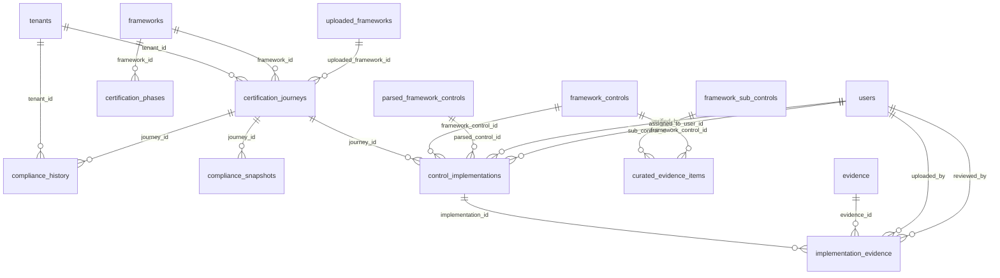

#### `_16_certification_journey_models.py` — 7 table(s)
*Per-framework certification journeys, phases, control implementations, and snapshots.*

- **`grc_certification_journeys`** *(class `CertificationJourney`, 14 cols)*
  - `id` — INTEGER · **PK** · NOT NULL
  - `tenant_id` — INTEGER · FK→`grc_tenants.id` · NOT NULL
  - `framework_id` — INTEGER · FK→`grc_frameworks.id`
  - `uploaded_framework_id` — INTEGER · FK→`grc_uploaded_frameworks.id`
  - `name` — VARCHAR(255) · NOT NULL
  - `target_date` — DATETIME
  - `started_at` — DATETIME
  - `completed_at` — DATETIME
  - `status` — VARCHAR(50)
  - `current_phase` — INTEGER
  - `notes` — TEXT
  - `generated_phases` — JSON
  - `phases_completion` — JSON
  - `stage_owners` — JSON
- **`grc_certification_phases`** *(class `CertificationPhase`, 7 cols)*
  - `id` — INTEGER · **PK** · NOT NULL
  - `framework_id` — INTEGER · FK→`grc_frameworks.id` · NOT NULL
  - `phase_number` — INTEGER · NOT NULL
  - `name` — VARCHAR(255) · NOT NULL
  - `description` — TEXT
  - `key_tasks` — JSON
  - `deliverables` — JSON
  - *unique:* (framework_id, phase_number)
- **`grc_compliance_history`** *(class `ComplianceHistory`, 11 cols)*
  - `id` — INTEGER · **PK** · NOT NULL
  - `tenant_id` — INTEGER · FK→`grc_tenants.id` · NOT NULL
  - `journey_id` — INTEGER · FK→`grc_certification_journeys.id` · NOT NULL
  - `framework_id` — INTEGER
  - `snapshot_day` — DATETIME · NOT NULL
  - `completion_pct` — FLOAT
  - `readiness_pct` — FLOAT
  - `evidence_coverage_pct` — FLOAT
  - `total_controls` — INTEGER
  - `status_counts` — JSON
  - `created_at` — DATETIME
  - *unique:* (journey_id, snapshot_day)
- **`grc_compliance_snapshots`** *(class `ComplianceSnapshot`, 12 cols)*
  - `id` — INTEGER · **PK** · NOT NULL
  - `journey_id` — INTEGER · FK→`grc_certification_journeys.id` · NOT NULL
  - `tenant_id` — INTEGER
  - `year` — INTEGER
  - `label` — VARCHAR(120)
  - `captured_at` — DATETIME
  - `captured_by` — INTEGER
  - `overall_pct` — INTEGER
  - `compliant_count` — INTEGER
  - `total_count` — INTEGER
  - `breakdown` — JSON
  - `notes` — TEXT
- **`grc_control_implementations`** *(class `ControlImplementation`, 14 cols)*
  - `id` — INTEGER · **PK** · NOT NULL
  - `journey_id` — INTEGER · FK→`grc_certification_journeys.id` · NOT NULL
  - `framework_control_id` — INTEGER · FK→`grc_framework_controls.id`
  - `parsed_control_id` — INTEGER · FK→`grc_parsed_framework_controls.id`
  - `status` — VARCHAR(50)
  - `implementation_notes` — TEXT
  - `implementation_date` — DATETIME
  - `verified_date` — DATETIME
  - `verified_by` — INTEGER · FK→`grc_users.id`
  - `is_applicable` — BOOLEAN
  - `priority` — INTEGER
  - `assigned_to_user_id` — INTEGER · FK→`grc_users.id`
  - `assigned_user_ids` — JSON
  - `criteria_status` — JSON
- **`grc_curated_evidence_items`** *(class `CuratedEvidenceItem`, 10 cols)*
  - `id` — INTEGER · **PK** · NOT NULL
  - `sub_control_id` — INTEGER · FK→`grc_framework_sub_controls.id`
  - `framework_control_id` — INTEGER · FK→`grc_framework_controls.id`
  - `title` — VARCHAR(255) · NOT NULL
  - `description` — TEXT
  - `artifact_type` — VARCHAR(50) · NOT NULL
  - `format_guidance` — TEXT
  - `frequency` — VARCHAR(50)
  - `is_required` — BOOLEAN
  - `created_at` — DATETIME
- **`grc_implementation_evidence`** *(class `ImplementationEvidence`, 17 cols)*
  - `id` — INTEGER · **PK** · NOT NULL
  - `implementation_id` — INTEGER · FK→`grc_control_implementations.id` · NOT NULL
  - `evidence_id` — INTEGER · FK→`grc_evidence.id`
  - `file_name` — VARCHAR(255)
  - `file_path` — VARCHAR(500)
  - `file_size` — INTEGER
  - `mime_type` — VARCHAR(100)
  - `uploaded_at` — DATETIME
  - `uploaded_by` — INTEGER · FK→`grc_users.id` · NOT NULL
  - `ai_confidence_score` — FLOAT
  - `ai_assessment_status` — VARCHAR(50)
  - `ai_assessment_notes` — TEXT
  - `ai_matched_controls` — JSON
  - `review_status` — VARCHAR(50)
  - `reviewed_by` — INTEGER · FK→`grc_users.id`
  - `reviewed_at` — DATETIME
  - `review_notes` — TEXT

### Workflow & Automation

```mermaid
erDiagram
  document_workflow_instances ||--o{ document_workflow_actions : instance_id
  workflow_steps ||--o{ document_workflow_actions : step_id
  users ||--o{ document_workflow_actions : action_by
  users ||--o{ document_workflow_actions : delegated_to
  governance_documents ||--o{ document_workflow_instances : document_id
  workflow_templates ||--o{ document_workflow_instances : template_id
  workflow_steps ||--o{ document_workflow_instances : current_step_id
  users ||--o{ document_workflow_instances : started_by
  workflow_steps ||--o{ workflow_step_approvers : step_id
  users ||--o{ workflow_step_approvers : user_id
  roles ||--o{ workflow_step_approvers : role_id
  workflow_templates ||--o{ workflow_steps : template_id
  tenants ||--o{ workflow_templates : tenant_id
  users ||--o{ workflow_templates : created_by
  tenants ||--o{ workflow_approval_requests : tenant_id
  workflow_instances ||--o{ workflow_approval_requests : workflow_instance_id
  workflow_engine_steps ||--o{ workflow_approval_requests : workflow_step_id
  users ||--o{ workflow_approval_requests : approver_user_id
  tenants ||--o{ workflow_audit_logs : tenant_id
  workflow_definitions ||--o{ workflow_audit_logs : workflow_definition_id
  workflow_instances ||--o{ workflow_audit_logs : workflow_instance_id
  workflow_engine_steps ||--o{ workflow_audit_logs : workflow_step_id
  users ||--o{ workflow_audit_logs : created_by_id
  workflow_definitions ||--o{ workflow_definition_versions : workflow_definition_id
  tenants ||--o{ workflow_definition_versions : tenant_id
  users ||--o{ workflow_definition_versions : created_by_id
  tenants ||--o{ workflow_definitions : tenant_id
  users ||--o{ workflow_definitions : created_by_id
  users ||--o{ workflow_definitions : updated_by_id
  workflow_definitions ||--o{ workflow_edges : workflow_definition_id
  tenants ||--o{ workflow_email_configs : tenant_id
  tenants ||--o{ workflow_engine_schedules : tenant_id
  workflow_definitions ||--o{ workflow_engine_schedules : workflow_definition_id
  users ||--o{ workflow_engine_schedules : created_by_id
  workflow_instances ||--o{ workflow_engine_steps : workflow_instance_id
  users ||--o{ workflow_engine_steps : assigned_to_user_id
  tenants ||--o{ workflow_engine_templates : tenant_id
  users ||--o{ workflow_engine_templates : created_by_id
  tenants ||--o{ workflow_engine_webhooks : tenant_id
  users ||--o{ workflow_engine_webhooks : created_by_id
  workflow_definitions ||--o{ workflow_instances : workflow_definition_id
  tenants ||--o{ workflow_instances : tenant_id
  workflow_definitions ||--o{ workflow_nodes : workflow_definition_id
  tenants ||--o{ workflow_notifications : tenant_id
  users ||--o{ workflow_notifications : user_id
  workflow_instances ||--o{ workflow_notifications : workflow_instance_id
```

#### `_20_customizable_workflow_models.py` — 5 table(s)
*Customisable workflow definitions and instances.*

- **`grc_document_workflow_actions`** *(class `DocumentWorkflowAction`, 10 cols)*
  - `id` — INTEGER · **PK** · NOT NULL
  - `instance_id` — INTEGER · FK→`grc_document_workflow_instances.id` · NOT NULL
  - `step_id` — INTEGER · FK→`grc_workflow_steps.id` · NOT NULL
  - `action` — VARCHAR(50) · NOT NULL
  - `action_by` — INTEGER · FK→`grc_users.id` · NOT NULL
  - `action_at` — DATETIME
  - `comments` — TEXT
  - `delegated_to` — INTEGER · FK→`grc_users.id`
  - `step_sequence` — INTEGER
  - `step_name` — VARCHAR(255)
- **`grc_document_workflow_instances`** *(class `DocumentWorkflowInstance`, 9 cols)*
  - `id` — INTEGER · **PK** · NOT NULL
  - `document_id` — INTEGER · FK→`grc_governance_documents.id` · NOT NULL
  - `template_id` — INTEGER · FK→`grc_workflow_templates.id` · NOT NULL
  - `current_step_id` — INTEGER · FK→`grc_workflow_steps.id`
  - `current_step_sequence` — INTEGER
  - `status` — VARCHAR(50)
  - `started_at` — DATETIME
  - `completed_at` — DATETIME
  - `started_by` — INTEGER · FK→`grc_users.id`
- **`grc_workflow_step_approvers`** *(class `WorkflowStepApprover`, 7 cols)*
  - `id` — INTEGER · **PK** · NOT NULL
  - `step_id` — INTEGER · FK→`grc_workflow_steps.id` · NOT NULL
  - `approver_type` — VARCHAR(50) · NOT NULL
  - `user_id` — INTEGER · FK→`grc_users.id`
  - `role_id` — INTEGER · FK→`grc_roles.id`
  - `is_required` — BOOLEAN
  - `sequence` — INTEGER
- **`grc_workflow_steps`** *(class `WorkflowStep`, 15 cols)*
  - `id` — INTEGER · **PK** · NOT NULL
  - `template_id` — INTEGER · FK→`grc_workflow_templates.id` · NOT NULL
  - `name` — VARCHAR(255) · NOT NULL
  - `description` — TEXT
  - `sequence` — INTEGER · NOT NULL
  - `step_type` — VARCHAR(50)
  - `approval_mode` — VARCHAR(50)
  - `is_required` — BOOLEAN
  - `timeout_days` — INTEGER
  - `on_approve_status` — VARCHAR(50)
  - `on_reject_action` — VARCHAR(50)
  - `notify_on_pending` — BOOLEAN
  - `notify_on_complete` — BOOLEAN
  - `reminder_days` — INTEGER
  - `created_at` — DATETIME
- **`grc_workflow_templates`** *(class `WorkflowTemplate`, 13 cols)*
  - `id` — INTEGER · **PK** · NOT NULL
  - `tenant_id` — INTEGER · FK→`grc_tenants.id` · NOT NULL
  - `name` — VARCHAR(255) · NOT NULL
  - `description` — TEXT
  - `doc_types` — JSON
  - `is_default` — BOOLEAN
  - `is_active` — BOOLEAN
  - `allow_skip` — BOOLEAN
  - `require_all_approvers` — BOOLEAN
  - `auto_publish_on_complete` — BOOLEAN
  - `created_at` — DATETIME
  - `updated_at` — DATETIME
  - `created_by` — INTEGER · FK→`grc_users.id`

#### `_34_workflow_automation_engine_standalone_config_driven.py` — 13 table(s)
*The standalone, config-driven workflow-automation engine (triggers, actions, runs).*

- **`grc_workflow_approval_requests`** *(class `ApprovalRequest`, 15 cols)*
  - `id` — INTEGER · **PK** · NOT NULL
  - `tenant_id` — INTEGER · FK→`grc_tenants.id` · NOT NULL
  - `workflow_instance_id` — INTEGER · FK→`grc_workflow_instances.id` · NOT NULL
  - `workflow_step_id` — INTEGER · FK→`grc_workflow_engine_steps.id` · NOT NULL
  - `status` — VARCHAR(50)
  - `approval_type` — VARCHAR(50)
  - `required_approvals` — INTEGER
  - `received_approvals` — INTEGER
  - `approver_user_id` — INTEGER · FK→`grc_users.id`
  - `approver_role` — VARCHAR(100)
  - `decision_comment` — TEXT
  - `due_at` — DATETIME
  - `responded_at` — DATETIME
  - `request_metadata` — JSON
  - `created_at` — DATETIME
- **`grc_workflow_audit_logs`** *(class `WorkflowAuditLog`, 10 cols)*
  - `id` — INTEGER · **PK** · NOT NULL
  - `tenant_id` — INTEGER · FK→`grc_tenants.id` · NOT NULL
  - `workflow_definition_id` — INTEGER · FK→`grc_workflow_definitions.id`
  - `workflow_instance_id` — INTEGER · FK→`grc_workflow_instances.id`
  - `workflow_step_id` — INTEGER · FK→`grc_workflow_engine_steps.id`
  - `event_type` — VARCHAR(100) · NOT NULL
  - `message` — TEXT
  - `payload` — JSON
  - `created_by_id` — INTEGER · FK→`grc_users.id`
  - `created_at` — DATETIME
- **`grc_workflow_definition_versions`** *(class `WorkflowDefinitionVersion`, 14 cols)*
  - `id` — INTEGER · **PK** · NOT NULL
  - `workflow_definition_id` — INTEGER · FK→`grc_workflow_definitions.id` · NOT NULL
  - `tenant_id` — INTEGER · FK→`grc_tenants.id` · NOT NULL
  - `version_number` — INTEGER · NOT NULL
  - `name` — VARCHAR(255) · NOT NULL
  - `description` — TEXT
  - `trigger_event` — VARCHAR(255) · NOT NULL
  - `trigger_conditions` — JSON
  - `definition_json` — JSON
  - `nodes_json` — JSON
  - `edges_json` — JSON
  - `change_summary` — TEXT
  - `created_by_id` — INTEGER · FK→`grc_users.id`
  - `created_at` — DATETIME
  - *unique:* (workflow_definition_id, version_number)
- **`grc_workflow_definitions`** *(class `WorkflowDefinition`, 14 cols)*  · ⭐ hub (6 inbound FKs)
  - `id` — INTEGER · **PK** · NOT NULL
  - `tenant_id` — INTEGER · FK→`grc_tenants.id` · NOT NULL
  - `name` — VARCHAR(255) · NOT NULL
  - `description` — TEXT
  - `version` — INTEGER
  - `is_active` — BOOLEAN
  - `trigger_event` — VARCHAR(255) · NOT NULL
  - `trigger_conditions` — JSON
  - `trigger_events` — JSON
  - `definition_json` — JSON
  - `created_by_id` — INTEGER · FK→`grc_users.id`
  - `updated_by_id` — INTEGER · FK→`grc_users.id`
  - `created_at` — DATETIME
  - `updated_at` — DATETIME
- **`grc_workflow_edges`** *(class `WorkflowEdge`, 7 cols)*
  - `id` — INTEGER · **PK** · NOT NULL
  - `workflow_definition_id` — INTEGER · FK→`grc_workflow_definitions.id` · NOT NULL
  - `source_node_key` — VARCHAR(100) · NOT NULL
  - `target_node_key` — VARCHAR(100) · NOT NULL
  - `condition` — JSON
  - `priority` — INTEGER
  - `created_at` — DATETIME
- **`grc_workflow_email_configs`** *(class `WorkflowEmailConfiguration`, 13 cols)*
  - `id` — INTEGER · **PK** · NOT NULL
  - `tenant_id` — INTEGER · FK→`grc_tenants.id` · NOT NULL
  - `config_name` — VARCHAR(255) · NOT NULL
  - `smtp_host` — VARCHAR(255) · NOT NULL
  - `smtp_port` — INTEGER
  - `smtp_username` — VARCHAR(255) · NOT NULL
  - `smtp_password` — VARCHAR(500) · NOT NULL
  - `from_email` — VARCHAR(255) · NOT NULL
  - `from_name` — VARCHAR(255)
  - `use_tls` — BOOLEAN
  - `is_active` — BOOLEAN
  - `created_at` — DATETIME
  - `updated_at` — DATETIME
  - *unique:* (tenant_id, config_name)
- **`grc_workflow_engine_schedules`** *(class `WorkflowEngineSchedule`, 14 cols)*
  - `id` — INTEGER · **PK** · NOT NULL
  - `tenant_id` — INTEGER · FK→`grc_tenants.id` · NOT NULL
  - `workflow_definition_id` — INTEGER · FK→`grc_workflow_definitions.id` · NOT NULL
  - `name` — VARCHAR(255) · NOT NULL
  - `schedule_type` — VARCHAR(50)
  - `interval_minutes` — INTEGER
  - `run_at` — DATETIME
  - `next_run_at` — DATETIME
  - `payload` — JSON
  - `is_active` — BOOLEAN
  - `last_run_at` — DATETIME
  - `created_by_id` — INTEGER · FK→`grc_users.id`
  - `created_at` — DATETIME
  - `updated_at` — DATETIME
- **`grc_workflow_engine_steps`** *(class `WorkflowEngineStep`, 13 cols)*
  - `id` — INTEGER · **PK** · NOT NULL
  - `workflow_instance_id` — INTEGER · FK→`grc_workflow_instances.id` · NOT NULL
  - `node_key` — VARCHAR(100) · NOT NULL
  - `node_type` — VARCHAR(50) · NOT NULL
  - `status` — VARCHAR(50)
  - `input_payload` — JSON
  - `output_payload` — JSON
  - `attempts` — INTEGER
  - `assigned_to_user_id` — INTEGER · FK→`grc_users.id`
  - `next_run_at` — DATETIME
  - `started_at` — DATETIME
  - `completed_at` — DATETIME
  - `error_message` — TEXT
- **`grc_workflow_engine_templates`** *(class `WorkflowEngineTemplate`, 16 cols)*
  - `id` — INTEGER · **PK** · NOT NULL
  - `tenant_id` — INTEGER · FK→`grc_tenants.id` · NOT NULL
  - `name` — VARCHAR(255) · NOT NULL
  - `description` — TEXT
  - `category` — VARCHAR(100)
  - `trigger_event` — VARCHAR(255) · NOT NULL
  - `trigger_conditions` — JSON
  - `definition_json` — JSON
  - `nodes_json` — JSON
  - `edges_json` — JSON
  - `tags` — JSON
  - `is_system_template` — BOOLEAN
  - `is_active` — BOOLEAN
  - `created_by_id` — INTEGER · FK→`grc_users.id`
  - `created_at` — DATETIME
  - `updated_at` — DATETIME
- **`grc_workflow_engine_webhooks`** *(class `WorkflowEngineWebhookEndpoint`, 11 cols)*
  - `id` — INTEGER · **PK** · NOT NULL
  - `tenant_id` — INTEGER · FK→`grc_tenants.id` · NOT NULL
  - `name` — VARCHAR(255) · NOT NULL
  - `token` — VARCHAR(255) · NOT NULL
  - `event_name` — VARCHAR(255) · NOT NULL
  - `callback_url` — VARCHAR(1000)
  - `secret` — VARCHAR(255)
  - `is_active` — BOOLEAN
  - `created_by_id` — INTEGER · FK→`grc_users.id`
  - `created_at` — DATETIME
  - `updated_at` — DATETIME
- **`grc_workflow_instances`** *(class `WorkflowInstance`, 13 cols)*  · ⭐ hub (4 inbound FKs)
  - `id` — INTEGER · **PK** · NOT NULL
  - `workflow_definition_id` — INTEGER · FK→`grc_workflow_definitions.id` · NOT NULL
  - `tenant_id` — INTEGER · FK→`grc_tenants.id` · NOT NULL
  - `status` — VARCHAR(50)
  - `current_node_key` — VARCHAR(100)
  - `trigger_event` — VARCHAR(255)
  - `trigger_payload` — JSON
  - `context` — JSON
  - `correlation_id` — VARCHAR(255)
  - `started_at` — DATETIME
  - `completed_at` — DATETIME
  - `failed_at` — DATETIME
  - `error_message` — TEXT
- **`grc_workflow_nodes`** *(class `WorkflowNode`, 12 cols)*
  - `id` — INTEGER · **PK** · NOT NULL
  - `workflow_definition_id` — INTEGER · FK→`grc_workflow_definitions.id` · NOT NULL
  - `node_key` — VARCHAR(100) · NOT NULL
  - `node_type` — VARCHAR(255) · NOT NULL
  - `name` — VARCHAR(255) · NOT NULL
  - `config` — JSON
  - `position_x` — FLOAT
  - `position_y` — FLOAT
  - `is_start` — BOOLEAN
  - `is_terminal` — BOOLEAN
  - `created_at` — DATETIME
  - `updated_at` — DATETIME
- **`grc_workflow_notifications`** *(class `WorkflowNotification`, 10 cols)*
  - `id` — INTEGER · **PK** · NOT NULL
  - `tenant_id` — INTEGER · FK→`grc_tenants.id` · NOT NULL
  - `user_id` — INTEGER · FK→`grc_users.id` · NOT NULL
  - `workflow_instance_id` — INTEGER · FK→`grc_workflow_instances.id`
  - `notification_type` — VARCHAR(50)
  - `subject` — VARCHAR(500) · NOT NULL
  - `message` — TEXT · NOT NULL
  - `is_read` — BOOLEAN
  - `read_at` — DATETIME
  - `created_at` — DATETIME

### Integrations & Cloud

```mermaid
erDiagram
  tenants ||--o{ cloud_connectors : tenant_id
  users ||--o{ cloud_connectors : created_by
  tenants ||--o{ cwe_control_overrides : tenant_id
  users ||--o{ cwe_control_overrides : created_by
  tenants ||--o{ software_identifiers : tenant_id
  it_assets ||--o{ software_identifiers : asset_id
  teams ||--o{ team_members : team_id
  users ||--o{ team_members : user_id
  users ||--o{ team_members : added_by
  tenants ||--o{ teams : tenant_id
  users ||--o{ teams : lead_user_id
  vulnerability_reports ||--o{ vulnerability_ai_jobs : report_id
  vulnerabilities ||--o{ vulnerability_ai_jobs : vulnerability_id
  tenants ||--o{ vulnerability_ai_jobs : tenant_id
  users ||--o{ vulnerability_ai_jobs : created_by
  vulnerabilities ||--o{ vulnerability_asset_links : vulnerability_id
  it_assets ||--o{ vulnerability_asset_links : asset_id
  users ||--o{ vulnerability_asset_links : created_by
  vulnerabilities ||--o{ vulnerability_control_links : vulnerability_id
  framework_controls ||--o{ vulnerability_control_links : framework_control_id
  normalized_controls ||--o{ vulnerability_control_links : normalized_control_id
  internal_controls ||--o{ vulnerability_control_links : internal_control_id
  parsed_framework_controls ||--o{ vulnerability_control_links : parsed_framework_control
  users ||--o{ vulnerability_control_links : created_by
  tenants ||--o{ vulnerability_dependencies : tenant_id
  vulnerabilities ||--o{ vulnerability_dependencies : dependent_vuln_id
  vulnerabilities ||--o{ vulnerability_dependencies : prerequisite_vuln_id
  users ||--o{ vulnerability_dependencies : created_by
  vulnerabilities ||--o{ vulnerability_mitigations : vulnerability_id
  tenants ||--o{ vulnerability_mitigations : tenant_id
  users ||--o{ vulnerability_mitigations : owner_id
  risk_mitigation_actions ||--o{ vulnerability_mitigations : erm_mitigation_id
  users ||--o{ vulnerability_mitigations : created_by
  vulnerabilities ||--o{ vulnerability_retests : vulnerability_id
  tenants ||--o{ vulnerability_retests : tenant_id
  users ||--o{ vulnerability_retests : tester_id
  tenants ||--o{ vulnerability_sla_config : tenant_id
```

#### `_23_track_a_phase_7_cloud_connector_framework_foundation.py` — 12 table(s)
*The cloud-connector framework foundation — connections, sync jobs, and collected resources.*

- **`grc_cloud_connectors`** *(class `CloudConnector`, 17 cols)*
  - `id` — INTEGER · **PK** · NOT NULL
  - `tenant_id` — INTEGER · FK→`grc_tenants.id` · NOT NULL
  - `provider` — VARCHAR(50) · NOT NULL
  - `display_name` — VARCHAR(200) · NOT NULL
  - `description` — TEXT
  - `encrypted_credentials_blob` — TEXT
  - `sync_schedule_seconds` — INTEGER
  - `is_active` — BOOLEAN · NOT NULL
  - `last_sync_at` — DATETIME
  - `last_sync_status` — VARCHAR(20)
  - `last_sync_error` — TEXT
  - `last_health_check_at` — DATETIME
  - `last_health_status` — VARCHAR(20)
  - `health_metrics` — JSON
  - `created_by` — INTEGER · FK→`grc_users.id`
  - `created_at` — DATETIME · NOT NULL
  - `updated_at` — DATETIME · NOT NULL
- **`grc_cwe_control_overrides`** *(class `CweControlOverride`, 9 cols)*
  - `id` — INTEGER · **PK** · NOT NULL
  - `tenant_id` — INTEGER · FK→`grc_tenants.id` · NOT NULL
  - `cwe_id` — VARCHAR(50) · NOT NULL
  - `framework_prefix` — VARCHAR(100) · NOT NULL
  - `control_code_pattern` — VARCHAR(100) · NOT NULL
  - `action` — VARCHAR(10) · NOT NULL
  - `notes` — TEXT
  - `created_at` — DATETIME
  - `created_by` — INTEGER · FK→`grc_users.id`
  - *unique:* (tenant_id, cwe_id, framework_prefix, control_code_pattern, action)
- **`grc_software_identifiers`** *(class `SoftwareIdentifier`, 10 cols)*
  - `id` — INTEGER · **PK** · NOT NULL
  - `tenant_id` — INTEGER · FK→`grc_tenants.id` · NOT NULL
  - `asset_id` — INTEGER · FK→`grc_it_assets.id` · NOT NULL
  - `identifier_type` — VARCHAR(10) · NOT NULL
  - `identifier` — VARCHAR(500) · NOT NULL
  - `vendor` — VARCHAR(100)
  - `product` — VARCHAR(100)
  - `version` — VARCHAR(50)
  - `source` — VARCHAR(50)
  - `created_at` — DATETIME
  - *unique:* (tenant_id, asset_id, identifier)
- **`grc_team_members`** *(class `TeamMember`, 6 cols)*
  - `id` — INTEGER · **PK** · NOT NULL
  - `team_id` — INTEGER · FK→`grc_teams.id` · NOT NULL
  - `user_id` — INTEGER · FK→`grc_users.id` · NOT NULL
  - `role_in_team` — VARCHAR(30) · NOT NULL
  - `added_at` — DATETIME
  - `added_by` — INTEGER · FK→`grc_users.id`
  - *unique:* (team_id, user_id)
- **`grc_teams`** *(class `Team`, 8 cols)*
  - `id` — INTEGER · **PK** · NOT NULL
  - `tenant_id` — INTEGER · FK→`grc_tenants.id` · NOT NULL
  - `name` — VARCHAR(100) · NOT NULL
  - `description` — TEXT
  - `lead_user_id` — INTEGER · FK→`grc_users.id`
  - `is_active` — BOOLEAN · NOT NULL
  - `created_at` — DATETIME
  - `updated_at` — DATETIME
  - *unique:* (tenant_id, name)
- **`grc_vulnerability_ai_jobs`** *(class `VulnerabilityAIJob`, 13 cols)*
  - `id` — INTEGER · **PK** · NOT NULL
  - `report_id` — INTEGER · FK→`grc_vulnerability_reports.id`
  - `vulnerability_id` — INTEGER · FK→`grc_vulnerabilities.id`
  - `tenant_id` — INTEGER · FK→`grc_tenants.id` · NOT NULL
  - `job_type` — VARCHAR(50) · NOT NULL
  - `status` — VARCHAR(50)
  - `input_data` — JSON
  - `output_data` — JSON
  - `error_message` — TEXT
  - `started_at` — DATETIME
  - `completed_at` — DATETIME
  - `created_at` — DATETIME
  - `created_by` — INTEGER · FK→`grc_users.id`
- **`grc_vulnerability_asset_links`** *(class `VulnerabilityAssetLink`, 9 cols)*
  - `id` — INTEGER · **PK** · NOT NULL
  - `vulnerability_id` — INTEGER · FK→`grc_vulnerabilities.id` · NOT NULL
  - `asset_id` — INTEGER · FK→`grc_it_assets.id` · NOT NULL
  - `impact_on_asset` — VARCHAR(50)
  - `notes` — TEXT
  - `link_source` — VARCHAR(50)
  - `auto_linked` — BOOLEAN
  - `created_at` — DATETIME
  - `created_by` — INTEGER · FK→`grc_users.id`
  - *unique:* (vulnerability_id, asset_id)
- **`grc_vulnerability_control_links`** *(class `VulnerabilityControlLink`, 10 cols)*
  - `id` — INTEGER · **PK** · NOT NULL
  - `vulnerability_id` — INTEGER · FK→`grc_vulnerabilities.id` · NOT NULL
  - `framework_control_id` — INTEGER · FK→`grc_framework_controls.id`
  - `normalized_control_id` — INTEGER · FK→`grc_normalized_controls.id`
  - `internal_control_id` — INTEGER · FK→`grc_internal_controls.id`
  - `parsed_framework_control_id` — INTEGER · FK→`grc_parsed_framework_controls.id`
  - `compliance_impact` — VARCHAR(50)
  - `notes` — TEXT
  - `created_at` — DATETIME
  - `created_by` — INTEGER · FK→`grc_users.id`
- **`grc_vulnerability_dependencies`** *(class `VulnerabilityDependency`, 8 cols)*
  - `id` — INTEGER · **PK** · NOT NULL
  - `tenant_id` — INTEGER · FK→`grc_tenants.id` · NOT NULL
  - `dependent_vuln_id` — INTEGER · FK→`grc_vulnerabilities.id` · NOT NULL
  - `prerequisite_vuln_id` — INTEGER · FK→`grc_vulnerabilities.id` · NOT NULL
  - `notes` — TEXT
  - `chain_stage` — VARCHAR(50)
  - `created_at` — DATETIME
  - `created_by` — INTEGER · FK→`grc_users.id`
  - *unique:* (dependent_vuln_id, prerequisite_vuln_id)
- **`grc_vulnerability_mitigations`** *(class `VulnerabilityMitigation`, 18 cols)*
  - `id` — INTEGER · **PK** · NOT NULL
  - `vulnerability_id` — INTEGER · FK→`grc_vulnerabilities.id` · NOT NULL
  - `tenant_id` — INTEGER · FK→`grc_tenants.id` · NOT NULL
  - `action_title` — VARCHAR(255) · NOT NULL
  - `action_description` — TEXT
  - `action_type` — VARCHAR(50)
  - `owner_id` — INTEGER · FK→`grc_users.id`
  - `priority` — VARCHAR(20)
  - `status` — VARCHAR(50)
  - `target_date` — DATETIME
  - `completed_at` — DATETIME
  - `effort_estimate` — VARCHAR(50)
  - `actual_effort` — VARCHAR(50)
  - `notes` — TEXT
  - `erm_mitigation_id` — INTEGER · FK→`grc_risk_mitigation_actions.id`
  - `created_at` — DATETIME
  - `updated_at` — DATETIME
  - `created_by` — INTEGER · FK→`grc_users.id`
- **`grc_vulnerability_retests`** *(class `VulnerabilityRetest`, 9 cols)*
  - `id` — INTEGER · **PK** · NOT NULL
  - `vulnerability_id` — INTEGER · FK→`grc_vulnerabilities.id` · NOT NULL
  - `tenant_id` — INTEGER · FK→`grc_tenants.id` · NOT NULL
  - `retest_date` — DATETIME
  - `tester_id` — INTEGER · FK→`grc_users.id`
  - `result` — VARCHAR(50) · NOT NULL
  - `findings` — TEXT
  - `evidence` — TEXT
  - `created_at` — DATETIME
- **`grc_vulnerability_sla_config`** *(class `VulnerabilitySLAConfig`, 9 cols)*
  - `id` — INTEGER · **PK** · NOT NULL
  - `tenant_id` — INTEGER · FK→`grc_tenants.id` · NOT NULL
  - `severity` — VARCHAR(20) · NOT NULL
  - `remediation_days` — INTEGER · NOT NULL
  - `notification_days` — INTEGER
  - `escalation_days` — INTEGER
  - `is_active` — BOOLEAN
  - `created_at` — DATETIME
  - `updated_at` — DATETIME
  - *unique:* (tenant_id, severity)

### Projects & Tasks

```mermaid
erDiagram
  critical_tasks ||--o{ critical_task_approvals : task_id
  users ||--o{ critical_task_approvals : requested_by_id
  users ||--o{ critical_task_approvals : approver_id
  critical_tasks ||--o{ critical_task_comments : task_id
  users ||--o{ critical_task_comments : user_id
  critical_tasks ||--o{ critical_task_history : task_id
  users ||--o{ critical_task_history : user_id
  critical_tasks ||--o{ critical_task_subtasks : task_id
  users ||--o{ critical_task_subtasks : assigned_owner_id
  tenants ||--o{ critical_task_templates : tenant_id
  tenants ||--o{ critical_tasks : tenant_id
  users ||--o{ critical_tasks : assigned_owner_id
  users ||--o{ critical_tasks : reviewer_id
  users ||--o{ critical_tasks : created_by_id
  risks ||--o{ critical_tasks : linked_risk_id
  internal_controls ||--o{ critical_tasks : linked_control_id
  vulnerabilities ||--o{ critical_tasks : linked_vulnerability_id
  issues ||--o{ critical_tasks : linked_issue_id
  issue_actions ||--o{ critical_tasks : linked_issue_action_id
  users ||--o{ critical_tasks : approved_by_id
  is_projects ||--o{ is_project_budget_items : project_id
  is_projects ||--o{ is_project_compliance_mappings : project_id
  is_projects ||--o{ is_project_dependencies : project_id
  is_projects ||--o{ is_project_documents : project_id
  tenants ||--o{ is_project_health_snapshots : tenant_id
  is_projects ||--o{ is_project_lessons_learned : project_id
  is_project_milestones ||--o{ is_project_milestone_evidence : milestone_id
  evidence ||--o{ is_project_milestone_evidence : evidence_id
  is_projects ||--o{ is_project_milestones : project_id
  is_projects ||--o{ is_project_risks : project_id
  is_projects ||--o{ is_project_status_updates : project_id
  is_projects ||--o{ is_project_tasks : project_id
  is_projects ||--o{ is_project_team_members : project_id
  tenants ||--o{ is_projects : tenant_id
  users ||--o{ is_projects : project_owner_id
  users ||--o{ is_projects : created_by
  tenants ||--o{ notification_preferences : tenant_id
  users ||--o{ notification_preferences : user_id
```

#### `_36_is_projects_critical_tasks_models.py` — 20 table(s)
*IS projects and the critical-task / task-management register.*

- **`grc_critical_task_approvals`** *(class `CriticalTaskApproval`, 11 cols)*
  - `id` — INTEGER · **PK** · NOT NULL
  - `task_id` — INTEGER · FK→`grc_critical_tasks.id` · NOT NULL
  - `requested_by_id` — INTEGER · FK→`grc_users.id`
  - `approver_id` — INTEGER · FK→`grc_users.id`
  - `status` — VARCHAR(50)
  - `transition_from` — VARCHAR(50)
  - `transition_to` — VARCHAR(50)
  - `comment` — TEXT
  - `response_comment` — TEXT
  - `created_at` — DATETIME
  - `responded_at` — DATETIME
- **`grc_critical_task_comments`** *(class `CriticalTaskComment`, 5 cols)*
  - `id` — INTEGER · **PK** · NOT NULL
  - `task_id` — INTEGER · FK→`grc_critical_tasks.id` · NOT NULL
  - `user_id` — INTEGER · FK→`grc_users.id` · NOT NULL
  - `content` — TEXT · NOT NULL
  - `created_at` — DATETIME
- **`grc_critical_task_history`** *(class `CriticalTaskHistory`, 8 cols)*
  - `id` — INTEGER · **PK** · NOT NULL
  - `task_id` — INTEGER · FK→`grc_critical_tasks.id` · NOT NULL
  - `user_id` — INTEGER · FK→`grc_users.id`
  - `action` — VARCHAR(100) · NOT NULL
  - `field_changed` — VARCHAR(100)
  - `old_value` — TEXT
  - `new_value` — TEXT
  - `created_at` — DATETIME
- **`grc_critical_task_subtasks`** *(class `CriticalTaskSubTask`, 9 cols)*
  - `id` — INTEGER · **PK** · NOT NULL
  - `task_id` — INTEGER · FK→`grc_critical_tasks.id` · NOT NULL
  - `title` — VARCHAR(255) · NOT NULL
  - `status` — VARCHAR(50)
  - `assigned_owner_id` — INTEGER · FK→`grc_users.id`
  - `due_date` — DATETIME
  - `completed_at` — DATETIME
  - `created_at` — DATETIME
  - `updated_at` — DATETIME
- **`grc_critical_task_templates`** *(class `CriticalTaskTemplate`, 10 cols)*
  - `id` — INTEGER · **PK** · NOT NULL
  - `tenant_id` — INTEGER · FK→`grc_tenants.id`
  - `name` — VARCHAR(255) · NOT NULL
  - `description` — TEXT
  - `category` — VARCHAR(100)
  - `priority` — VARCHAR(50)
  - `sla_days` — INTEGER
  - `sub_tasks_template` — JSON
  - `is_system` — BOOLEAN
  - `created_at` — DATETIME
  - *unique:* (tenant_id, name)
- **`grc_critical_tasks`** *(class `CriticalTask`, 40 cols)*  · ⭐ hub (6 inbound FKs)
  - `id` — INTEGER · **PK** · NOT NULL
  - `tenant_id` — INTEGER · FK→`grc_tenants.id` · NOT NULL
  - `title` — VARCHAR(255) · NOT NULL
  - `description` — TEXT
  - `source` — VARCHAR(50)
  - `source_module` — VARCHAR(100)
  - `source_entity_id` — INTEGER
  - `source_entity_type` — VARCHAR(100)
  - `priority` — VARCHAR(50)
  - `severity` — VARCHAR(50)
  - `status` — VARCHAR(50)
  - `category` — VARCHAR(100)
  - `assigned_owner_id` — INTEGER · FK→`grc_users.id`
  - `assigned_user_ids` — JSON
  - `reviewer_id` — INTEGER · FK→`grc_users.id`
  - `created_by_id` — INTEGER · FK→`grc_users.id`
  - `due_date` — DATETIME
  - `sla_days` — INTEGER
  - `escalation_level` — INTEGER
  - `linked_risk_id` — INTEGER · FK→`grc_risks.id`
  - `linked_control_id` — INTEGER · FK→`grc_internal_controls.id`
  - `linked_vulnerability_id` — INTEGER · FK→`grc_vulnerabilities.id`
  - `linked_framework_id` — INTEGER
  - `linked_requirement_id` — INTEGER
  - `linked_issue_id` — INTEGER · FK→`grc_issues.id`
  - `linked_issue_action_id` — INTEGER · FK→`grc_issue_actions.id`
  - `evidence_notes` — TEXT
  - `completed_at` — DATETIME
  - `verified_at` — DATETIME
  - `recurrence_pattern` — VARCHAR(50)
  - `recurrence_interval` — INTEGER
  - `parent_task_id` — INTEGER · FK→`grc_critical_tasks.id`
  - `next_recurrence_date` — DATETIME
  - `approval_required` — BOOLEAN
  - `approval_status` — VARCHAR(50)
  - `approved_by_id` — INTEGER · FK→`grc_users.id`
  - `approved_at` — DATETIME
  - `approval_comment` — TEXT
  - `created_at` — DATETIME
  - `updated_at` — DATETIME
- **`grc_is_project_budget_items`** *(class `ISProjectBudgetItem`, 11 cols)*
  - `id` — INTEGER · **PK** · NOT NULL
  - `project_id` — INTEGER · FK→`grc_is_projects.id` · NOT NULL
  - `description` — TEXT
  - `category` — VARCHAR(100) · NOT NULL
  - `amount` — FLOAT
  - `date` — DATETIME
  - `status` — VARCHAR(50)
  - `approved_by` — VARCHAR(255)
  - `notes` — TEXT
  - `created_at` — DATETIME
  - `updated_at` — DATETIME
- **`grc_is_project_compliance_mappings`** *(class `ISProjectComplianceMapping`, 11 cols)*
  - `id` — INTEGER · **PK** · NOT NULL
  - `project_id` — INTEGER · FK→`grc_is_projects.id` · NOT NULL
  - `control_id` — INTEGER
  - `control_name` — VARCHAR(255) · NOT NULL
  - `framework_name` — VARCHAR(255) · NOT NULL
  - `requirement_description` — TEXT
  - `deliverable` — TEXT
  - `coverage_status` — VARCHAR(50)
  - `notes` — TEXT
  - `created_at` — DATETIME
  - `updated_at` — DATETIME
- **`grc_is_project_dependencies`** *(class `ISProjectDependency`, 14 cols)*
  - `id` — INTEGER · **PK** · NOT NULL
  - `project_id` — INTEGER · FK→`grc_is_projects.id` · NOT NULL
  - `dependency_type` — VARCHAR(50)
  - `dependent_project_id` — INTEGER
  - `dependent_project_name` — VARCHAR(255)
  - `external_dependency` — VARCHAR(255)
  - `description` — TEXT
  - `status` — VARCHAR(50)
  - `direction` — VARCHAR(50)
  - `impact_if_delayed` — TEXT
  - `expected_date` — DATETIME
  - `resolved_date` — DATETIME
  - `created_at` — DATETIME
  - `updated_at` — DATETIME
- **`grc_is_project_documents`** *(class `ISProjectDocument`, 10 cols)*
  - `id` — INTEGER · **PK** · NOT NULL
  - `project_id` — INTEGER · FK→`grc_is_projects.id` · NOT NULL
  - `title` — VARCHAR(255) · NOT NULL
  - `description` — TEXT
  - `document_type` — VARCHAR(100)
  - `url` — VARCHAR(1000)
  - `reference_id` — VARCHAR(255)
  - `reference_type` — VARCHAR(255)
  - `created_at` — DATETIME
  - `created_by_name` — VARCHAR(255)
- **`grc_is_project_health_snapshots`** *(class `ISProjectHealthSnapshot`, 8 cols)*
  - `id` — INTEGER · **PK** · NOT NULL
  - `tenant_id` — INTEGER · FK→`grc_tenants.id` · NOT NULL
  - `snapshot_date` — DATETIME
  - `on_track` — INTEGER
  - `at_risk` — INTEGER
  - `off_track` — INTEGER
  - `total_projects` — INTEGER
  - `created_at` — DATETIME
- **`grc_is_project_lessons_learned`** *(class `ISProjectLessonLearned`, 11 cols)*
  - `id` — INTEGER · **PK** · NOT NULL
  - `project_id` — INTEGER · FK→`grc_is_projects.id` · NOT NULL
  - `category` — VARCHAR(100)
  - `title` — VARCHAR(255) · NOT NULL
  - `description` — TEXT
  - `impact` — TEXT
  - `linked_milestone_id` — INTEGER
  - `linked_task_id` — INTEGER
  - `author_name` — VARCHAR(255)
  - `created_at` — DATETIME
  - `updated_at` — DATETIME
- **`grc_is_project_milestone_evidence`** *(class `ISProjectMilestoneEvidence`, 5 cols)*
  - `id` — INTEGER · **PK** · NOT NULL
  - `milestone_id` — INTEGER · FK→`grc_is_project_milestones.id` · NOT NULL
  - `evidence_id` — INTEGER · FK→`grc_evidence.id` · NOT NULL
  - `uploaded_by_name` — VARCHAR(255)
  - `created_at` — DATETIME
- **`grc_is_project_milestones`** *(class `ISProjectMilestone`, 12 cols)*
  - `id` — INTEGER · **PK** · NOT NULL
  - `project_id` — INTEGER · FK→`grc_is_projects.id` · NOT NULL
  - `name` — VARCHAR(255) · NOT NULL
  - `description` — TEXT
  - `target_date` — DATETIME
  - `actual_completion_date` — DATETIME
  - `status` — VARCHAR(50)
  - `deliverables` — JSON
  - `completion_percentage` — INTEGER
  - `sort_order` — INTEGER
  - `created_at` — DATETIME
  - `updated_at` — DATETIME
- **`grc_is_project_risks`** *(class `ISProjectRisk`, 13 cols)*
  - `id` — INTEGER · **PK** · NOT NULL
  - `project_id` — INTEGER · FK→`grc_is_projects.id` · NOT NULL
  - `title` — VARCHAR(255) · NOT NULL
  - `description` — TEXT
  - `type` — VARCHAR(50)
  - `severity` — VARCHAR(50)
  - `status` — VARCHAR(50)
  - `mitigation` — TEXT
  - `owner_name` — VARCHAR(255)
  - `identified_date` — DATETIME
  - `resolved_date` — DATETIME
  - `created_at` — DATETIME
  - `updated_at` — DATETIME
- **`grc_is_project_status_updates`** *(class `ISProjectStatusUpdate`, 11 cols)*
  - `id` — INTEGER · **PK** · NOT NULL
  - `project_id` — INTEGER · FK→`grc_is_projects.id` · NOT NULL
  - `author_id` — INTEGER
  - `author_name` — VARCHAR(255)
  - `update_date` — DATETIME
  - `health_status` — VARCHAR(50)
  - `what_was_done` — TEXT
  - `whats_planned` — TEXT
  - `blockers` — TEXT
  - `notes` — TEXT
  - `created_at` — DATETIME
- **`grc_is_project_tasks`** *(class `ISProjectTask`, 15 cols)*
  - `id` — INTEGER · **PK** · NOT NULL
  - `project_id` — INTEGER · FK→`grc_is_projects.id` · NOT NULL
  - `title` — VARCHAR(255) · NOT NULL
  - `description` — TEXT
  - `assignee_id` — INTEGER
  - `assignee_name` — VARCHAR(255)
  - `status` — VARCHAR(50)
  - `priority` — VARCHAR(50)
  - `due_date` — DATETIME
  - `completed_date` — DATETIME
  - `dependencies` — JSON
  - `progress` — INTEGER
  - `sort_order` — INTEGER
  - `created_at` — DATETIME
  - `updated_at` — DATETIME
- **`grc_is_project_team_members`** *(class `ISProjectTeamMember`, 8 cols)*
  - `id` — INTEGER · **PK** · NOT NULL
  - `project_id` — INTEGER · FK→`grc_is_projects.id` · NOT NULL
  - `user_id` — INTEGER
  - `user_name` — VARCHAR(255)
  - `email` — VARCHAR(255)
  - `role` — VARCHAR(100)
  - `responsibilities` — TEXT
  - `joined_at` — DATETIME
- **`grc_is_projects`** *(class `ISProject`, 25 cols)*  · ⭐ hub (11 inbound FKs)
  - `id` — INTEGER · **PK** · NOT NULL
  - `tenant_id` — INTEGER · FK→`grc_tenants.id` · NOT NULL
  - `name` — VARCHAR(255) · NOT NULL
  - `description` — TEXT
  - `category` — VARCHAR(100)
  - `priority` — VARCHAR(50)
  - `status` — VARCHAR(50)
  - `health` — VARCHAR(50)
  - `project_owner_id` — INTEGER · FK→`grc_users.id`
  - `project_owner_name` — VARCHAR(255)
  - `sponsor` — VARCHAR(255)
  - `department` — VARCHAR(255)
  - `start_date` — DATETIME
  - `target_end_date` — DATETIME
  - `actual_end_date` — DATETIME
  - `budget_estimated` — FLOAT
  - `budget_actual` — FLOAT
  - `business_justification` — TEXT
  - `linked_risks` — JSON
  - `linked_controls` — JSON
  - `linked_frameworks` — JSON
  - `completion_percentage` — INTEGER
  - `created_by` — INTEGER · FK→`grc_users.id`
  - `created_at` — DATETIME
  - `updated_at` — DATETIME
- **`grc_notification_preferences`** *(class `NotificationPreference`, 10 cols)*
  - `id` — INTEGER · **PK** · NOT NULL
  - `tenant_id` — INTEGER · FK→`grc_tenants.id` · NOT NULL
  - `user_id` — INTEGER · FK→`grc_users.id` · NOT NULL
  - `notify_on_assignment` — BOOLEAN
  - `notify_on_sla_warning` — BOOLEAN
  - `notify_on_sla_breach` — BOOLEAN
  - `notify_on_escalation` — BOOLEAN
  - `notify_on_approval_request` — BOOLEAN
  - `created_at` — DATETIME
  - `updated_at` — DATETIME
  - *unique:* (tenant_id, user_id)

### Artifacts & Catalogs

```mermaid
erDiagram
  compliance_assessment_documents ||--o{ audit_plan_entries : assessment_id
  tenants ||--o{ audit_plan_entries : tenant_id
  tenants ||--o{ benchmark_os_mappings : tenant_id
  tenants ||--o{ cis_ingest_jobs : tenant_id
  users ||--o{ cis_ingest_jobs : uploaded_by
  tenants ||--o{ compliance_agents : tenant_id
  it_assets ||--o{ compliance_agents : asset_id
  users ||--o{ compliance_agents : created_by_user_id
  users ||--o{ compliance_agents : revoked_by_user_id
  users ||--o{ compliance_agents : pending_scan_user_id
  tenants ||--o{ compliance_plugin_runs : tenant_id
  compliance_plugins ||--o{ compliance_plugin_runs : plugin_id
  it_assets ||--o{ compliance_plugin_runs : asset_id
  integration_connections ||--o{ compliance_plugin_runs : connection_id
  users ||--o{ compliance_plugin_runs : triggered_by_user_id
  compliance_agents ||--o{ compliance_plugin_runs : executed_by_agent_id
  tenants ||--o{ compliance_plugins : tenant_id
  cis_ingest_jobs ||--o{ compliance_plugins : source_ingest_job_id
  tenants ||--o{ criticality_assessment_activity : tenant_id
  users ||--o{ criticality_assessment_activity : user_id
  tenants ||--o{ criticality_assessment_comments : tenant_id
  users ||--o{ criticality_assessment_comments : user_id
  tenants ||--o{ criticality_assessment_evidence : tenant_id
  users ||--o{ criticality_assessment_evidence : uploaded_by
  tenants ||--o{ info_system_criticality_items : tenant_id
  it_assets ||--o{ info_system_criticality_items : linked_asset_id
  users ||--o{ info_system_criticality_items : business_owner_user_id
  users ||--o{ info_system_criticality_items : service_owner_user_id
  users ||--o{ info_system_criticality_items : assessor_user_id
  users ||--o{ info_system_criticality_items : submitted_by
  users ||--o{ info_system_criticality_items : approved_by
  users ||--o{ info_system_criticality_items : rejected_by
  risks ||--o{ info_system_criticality_items : linked_risk_id
  users ||--o{ info_system_criticality_items : created_by
  users ||--o{ info_system_criticality_items : updated_by
  tenants ||--o{ infra_asset_criticality_items : tenant_id
  it_assets ||--o{ infra_asset_criticality_items : linked_asset_id
  users ||--o{ infra_asset_criticality_items : custodian_user_id
  users ||--o{ infra_asset_criticality_items : administrator_user_id
  users ||--o{ infra_asset_criticality_items : assessor_user_id
  users ||--o{ infra_asset_criticality_items : submitted_by
  users ||--o{ infra_asset_criticality_items : approved_by
  users ||--o{ infra_asset_criticality_items : rejected_by
  risks ||--o{ infra_asset_criticality_items : linked_risk_id
  users ||--o{ infra_asset_criticality_items : created_by
  users ||--o{ infra_asset_criticality_items : updated_by
  tenants ||--o{ nca_kpi_entries : tenant_id
  users ||--o{ nca_kpi_entries : owner_user_id
  tenants ||--o{ nca_risk_entries : tenant_id
  users ||--o{ nca_risk_entries : risk_owner_user_id
  users ||--o{ nca_risk_entries : treatment_owner_user_id
  risks ||--o{ nca_risk_entries : bridged_risk_id
  tenants ||--o{ nca_vuln_entries : tenant_id
  users ||--o{ nca_vuln_entries : owner_user_id
  vulnerabilities ||--o{ nca_vuln_entries : bridged_vulnerability_id
  tenants ||--o{ plugin_asset_scopes : tenant_id
  compliance_plugins ||--o{ plugin_asset_scopes : plugin_id
  tenants ||--o{ plugin_control_mappings : tenant_id
  compliance_plugins ||--o{ plugin_control_mappings : plugin_id
  framework_controls ||--o{ plugin_control_mappings : framework_control_id
  normalized_controls ||--o{ plugin_control_mappings : normalized_control_id
  tenants ||--o{ plugin_schedule_overrides : tenant_id
  compliance_plugins ||--o{ plugin_schedule_overrides : plugin_id
  tenants ||--o{ rcsa_custom_row_evidence : tenant_id
  rcsa_custom_rows ||--o{ rcsa_custom_row_evidence : row_id
  users ||--o{ rcsa_custom_row_evidence : uploaded_by
  evidence ||--o{ rcsa_custom_row_evidence : linked_evidence_id
  tenants ||--o{ rcsa_custom_rows : tenant_id
  rcsa_custom_templates ||--o{ rcsa_custom_rows : template_id
  risks ||--o{ rcsa_custom_rows : linked_risk_id
  users ||--o{ rcsa_custom_rows : assigned_user_id
  users ||--o{ rcsa_custom_rows : created_by
  users ||--o{ rcsa_custom_rows : updated_by
  tenants ||--o{ rcsa_custom_templates : tenant_id
  users ||--o{ rcsa_custom_templates : created_by
  tenants ||--o{ tenant_artifacts : tenant_id
  artifact_catalog_items ||--o{ tenant_artifacts : catalog_item_id
  users ||--o{ tenant_artifacts : assigned_to_id
  users ||--o{ tenant_artifacts : created_by_id
  users ||--o{ tenant_artifacts : reviewed_by_id
  users ||--o{ tenant_artifacts : approved_by_id
  tenants ||--o{ tenant_risk_weights : tenant_id
  users ||--o{ tenant_risk_weights : updated_by
  os_versions {
  }
```

#### `_37_artifact_catalog_tenant_artifacts.py` — 24 table(s)
*Tenant artifact catalog and template store, plus regulator registers (NCA risk/audit) and assessment scaffolding.*

- **`grc_artifact_catalog_items`** *(class `ArtifactCatalogItem`, 15 cols)*
  - `id` — INTEGER · **PK** · NOT NULL
  - `framework_key` — VARCHAR(100) · NOT NULL
  - `framework_name` — VARCHAR(255) · NOT NULL
  - `artifact_id` — VARCHAR(50) · NOT NULL
  - `stage` — VARCHAR(100) · NOT NULL
  - `stage_number` — INTEGER
  - `name` — VARCHAR(500) · NOT NULL
  - `artifact_type` — VARCHAR(100) · NOT NULL
  - `control_ref` — VARCHAR(255)
  - `mandatory` — BOOLEAN
  - `description` — TEXT
  - `format` — VARCHAR(100)
  - `owner` — VARCHAR(255)
  - `is_platform_native` — BOOLEAN
  - `platform_data_type` — VARCHAR(100)
  - *unique:* (framework_key, artifact_id)
- **`grc_audit_plan_entries`** *(class `AuditPlanEntry`, 26 cols)*
  - `id` — INTEGER · **PK** · NOT NULL
  - `assessment_id` — INTEGER · FK→`grc_compliance_assessment_documents.id` · NOT NULL
  - `tenant_id` — INTEGER · FK→`grc_tenants.id` · NOT NULL
  - `entry_type` — VARCHAR(20)
  - `audit_id` — VARCHAR(30)
  - `audit_name` — VARCHAR(500)
  - `team_responsible` — VARCHAR(200)
  - `lead_auditor` — VARCHAR(255)
  - `audit_type` — VARCHAR(200)
  - `scope` — TEXT
  - `methods` — TEXT
  - `criteria` — TEXT
  - `sampling` — TEXT
  - `evidence_needed` — TEXT
  - `duration` — VARCHAR(200)
  - `schedule` — TEXT
  - `audit_start` — DATE
  - `audit_end` — DATE
  - `cost` — VARCHAR(100)
  - `comment` — TEXT
  - `status` — VARCHAR(50)
  - `priority` — VARCHAR(20)
  - `ai_recommendation` — TEXT
  - `ai_recommendation_generated_at` — DATETIME
  - `created_at` — DATETIME
  - `updated_at` — DATETIME
- **`grc_benchmark_os_mappings`** *(class `BenchmarkOsMapping`, 9 cols)*
  - `id` — INTEGER · **PK** · NOT NULL
  - `tenant_id` — INTEGER · FK→`grc_tenants.id`
  - `os_pattern` — VARCHAR(80) · NOT NULL
  - `benchmark_name` — VARCHAR(200) · NOT NULL
  - `notes` — TEXT
  - `is_active` — BOOLEAN · NOT NULL
  - `priority` — INTEGER · NOT NULL
  - `created_at` — DATETIME
  - `updated_at` — DATETIME
  - *unique:* (tenant_id, os_pattern, benchmark_name)
- **`grc_cis_ingest_jobs`** *(class `CisIngestJob`, 20 cols)*
  - `id` — INTEGER · **PK** · NOT NULL
  - `tenant_id` — INTEGER · FK→`grc_tenants.id`
  - `uploaded_by` — INTEGER · FK→`grc_users.id`
  - `original_filename` — VARCHAR(500) · NOT NULL
  - `sha256` — VARCHAR(64) · NOT NULL
  - `benchmark_label` — VARCHAR(200)
  - `status` — VARCHAR(30) · NOT NULL
  - `page_count` — INTEGER
  - `rules_extracted` — INTEGER
  - `rules_inserted` — INTEGER
  - `rules_updated` — INTEGER
  - `rules_flagged` — INTEGER
  - `rules_toc_rejected` — INTEGER
  - `ocr_pages` — INTEGER
  - `error_text` — TEXT
  - `extraction_log` — JSON
  - `started_at` — DATETIME
  - `completed_at` — DATETIME
  - `created_at` — DATETIME
  - `pdf_bytes` — BLOB
- **`grc_compliance_agents`** *(class `ComplianceAgent`, 28 cols)*
  - `id` — INTEGER · **PK** · NOT NULL
  - `tenant_id` — INTEGER · FK→`grc_tenants.id` · NOT NULL
  - `asset_id` — INTEGER · FK→`grc_it_assets.id`
  - `enrollment_token_hash` — VARCHAR(128)
  - `api_token_hash` — VARCHAR(128)
  - `agent_name` — VARCHAR(255) · NOT NULL
  - `mode` — VARCHAR(20)
  - `os_family` — VARCHAR(50)
  - `agent_version` — VARCHAR(50)
  - `hostname` — VARCHAR(255)
  - `ip_address` — VARCHAR(50)
  - `status` — VARCHAR(50)
  - `last_heartbeat_at` — DATETIME
  - `last_result_at` — DATETIME
  - `enrolled_at` — DATETIME
  - `created_at` — DATETIME
  - `updated_at` — DATETIME
  - `created_by_user_id` — INTEGER · FK→`grc_users.id`
  - `revoked_at` — DATETIME
  - `revoked_by_user_id` — INTEGER · FK→`grc_users.id`
  - `revoke_reason` — TEXT
  - `kind` — VARCHAR(20) · NOT NULL
  - `enrollment_max_uses` — INTEGER
  - `enrollment_uses` — INTEGER · NOT NULL
  - `enrollment_expires_at` — DATETIME
  - `spawned_from_agent_id` — INTEGER · FK→`grc_compliance_agents.id`
  - `pending_scan_at` — DATETIME
  - `pending_scan_user_id` — INTEGER · FK→`grc_users.id`
  - *unique:* (tenant_id, agent_name)
- **`grc_compliance_plugin_runs`** *(class `CompliancePluginRun`, 20 cols)*
  - `id` — INTEGER · **PK** · NOT NULL
  - `tenant_id` — INTEGER · FK→`grc_tenants.id` · NOT NULL
  - `plugin_id` — INTEGER · FK→`grc_compliance_plugins.id` · NOT NULL
  - `asset_id` — INTEGER · FK→`grc_it_assets.id`
  - `connection_id` — INTEGER · FK→`grc_integration_connections.id`
  - `status` — VARCHAR(30) · NOT NULL
  - `result_summary` — TEXT
  - `raw_output` — JSON
  - `result_detail` — TEXT
  - `remediation_shown` — TEXT
  - `evidence_snapshot` — JSON
  - `evidence_hash` — VARCHAR(64)
  - `duration_ms` — INTEGER
  - `triggered_by` — VARCHAR(30)
  - `triggered_by_user_id` — INTEGER · FK→`grc_users.id`
  - `executed_by_agent_id` — INTEGER · FK→`grc_compliance_agents.id`
  - `started_at` — DATETIME
  - `completed_at` — DATETIME
  - `error_message` — TEXT
  - `is_leaked` — BOOLEAN · NOT NULL
- **`grc_compliance_plugins`** *(class `CompliancePlugin`, 39 cols)*  · ⭐ hub (5 inbound FKs)
  - `id` — INTEGER · **PK** · NOT NULL
  - `tenant_id` — INTEGER · FK→`grc_tenants.id`
  - `plugin_key` — VARCHAR(200) · NOT NULL
  - `benchmark` — VARCHAR(100) · NOT NULL
  - `rule_id` — VARCHAR(50) · NOT NULL
  - `title` — VARCHAR(500) · NOT NULL
  - `description` — TEXT
  - `rationale` — TEXT
  - `remediation` — TEXT
  - `severity` — VARCHAR(20)
  - `runner_type` — VARCHAR(30) · NOT NULL
  - `check_definition` — JSON · NOT NULL
  - `enabled` — BOOLEAN
  - `is_builtin` — BOOLEAN
  - `source_url` — VARCHAR(500)
  - `schedule_cron` — VARCHAR(50)
  - `parent_plugin_id` — INTEGER · FK→`grc_compliance_plugins.id`
  - `depth` — INTEGER
  - `section_path` — VARCHAR(500)
  - `level` — VARCHAR(20)
  - `assessment_status` — VARCHAR(20)
  - `audit_steps_text` — TEXT
  - `references_json` — JSON
  - `cis_controls_json` — JSON
  - `mitre_techniques_json` — JSON
  - `confidence_score` — FLOAT
  - `review_status` — VARCHAR(30)
  - `auto_generated_check` — BOOLEAN
  - `source_ingest_job_id` — INTEGER · FK→`grc_cis_ingest_jobs.id`
  - `os_keys` — JSON
  - `classification_source` — VARCHAR(20)
  - `classified_at` — DATETIME
  - `benchmark_version` — VARCHAR(40)
  - `target_builds` — JSON
  - `benchmark_section_path` — VARCHAR(500)
  - `rule_id_validated_at` — DATETIME
  - `rule_id_validation_status` — VARCHAR(20)
  - `created_at` — DATETIME
  - `updated_at` — DATETIME
  - *unique:* (tenant_id, plugin_key)
- **`grc_criticality_assessment_activity`** *(class `CriticalityAssessmentActivity`, 8 cols)*
  - `id` — INTEGER · **PK** · NOT NULL
  - `tenant_id` — INTEGER · FK→`grc_tenants.id` · NOT NULL
  - `assessment_kind` — VARCHAR(8) · NOT NULL
  - `assessment_id` — INTEGER · NOT NULL
  - `user_id` — INTEGER · FK→`grc_users.id`
  - `type` — VARCHAR(40) · NOT NULL
  - `payload` — JSON
  - `created_at` — DATETIME
- **`grc_criticality_assessment_comments`** *(class `CriticalityAssessmentComment`, 9 cols)*
  - `id` — INTEGER · **PK** · NOT NULL
  - `tenant_id` — INTEGER · FK→`grc_tenants.id` · NOT NULL
  - `assessment_kind` — VARCHAR(8) · NOT NULL
  - `assessment_id` — INTEGER · NOT NULL
  - `user_id` — INTEGER · FK→`grc_users.id`
  - `parent_id` — INTEGER · FK→`grc_criticality_assessment_comments.id`
  - `body` — TEXT · NOT NULL
  - `created_at` — DATETIME
  - `edited_at` — DATETIME
- **`grc_criticality_assessment_evidence`** *(class `CriticalityAssessmentEvidence`, 11 cols)*
  - `id` — INTEGER · **PK** · NOT NULL
  - `tenant_id` — INTEGER · FK→`grc_tenants.id` · NOT NULL
  - `assessment_kind` — VARCHAR(8) · NOT NULL
  - `assessment_id` — INTEGER · NOT NULL
  - `file_name` — VARCHAR(255) · NOT NULL
  - `file_path` — VARCHAR(500) · NOT NULL
  - `file_size` — INTEGER
  - `mime_type` — VARCHAR(120)
  - `description` — TEXT
  - `uploaded_by` — INTEGER · FK→`grc_users.id`
  - `uploaded_at` — DATETIME · NOT NULL
- **`grc_info_system_criticality_items`** *(class `InfoSystemCriticalityItem`, 47 cols)*
  - `id` — INTEGER · **PK** · NOT NULL
  - `tenant_id` — INTEGER · FK→`grc_tenants.id` · NOT NULL
  - `linked_asset_id` — INTEGER · FK→`grc_it_assets.id`
  - `name` — VARCHAR(255) · NOT NULL
  - `description` — TEXT
  - `address` — VARCHAR(500)
  - `business_owner_user_id` — INTEGER · FK→`grc_users.id`
  - `business_owner_name` — VARCHAR(255)
  - `business_owner_designation` — VARCHAR(255)
  - `business_owner_phone` — VARCHAR(64)
  - `business_owner_email` — VARCHAR(255)
  - `service_owner_user_id` — INTEGER · FK→`grc_users.id`
  - `service_owner_name` — VARCHAR(255)
  - `service_owner_designation` — VARCHAR(255)
  - `service_owner_phone` — VARCHAR(64)
  - `service_owner_email` — VARCHAR(255)
  - `assessor_user_id` — INTEGER · FK→`grc_users.id`
  - `assessor_name` — VARCHAR(255)
  - `assessor_designation` — VARCHAR(255)
  - `assessor_phone` — VARCHAR(64)
  - `assessor_email` — VARCHAR(255)
  - `date_of_assessment` — DATE
  - `operational_dependency` — INTEGER
  - `financial_impact` — INTEGER
  - `customer_stakeholder_impact` — INTEGER
  - `data_sensitivity` — INTEGER
  - `unauthorized_access_risk` — INTEGER
  - `rto_rpo_requirements` — INTEGER
  - `internet_facing` — INTEGER
  - `b2b_exposure` — INTEGER
  - `total_score` — INTEGER
  - `criticality_level` — VARCHAR(32)
  - `comments` — TEXT
  - `approval_status` — VARCHAR(32)
  - `current_approval_tier` — INTEGER
  - `submitted_at` — DATETIME
  - `submitted_by` — INTEGER · FK→`grc_users.id`
  - `approved_at` — DATETIME
  - `approved_by` — INTEGER · FK→`grc_users.id`
  - `rejected_at` — DATETIME
  - `rejected_by` — INTEGER · FK→`grc_users.id`
  - `rejection_reason` — TEXT
  - `linked_risk_id` — INTEGER · FK→`grc_risks.id`
  - `created_by` — INTEGER · FK→`grc_users.id`
  - `updated_by` — INTEGER · FK→`grc_users.id`
  - `created_at` — DATETIME
  - `updated_at` — DATETIME
- **`grc_infra_asset_criticality_items`** *(class `InfraAssetCriticalityItem`, 51 cols)*
  - `id` — INTEGER · **PK** · NOT NULL
  - `tenant_id` — INTEGER · FK→`grc_tenants.id` · NOT NULL
  - `linked_asset_id` — INTEGER · FK→`grc_it_assets.id`
  - `name` — VARCHAR(255) · NOT NULL
  - `description` — TEXT
  - `make_model` — VARCHAR(255)
  - `location` — VARCHAR(255)
  - `associated_ips` — TEXT
  - `fault_tolerance` — VARCHAR(64)
  - `custodian_user_id` — INTEGER · FK→`grc_users.id`
  - `custodian_name` — VARCHAR(255)
  - `custodian_designation` — VARCHAR(255)
  - `custodian_phone` — VARCHAR(64)
  - `custodian_email` — VARCHAR(255)
  - `administrator_user_id` — INTEGER · FK→`grc_users.id`
  - `administrator_name` — VARCHAR(255)
  - `administrator_designation` — VARCHAR(255)
  - `administrator_phone` — VARCHAR(64)
  - `administrator_email` — VARCHAR(255)
  - `assessor_user_id` — INTEGER · FK→`grc_users.id`
  - `assessor_name` — VARCHAR(255)
  - `assessor_designation` — VARCHAR(255)
  - `assessor_phone` — VARCHAR(64)
  - `assessor_email` — VARCHAR(255)
  - `date_of_assessment` — DATE
  - `business_impact` — INTEGER
  - `service_dependency` — INTEGER
  - `data_sensitivity` — INTEGER
  - `redundancy_failover` — INTEGER
  - `rto` — INTEGER
  - `availability_requirement` — INTEGER
  - `operational_disruption` — INTEGER
  - `regulatory_dependency` — INTEGER
  - `exposure` — INTEGER
  - `total_score` — FLOAT
  - `criticality_level` — VARCHAR(32)
  - `comments` — TEXT
  - `approval_status` — VARCHAR(32)
  - `current_approval_tier` — INTEGER
  - `submitted_at` — DATETIME
  - `submitted_by` — INTEGER · FK→`grc_users.id`
  - `approved_at` — DATETIME
  - `approved_by` — INTEGER · FK→`grc_users.id`
  - `rejected_at` — DATETIME
  - `rejected_by` — INTEGER · FK→`grc_users.id`
  - `rejection_reason` — TEXT
  - `linked_risk_id` — INTEGER · FK→`grc_risks.id`
  - `created_by` — INTEGER · FK→`grc_users.id`
  - `updated_by` — INTEGER · FK→`grc_users.id`
  - `created_at` — DATETIME
  - `updated_at` — DATETIME
- **`grc_nca_kpi_entries`** *(class `NcaKpiEntry`, 31 cols)*
  - `id` — INTEGER · **PK** · NOT NULL
  - `tenant_id` — INTEGER · FK→`grc_tenants.id` · NOT NULL
  - `kpi_identifier` — VARCHAR(20)
  - `cybersecurity_domain` — VARCHAR(255)
  - `kpi_name` — VARCHAR(500)
  - `kpi_description` — TEXT
  - `kpi_definition` — TEXT
  - `kpi_type` — VARCHAR(50)
  - `frequency` — VARCHAR(50)
  - `data_source` — VARCHAR(255)
  - `reporting_year` — INTEGER
  - `prior_year_q4_actual` — FLOAT
  - `q1_target` — FLOAT
  - `q1_actual` — FLOAT
  - `q1_notes` — TEXT
  - `q2_target` — FLOAT
  - `q2_actual` — FLOAT
  - `q2_notes` — TEXT
  - `q3_target` — FLOAT
  - `q3_actual` — FLOAT
  - `q3_notes` — TEXT
  - `q4_target` — FLOAT
  - `q4_actual` — FLOAT
  - `q4_notes` — TEXT
  - `owner_user_id` — INTEGER · FK→`grc_users.id`
  - `linked_risk_ids` — JSON
  - `linked_control_ids` — JSON
  - `ai_recommendation` — TEXT
  - `ai_recommendation_generated_at` — DATETIME
  - `created_at` — DATETIME
  - `updated_at` — DATETIME
- **`grc_nca_risk_entries`** *(class `NcaRiskEntry`, 35 cols)*
  - `id` — INTEGER · **PK** · NOT NULL
  - `tenant_id` — INTEGER · FK→`grc_tenants.id` · NOT NULL
  - `risk_identifier` — VARCHAR(20)
  - `risk_area` — VARCHAR(100)
  - `risk_owner` — VARCHAR(255)
  - `date_identified` — DATE
  - `description` — TEXT
  - `risk_cause` — TEXT
  - `threat` — VARCHAR(255)
  - `risk_analysis` — TEXT
  - `date_analysis` — DATE
  - `inherent_likelihood` — INTEGER
  - `inherent_impact` — INTEGER
  - `inherent_rating_override` — VARCHAR(20)
  - `treatment_type` — VARCHAR(50)
  - `treatment_description` — TEXT
  - `treatment_owner` — VARCHAR(255)
  - `treatment_deadline` — DATE
  - `residual_description` — TEXT
  - `residual_likelihood` — INTEGER
  - `residual_impact` — INTEGER
  - `following_steps` — TEXT
  - `last_evaluation_date` — DATE
  - `comment` — TEXT
  - `risk_owner_user_id` — INTEGER · FK→`grc_users.id`
  - `treatment_owner_user_id` — INTEGER · FK→`grc_users.id`
  - `bridged_risk_id` — INTEGER · FK→`grc_risks.id`
  - `linked_asset_ids` — JSON
  - `linked_control_ids` — JSON
  - `mitigation_actions` — JSON
  - `lifecycle_status` — VARCHAR(30)
  - `ai_recommendation` — TEXT
  - `ai_recommendation_generated_at` — DATETIME
  - `created_at` — DATETIME
  - `updated_at` — DATETIME
- **`grc_nca_vuln_entries`** *(class `NcaVulnEntry`, 29 cols)*
  - `id` — INTEGER · **PK** · NOT NULL
  - `tenant_id` — INTEGER · FK→`grc_tenants.id` · NOT NULL
  - `vuln_identifier` — VARCHAR(20)
  - `title` — VARCHAR(255)
  - `description` — TEXT
  - `vendor_link` — VARCHAR(500)
  - `cve_number` — VARCHAR(50)
  - `cve_score` — FLOAT
  - `affected_technology` — TEXT
  - `affected_assets` — TEXT
  - `threat_analysis` — TEXT
  - `threat_severity` — INTEGER
  - `risk_likelihood` — INTEGER
  - `risk_severity` — INTEGER
  - `owner` — VARCHAR(255)
  - `status` — VARCHAR(30)
  - `first_observation_date` — DATE
  - `due_date` — DATE
  - `resolution_date` — DATE
  - `comments` — TEXT
  - `owner_user_id` — INTEGER · FK→`grc_users.id`
  - `bridged_vulnerability_id` — INTEGER · FK→`grc_vulnerabilities.id`
  - `linked_asset_ids` — JSON
  - `linked_control_ids` — JSON
  - `mitigation_actions` — JSON
  - `ai_recommendation` — TEXT
  - `ai_recommendation_generated_at` — DATETIME
  - `created_at` — DATETIME
  - `updated_at` — DATETIME
- **`grc_os_versions`** *(class `OsVersion`, 13 cols)*
  - `id` — INTEGER · **PK** · NOT NULL
  - `family` — VARCHAR(40) · NOT NULL
  - `product` — VARCHAR(80)
  - `build` — VARCHAR(40)
  - `normalized_key` — VARCHAR(80) · NOT NULL
  - `parent_key` — VARCHAR(80)
  - `display_name` — VARCHAR(120) · NOT NULL
  - `release_year` — INTEGER
  - `eol_year` — INTEGER
  - `is_supported` — BOOLEAN · NOT NULL
  - `benchmark_hint` — VARCHAR(200)
  - `created_at` — DATETIME
  - `updated_at` — DATETIME
  - *unique:* (normalized_key)
- **`grc_plugin_asset_scopes`** *(class `PluginAssetScope`, 6 cols)*
  - `id` — INTEGER · **PK** · NOT NULL
  - `tenant_id` — INTEGER · FK→`grc_tenants.id` · NOT NULL
  - `plugin_id` — INTEGER · FK→`grc_compliance_plugins.id` · NOT NULL
  - `mode` — VARCHAR(20) · NOT NULL
  - `asset_ids` — JSON · NOT NULL
  - `updated_at` — DATETIME
  - *unique:* (tenant_id, plugin_id)
- **`grc_plugin_control_mappings`** *(class `PluginControlMapping`, 7 cols)*
  - `id` — INTEGER · **PK** · NOT NULL
  - `tenant_id` — INTEGER · FK→`grc_tenants.id` · NOT NULL
  - `plugin_id` — INTEGER · FK→`grc_compliance_plugins.id` · NOT NULL
  - `framework_control_id` — INTEGER · FK→`grc_framework_controls.id`
  - `normalized_control_id` — INTEGER · FK→`grc_normalized_controls.id`
  - `weight` — FLOAT
  - `created_at` — DATETIME
- **`grc_plugin_schedule_overrides`** *(class `PluginScheduleOverride`, 6 cols)*
  - `id` — INTEGER · **PK** · NOT NULL
  - `tenant_id` — INTEGER · FK→`grc_tenants.id` · NOT NULL
  - `plugin_id` — INTEGER · FK→`grc_compliance_plugins.id` · NOT NULL
  - `schedule_cron` — VARCHAR(50)
  - `created_at` — DATETIME
  - `updated_at` — DATETIME
  - *unique:* (tenant_id, plugin_id)
- **`grc_rcsa_custom_row_evidence`** *(class `RCSACustomRowEvidence`, 11 cols)*
  - `id` — INTEGER · **PK** · NOT NULL
  - `tenant_id` — INTEGER · FK→`grc_tenants.id` · NOT NULL
  - `row_id` — INTEGER · FK→`grc_rcsa_custom_rows.id` · NOT NULL
  - `file_name` — VARCHAR(255) · NOT NULL
  - `file_path` — VARCHAR(500) · NOT NULL
  - `file_size` — INTEGER
  - `mime_type` — VARCHAR(120)
  - `description` — TEXT
  - `uploaded_by` — INTEGER · FK→`grc_users.id`
  - `uploaded_at` — DATETIME · NOT NULL
  - `linked_evidence_id` — INTEGER · FK→`grc_evidence.id`
- **`grc_rcsa_custom_rows`** *(class `RCSACustomRow`, 18 cols)*
  - `id` — INTEGER · **PK** · NOT NULL
  - `tenant_id` — INTEGER · FK→`grc_tenants.id` · NOT NULL
  - `template_id` — INTEGER · FK→`grc_rcsa_custom_templates.id` · NOT NULL
  - `risk_id_text` — VARCHAR(60)
  - `inherent_overall_label` — VARCHAR(40)
  - `residual_overall_label` — VARCHAR(40)
  - `inherent_overall_score` — INTEGER
  - `residual_overall_score` — INTEGER
  - `data` — JSON · NOT NULL
  - `linked_risk_id` — INTEGER · FK→`grc_risks.id`
  - `field_origins` — JSON
  - `assigned_user_id` — INTEGER · FK→`grc_users.id`
  - `ai_explanation` — TEXT
  - `ai_explanation_at` — DATETIME
  - `created_by` — INTEGER · FK→`grc_users.id`
  - `updated_by` — INTEGER · FK→`grc_users.id`
  - `created_at` — DATETIME
  - `updated_at` — DATETIME
- **`grc_rcsa_custom_templates`** *(class `RCSACustomTemplate`, 14 cols)*
  - `id` — INTEGER · **PK** · NOT NULL
  - `tenant_id` — INTEGER · FK→`grc_tenants.id` · NOT NULL
  - `name` — VARCHAR(255) · NOT NULL
  - `description` — TEXT
  - `function_area` — VARCHAR(120)
  - `original_filename` — VARCHAR(500) · NOT NULL
  - `sheet_name` — VARCHAR(255)
  - `column_schema` — JSON · NOT NULL
  - `original_file` — BLOB
  - `file_sha256` — VARCHAR(64)
  - `is_active` — BOOLEAN
  - `created_by` — INTEGER · FK→`grc_users.id`
  - `created_at` — DATETIME
  - `updated_at` — DATETIME
- **`grc_tenant_artifacts`** *(class `TenantArtifact`, 25 cols)*
  - `id` — INTEGER · **PK** · NOT NULL
  - `tenant_id` — INTEGER · FK→`grc_tenants.id` · NOT NULL
  - `catalog_item_id` — INTEGER · FK→`grc_artifact_catalog_items.id`
  - `assessment_id` — INTEGER
  - `framework_key` — VARCHAR(100) · NOT NULL
  - `name` — VARCHAR(500) · NOT NULL
  - `artifact_type` — VARCHAR(100) · NOT NULL
  - `stage` — VARCHAR(100)
  - `control_ref` — VARCHAR(255)
  - `description` — TEXT
  - `format` — VARCHAR(100)
  - `content` — TEXT
  - `file_path` — VARCHAR(500)
  - `file_name` — VARCHAR(255)
  - `file_size` — INTEGER
  - `status` — VARCHAR(50)
  - `assigned_to_id` — INTEGER · FK→`grc_users.id`
  - `created_by_id` — INTEGER · FK→`grc_users.id`
  - `reviewed_by_id` — INTEGER · FK→`grc_users.id`
  - `approved_by_id` — INTEGER · FK→`grc_users.id`
  - `is_platform_native` — BOOLEAN
  - `platform_data_type` — VARCHAR(100)
  - `platform_record_count` — INTEGER
  - `created_at` — DATETIME
  - `updated_at` — DATETIME
- **`grc_tenant_risk_weights`** *(class `TenantRiskWeights`, 9 cols)*
  - `tenant_id` — INTEGER · **PK** · FK→`grc_tenants.id` · NOT NULL
  - `weight_cis` — NUMERIC(5, 2) · NOT NULL
  - `weight_vuln` — NUMERIC(5, 2) · NOT NULL
  - `weight_cia` — NUMERIC(5, 2) · NOT NULL
  - `weight_ctrl` — NUMERIC(5, 2) · NOT NULL
  - `weight_risk` — NUMERIC(5, 2) · NOT NULL
  - `preset_name` — VARCHAR(40)
  - `updated_at` — DATETIME
  - `updated_by` — INTEGER · FK→`grc_users.id`

### Business Continuity

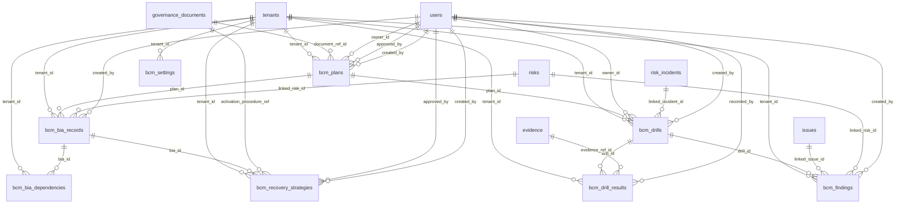

#### `_44_business_continuity_management_models.py` — 8 table(s)
*BCM — continuity plans, Business Impact Analyses, drills, and findings.*

- **`grc_bcm_bia_dependencies`** *(class `BcmBiaDependency`, 9 cols)*
  - `id` — INTEGER · **PK** · NOT NULL
  - `tenant_id` — INTEGER · FK→`grc_tenants.id` · NOT NULL
  - `bia_id` — INTEGER · FK→`grc_bcm_bia_records.id` · NOT NULL
  - `dependency_type` — VARCHAR(20) · NOT NULL
  - `name` — VARCHAR(255) · NOT NULL
  - `criticality` — VARCHAR(20)
  - `external_bcp_status` — VARCHAR(20)
  - `notes` — TEXT
  - `created_at` — DATETIME
- **`grc_bcm_bia_records`** *(class `BcmBiaRecord`, 15 cols)*
  - `id` — INTEGER · **PK** · NOT NULL
  - `tenant_id` — INTEGER · FK→`grc_tenants.id` · NOT NULL
  - `plan_id` — INTEGER · FK→`grc_bcm_plans.id` · NOT NULL
  - `process_name` — VARCHAR(255) · NOT NULL
  - `description` — TEXT
  - `criticality_rating` — VARCHAR(20) · NOT NULL
  - `rto_hours` — INTEGER
  - `rpo_hours` — INTEGER
  - `mtpd_hours` — INTEGER
  - `linked_risk_id` — INTEGER · FK→`grc_risks.id`
  - `linked_asset_ids` — JSON
  - `is_complete` — BOOLEAN
  - `created_by` — INTEGER · FK→`grc_users.id`
  - `created_at` — DATETIME
  - `updated_at` — DATETIME
- **`grc_bcm_drill_results`** *(class `BcmDrillResult`, 11 cols)*
  - `id` — INTEGER · **PK** · NOT NULL
  - `tenant_id` — INTEGER · FK→`grc_tenants.id` · NOT NULL
  - `drill_id` — INTEGER · FK→`grc_bcm_drills.id` · NOT NULL
  - `rto_met` — BOOLEAN
  - `rpo_met` — BOOLEAN
  - `actual_rto_hours` — INTEGER
  - `actual_rpo_hours` — INTEGER
  - `summary` — TEXT
  - `evidence_ref_id` — INTEGER · FK→`grc_evidence.id`
  - `recorded_by` — INTEGER · FK→`grc_users.id`
  - `recorded_at` — DATETIME
- **`grc_bcm_drills`** *(class `BcmDrill`, 17 cols)*
  - `id` — INTEGER · **PK** · NOT NULL
  - `tenant_id` — INTEGER · FK→`grc_tenants.id` · NOT NULL
  - `plan_id` — INTEGER · FK→`grc_bcm_plans.id` · NOT NULL
  - `title` — VARCHAR(255) · NOT NULL
  - `drill_type` — VARCHAR(30) · NOT NULL
  - `scenario` — TEXT
  - `scheduled_date` — DATETIME
  - `actual_start` — DATETIME
  - `actual_end` — DATETIME
  - `owner_id` — INTEGER · FK→`grc_users.id`
  - `participants` — JSON
  - `status` — VARCHAR(20) · NOT NULL
  - `source_type` — VARCHAR(20) · NOT NULL
  - `linked_incident_id` — INTEGER · FK→`grc_risk_incidents.id`
  - `created_by` — INTEGER · FK→`grc_users.id`
  - `created_at` — DATETIME
  - `updated_at` — DATETIME
- **`grc_bcm_findings`** *(class `BcmFinding`, 11 cols)*
  - `id` — INTEGER · **PK** · NOT NULL
  - `tenant_id` — INTEGER · FK→`grc_tenants.id` · NOT NULL
  - `drill_id` — INTEGER · FK→`grc_bcm_drills.id` · NOT NULL
  - `title` — VARCHAR(255) · NOT NULL
  - `description` — TEXT
  - `severity` — VARCHAR(20) · NOT NULL
  - `linked_issue_id` — INTEGER · FK→`grc_issues.id`
  - `linked_risk_id` — INTEGER · FK→`grc_risks.id`
  - `created_by` — INTEGER · FK→`grc_users.id`
  - `created_at` — DATETIME
  - `updated_at` — DATETIME
- **`grc_bcm_plans`** *(class `BcmPlan`, 18 cols)*
  - `id` — INTEGER · **PK** · NOT NULL
  - `tenant_id` — INTEGER · FK→`grc_tenants.id` · NOT NULL
  - `title` — VARCHAR(255) · NOT NULL
  - `description` — TEXT
  - `business_unit` — VARCHAR(255)
  - `status` — VARCHAR(30) · NOT NULL
  - `document_ref_id` — INTEGER · FK→`grc_governance_documents.id`
  - `owner_id` — INTEGER · FK→`grc_users.id`
  - `rto_hours` — INTEGER
  - `rpo_hours` — INTEGER
  - `testing_frequency` — VARCHAR(20) · NOT NULL
  - `version` — INTEGER
  - `approved_by` — INTEGER · FK→`grc_users.id`
  - `approved_date` — DATETIME
  - `next_review_due` — DATETIME
  - `created_by` — INTEGER · FK→`grc_users.id`
  - `created_at` — DATETIME
  - `updated_at` — DATETIME
- **`grc_bcm_recovery_strategies`** *(class `BcmRecoveryStrategy`, 13 cols)*
  - `id` — INTEGER · **PK** · NOT NULL
  - `tenant_id` — INTEGER · FK→`grc_tenants.id` · NOT NULL
  - `bia_id` — INTEGER · FK→`grc_bcm_bia_records.id` · NOT NULL
  - `strategy_type` — VARCHAR(40) · NOT NULL
  - `description` — TEXT
  - `activation_procedure_ref` — INTEGER · FK→`grc_governance_documents.id`
  - `status` — VARCHAR(20) · NOT NULL
  - `approved_by` — INTEGER · FK→`grc_users.id`
  - `approved_date` — DATETIME
  - `review_comments` — TEXT
  - `created_by` — INTEGER · FK→`grc_users.id`
  - `created_at` — DATETIME
  - `updated_at` — DATETIME
- **`grc_bcm_settings`** *(class `BcmSettings`, 5 cols)*
  - `id` — INTEGER · **PK** · NOT NULL
  - `tenant_id` — INTEGER · FK→`grc_tenants.id` · NOT NULL
  - `finding_issue_threshold` — VARCHAR(20) · NOT NULL
  - `created_at` — DATETIME
  - `updated_at` — DATETIME

### AI

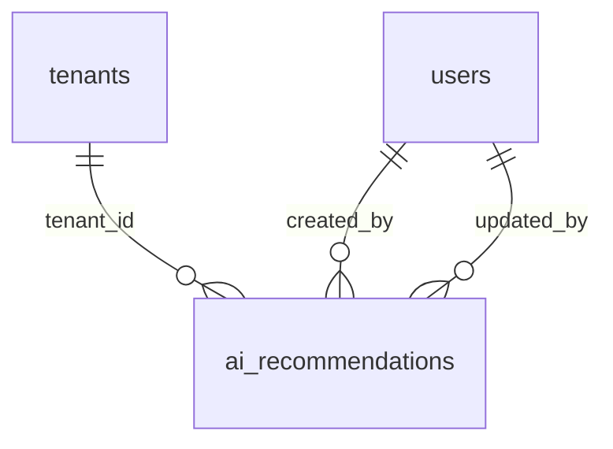

#### `_40_ai_recommendation_store.py` — 1 table(s)
*Saved AI recommendations reused across modules.*

- **`grc_ai_recommendations`** *(class `AIRecommendation`, 15 cols)*
  - `id` — INTEGER · **PK** · NOT NULL
  - `tenant_id` — INTEGER · FK→`grc_tenants.id` · NOT NULL
  - `module` — VARCHAR(60) · NOT NULL
  - `entity_type` — VARCHAR(60)
  - `entity_id` — VARCHAR(80)
  - `recommendation_type` — VARCHAR(80) · NOT NULL
  - `title` — VARCHAR(300)
  - `summary` — TEXT
  - `output` — JSON
  - `model` — VARCHAR(120)
  - `status` — VARCHAR(30)
  - `created_by` — INTEGER · FK→`grc_users.id`
  - `updated_by` — INTEGER · FK→`grc_users.id`
  - `created_at` — DATETIME
  - `updated_at` — DATETIME

### Reporting

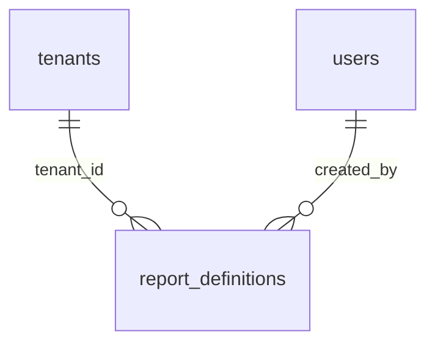

#### `_45_report_definitions.py` — 1 table(s)
*Saved report definitions from the cross-module Report Builder.*

- **`grc_report_definitions`** *(class `ReportDefinition`, 10 cols)*
  - `id` — INTEGER · **PK** · NOT NULL
  - `tenant_id` — INTEGER · FK→`grc_tenants.id`
  - `slug` — VARCHAR(64) · NOT NULL
  - `name` — VARCHAR(255) · NOT NULL
  - `dataset` — VARCHAR(64) · NOT NULL
  - `spec` — JSON
  - `is_shared` — BOOLEAN
  - `created_by` — INTEGER · FK→`grc_users.id`
  - `created_at` — DATETIME
  - `updated_at` — DATETIME
  - *unique:* (slug, created_by)

## 6. Complete table index

All 326 tables, alphabetical, with their domain file:

| Table | Class | Cols | Domain file |
|---|---|---|---|
| `grc_access_review_campaigns` | AccessReviewCampaign | 24 | _40_access_review_models |
| `grc_access_review_escalations` | AccessReviewEscalation | 8 | _40_access_review_models |
| `grc_access_review_findings` | AccessReviewFinding | 13 | _40_access_review_models |
| `grc_access_review_items` | AccessReviewItem | 34 | _40_access_review_models |
| `grc_access_review_rule_config` | AccessReviewRuleConfig | 6 | _40_access_review_models |
| `grc_ai_evidence_recommendations` | AIEvidenceRecommendation | 13 | _09_1_unified_common_control_library_models |
| `grc_ai_recommendations` | AIRecommendation | 15 | _40_ai_recommendation_store |
| `grc_ai_risk_assessment_entries` | AIRiskAssessmentEntry | 31 | _39_ai_risk_assessment_template |
| `grc_ai_risk_assessment_evidence_links` | AIRiskAssessmentEvidenceLink | 5 | _39_ai_risk_assessment_template |
| `grc_artifact_catalog_items` | ArtifactCatalogItem | 15 | _37_artifact_catalog_tenant_artifacts |
| `grc_assessment_evidence` | AssessmentEvidence | 16 | _17_framework_upload_parsing_models |
| `grc_assessment_evidence_approval_history` | AssessmentEvidenceApprovalHistory | 9 | _31_assessment_evidence_approval_workflow_models |
| `grc_assessment_evidence_approval_tiers` | AssessmentEvidenceApprovalTier | 9 | _31_assessment_evidence_approval_workflow_models |
| `grc_assessment_evidence_approval_workflows` | AssessmentEvidenceApprovalWorkflow | 9 | _31_assessment_evidence_approval_workflow_models |
| `grc_assessment_item_evidence` | AssessmentItemEvidence | 13 | _31_assessment_evidence_approval_workflow_models |
| `grc_assessment_items` | AssessmentItem | 13 | _17_framework_upload_parsing_models |
| `grc_assessment_remediations` | AssessmentRemediation | 15 | _17_framework_upload_parsing_models |
| `grc_asset_control_links` | AssetControlLink | 3 | _14_it_asset_inventory |
| `grc_asset_evidence_links` | AssetEvidenceLink | 4 | _14_it_asset_inventory |
| `grc_asset_framework_control_links` | AssetFrameworkControlLink | 5 | _14_it_asset_inventory |
| `grc_asset_internal_control_links` | AssetInternalControlLink | 4 | _14_it_asset_inventory |
| `grc_asset_risk_assessments` | AssetRiskAssessment | 7 | _14_it_asset_inventory |
| `grc_asset_security_compliance_selections` | AssetSecurityComplianceSelection | 7 | _14_it_asset_inventory |
| `grc_attestation_campaigns` | AttestationCampaign | 21 | _27_attestation_certification_management_models |
| `grc_attestation_requests` | AttestationRequest | 21 | _27_attestation_certification_management_models |
| `grc_audit_logs` | AuditLog | 9 | _06_audit_trail |
| `grc_audit_package_access_logs` | AuditPackageAccessLog | 7 | _10_evidence_management |
| `grc_audit_package_evidence` | AuditPackageEvidence | 7 | _10_evidence_management |
| `grc_audit_packages` | AuditPackage | 17 | _10_evidence_management |
| `grc_audit_plan_entries` | AuditPlanEntry | 26 | _37_artifact_catalog_tenant_artifacts |
| `grc_bcm_bia_dependencies` | BcmBiaDependency | 9 | _44_business_continuity_management_models |
| `grc_bcm_bia_records` | BcmBiaRecord | 15 | _44_business_continuity_management_models |
| `grc_bcm_drill_results` | BcmDrillResult | 11 | _44_business_continuity_management_models |
| `grc_bcm_drills` | BcmDrill | 17 | _44_business_continuity_management_models |
| `grc_bcm_findings` | BcmFinding | 11 | _44_business_continuity_management_models |
| `grc_bcm_plans` | BcmPlan | 18 | _44_business_continuity_management_models |
| `grc_bcm_recovery_strategies` | BcmRecoveryStrategy | 13 | _44_business_continuity_management_models |
| `grc_bcm_settings` | BcmSettings | 5 | _44_business_continuity_management_models |
| `grc_benchmark_os_mappings` | BenchmarkOsMapping | 9 | _37_artifact_catalog_tenant_artifacts |
| `grc_business_units` | BusinessUnit | 4 | _01_multi_tenancy_models |
| `grc_certification_journeys` | CertificationJourney | 14 | _16_certification_journey_models |
| `grc_certification_phases` | CertificationPhase | 7 | _16_certification_journey_models |
| `grc_cis_ingest_jobs` | CisIngestJob | 20 | _37_artifact_catalog_tenant_artifacts |
| `grc_clause_applicability` | ClauseApplicability | 18 | _17_framework_upload_parsing_models |
| `grc_cloud_connectors` | CloudConnector | 17 | _23_track_a_phase_7_cloud_connector_framework_foundation |
| `grc_committee_charters` | CommitteeCharter | 18 | _29_board_committee_management_models |
| `grc_committee_meetings` | CommitteeMeeting | 14 | _29_board_committee_management_models |
| `grc_committee_members` | CommitteeMember | 8 | _29_board_committee_management_models |
| `grc_common_control_group_mappings` | CommonControlGroupMapping | 8 | _09_1_unified_common_control_library_models |
| `grc_common_control_groups` | CommonControlGroup | 14 | _09_1_unified_common_control_library_models |
| `grc_compliance_agents` | ComplianceAgent | 28 | _37_artifact_catalog_tenant_artifacts |
| `grc_compliance_assessment_document_items` | ComplianceAssessmentDocumentItem | 27 | _30_compliance_assessment_documents_models |
| `grc_compliance_assessment_documents` | ComplianceAssessmentDocument | 26 | _30_compliance_assessment_documents_models |
| `grc_compliance_assessments` | GRCComplianceAssessment | 8 | _15_compliance_programs |
| `grc_compliance_history` | ComplianceHistory | 11 | _16_certification_journey_models |
| `grc_compliance_plugin_runs` | CompliancePluginRun | 20 | _37_artifact_catalog_tenant_artifacts |
| `grc_compliance_plugins` | CompliancePlugin | 39 | _37_artifact_catalog_tenant_artifacts |
| `grc_compliance_programs` | ComplianceProgram | 9 | _15_compliance_programs |
| `grc_compliance_sla_policy` | ComplianceSlaPolicy | 14 | _30_compliance_assessment_documents_models |
| `grc_compliance_snapshots` | ComplianceSnapshot | 12 | _16_certification_journey_models |
| `grc_control_assurance_snapshots` | ControlAssuranceSnapshot | 13 | _44_control_workbench |
| `grc_control_comparison_mappings` | ControlComparisonMapping | 9 | _09_1_unified_common_control_library_models |
| `grc_control_comparison_runs` | ControlComparisonRun | 15 | _09_1_unified_common_control_library_models |
| `grc_control_evidence_mappings` | ControlEvidenceMapping | 7 | _17_framework_upload_parsing_models |
| `grc_control_evidence_requirements` | ControlEvidenceRequirement | 33 | _17_framework_upload_parsing_models |
| `grc_control_implementations` | ControlImplementation | 14 | _16_certification_journey_models |
| `grc_control_inheritance` | ControlInheritance | 11 | _09_1_unified_common_control_library_models |
| `grc_control_mapping_analysis` | ControlMappingAnalysis | 12 | _09_1_unified_common_control_library_models |
| `grc_control_mappings` | ControlMapping | 4 | _08_normalized_control_model |
| `grc_control_objectives` | ControlObjective | 6 | _07_framework_normalization_models |
| `grc_control_similarity_mappings` | ControlSimilarityMapping | 12 | _09_1_unified_common_control_library_models |
| `grc_control_work_escalations` | ControlWorkEscalation | 14 | _44_control_workbench |
| `grc_control_work_evidence` | ControlWorkEvidence | 15 | _44_control_workbench |
| `grc_control_work_items` | ControlWorkItem | 30 | _44_control_workbench |
| `grc_control_work_risk_links` | ControlWorkRiskLink | 9 | _44_control_workbench |
| `grc_control_work_test_procedures` | ControlWorkTestProcedure | 13 | _44_control_workbench |
| `grc_control_work_tests` | ControlWorkTest | 19 | _44_control_workbench |
| `grc_control_work_workflow_actions` | ControlWorkWorkflowAction | 9 | _44_control_workbench |
| `grc_critical_task_approvals` | CriticalTaskApproval | 11 | _36_is_projects_critical_tasks_models |
| `grc_critical_task_comments` | CriticalTaskComment | 5 | _36_is_projects_critical_tasks_models |
| `grc_critical_task_history` | CriticalTaskHistory | 8 | _36_is_projects_critical_tasks_models |
| `grc_critical_task_subtasks` | CriticalTaskSubTask | 9 | _36_is_projects_critical_tasks_models |
| `grc_critical_task_templates` | CriticalTaskTemplate | 10 | _36_is_projects_critical_tasks_models |
| `grc_critical_tasks` | CriticalTask | 40 | _36_is_projects_critical_tasks_models |
| `grc_criticality_assessment_activity` | CriticalityAssessmentActivity | 8 | _37_artifact_catalog_tenant_artifacts |
| `grc_criticality_assessment_comments` | CriticalityAssessmentComment | 9 | _37_artifact_catalog_tenant_artifacts |
| `grc_criticality_assessment_evidence` | CriticalityAssessmentEvidence | 11 | _37_artifact_catalog_tenant_artifacts |
| `grc_curated_evidence_items` | CuratedEvidenceItem | 10 | _16_certification_journey_models |
| `grc_cwe_control_overrides` | CweControlOverride | 9 | _23_track_a_phase_7_cloud_connector_framework_foundation |
| `grc_department_escalation_paths` | GRCDepartmentEscalationPath | 8 | _24_department_management_models |
| `grc_department_members` | GRCDepartmentMember | 9 | _24_department_management_models |
| `grc_departments` | GRCDepartment | 10 | _24_department_management_models |
| `grc_document_annotations` | DocumentAnnotation | 10 | _12_governance |
| `grc_document_approval_steps` | DocumentApprovalStep | 16 | _13_governance_document_management_enhanced |
| `grc_document_approval_workflows` | DocumentApprovalWorkflow | 6 | _13_governance_document_management_enhanced |
| `grc_document_asset_links` | DocumentAssetLink | 7 | _13_governance_document_management_enhanced |
| `grc_document_attestations` | DocumentAttestation | 14 | _13_governance_document_management_enhanced |
| `grc_document_audit_logs` | DocumentAuditLog | 12 | _13_governance_document_management_enhanced |
| `grc_document_control_links` | DocumentControlLink | 7 | _13_governance_document_management_enhanced |
| `grc_document_regulatory_links` | DocumentRegulatoryLink | 9 | _13_governance_document_management_enhanced |
| `grc_document_reviewers` | DocumentReviewer | 10 | _13_governance_document_management_enhanced |
| `grc_document_risk_links` | DocumentRiskLink | 7 | _13_governance_document_management_enhanced |
| `grc_document_signatures` | DocumentSignature | 11 | _13_governance_document_management_enhanced |
| `grc_document_signoff_assignments` | DocumentSignoffAssignment | 8 | _13_governance_document_management_enhanced |
| `grc_document_versions` | DocumentVersion | 7 | _13_governance_document_management_enhanced |
| `grc_document_workflow_actions` | DocumentWorkflowAction | 10 | _20_customizable_workflow_models |
| `grc_document_workflow_instances` | DocumentWorkflowInstance | 9 | _20_customizable_workflow_models |
| `grc_documents` | Document | 15 | _13_governance_document_management_enhanced |
| `grc_escalation_chains` | EscalationChain | 11 | _27_attestation_certification_management_models |
| `grc_evidence` | Evidence | 31 | _10_evidence_management |
| `grc_evidence_ai_assessments` | EvidenceAIAssessment | 25 | _10_evidence_management |
| `grc_evidence_assessment_cache` | EvidenceAssessmentCache | 9 | _10_evidence_management |
| `grc_evidence_control_mappings` | EvidenceControlMapping | 23 | _10_evidence_management |
| `grc_evidence_incident_links` | EvidenceIncidentLink | 6 | _10_evidence_management |
| `grc_evidence_policy_links` | EvidencePolicyLink | 6 | _10_evidence_management |
| `grc_evidence_requirement_history` | EvidenceRequirementHistory | 9 | _17_framework_upload_parsing_models |
| `grc_evidence_versions` | EvidenceVersion | 7 | _10_evidence_management |
| `grc_exceptions` | Exception | 9 | _12_governance |
| `grc_framework_assessments` | FrameworkAssessment | 16 | _17_framework_upload_parsing_models |
| `grc_framework_control_alignments` | FrameworkControlAlignment | 11 | _17_framework_upload_parsing_models |
| `grc_framework_control_ownership` | FrameworkControlOwnership | 8 | _17_framework_upload_parsing_models |
| `grc_framework_controls` | FrameworkControl | 12 | _07_framework_normalization_models |
| `grc_framework_documents` | FrameworkDocument | 25 | _43_framework_templates_models |
| `grc_framework_domains` | FrameworkDomain | 6 | _07_framework_normalization_models |
| `grc_framework_register_entries` | FrameworkRegisterEntry | 29 | _43_framework_templates_models |
| `grc_framework_risk_assessments` | FrameworkRiskAssessment | 10 | _11_enterprise_risk_management |
| `grc_framework_risk_question_evidence` | FrameworkRiskQuestionEvidence | 9 | _11_enterprise_risk_management |
| `grc_framework_risk_questions` | FrameworkRiskQuestion | 24 | _11_enterprise_risk_management |
| `grc_framework_sub_controls` | FrameworkSubControl | 9 | _07_framework_normalization_models |
| `grc_frameworks` | Framework | 12 | _07_framework_normalization_models |
| `grc_governance_action_reviews` | GovernanceActionReview | 16 | _13_governance_document_management_enhanced |
| `grc_governance_committees` | GovernanceCommittee | 11 | _29_board_committee_management_models |
| `grc_governance_document_versions` | GovernanceDocumentVersion | 17 | _13_governance_document_management_enhanced |
| `grc_governance_documents` | GovernanceDocument | 35 | _13_governance_document_management_enhanced |
| `grc_governance_objectives` | GovernanceObjective | 7 | _12_governance |
| `grc_identity_group_role_mappings` | IdentityGroupRoleMapping | 7 | _05_identity_provider_integration_microsoft_entra_id_etc |
| `grc_identity_provider_configs` | IdentityProviderConfig | 24 | _05_identity_provider_integration_microsoft_entra_id_etc |
| `grc_implementation_evidence` | ImplementationEvidence | 17 | _16_certification_journey_models |
| `grc_info_system_criticality_items` | InfoSystemCriticalityItem | 47 | _37_artifact_catalog_tenant_artifacts |
| `grc_infra_asset_criticality_items` | InfraAssetCriticalityItem | 51 | _37_artifact_catalog_tenant_artifacts |
| `grc_integration_audit_logs` | IntegrationAuditLog | 10 | _33_integrations_module_vulnerability_scanner_integration |
| `grc_integration_connections` | IntegrationConnection | 26 | _33_integrations_module_vulnerability_scanner_integration |
| `grc_integration_exceptions` | IntegrationException | 20 | _33_integrations_module_vulnerability_scanner_integration |
| `grc_internal_control_escalations` | InternalControlEscalation | 14 | _21_internal_control_register_erm_sub_module |
| `grc_internal_control_evidence` | InternalControlEvidence | 7 | _21_internal_control_register_erm_sub_module |
| `grc_internal_control_framework_links` | InternalControlFrameworkLink | 9 | _21_internal_control_register_erm_sub_module |
| `grc_internal_control_risk_links` | InternalControlRiskLink | 8 | _21_internal_control_register_erm_sub_module |
| `grc_internal_control_tests` | InternalControlTest | 19 | _21_internal_control_register_erm_sub_module |
| `grc_internal_control_workflow_actions` | InternalControlWorkflowAction | 8 | _21_internal_control_register_erm_sub_module |
| `grc_internal_controls` | InternalControl | 31 | _21_internal_control_register_erm_sub_module |
| `grc_is_project_budget_items` | ISProjectBudgetItem | 11 | _36_is_projects_critical_tasks_models |
| `grc_is_project_compliance_mappings` | ISProjectComplianceMapping | 11 | _36_is_projects_critical_tasks_models |
| `grc_is_project_dependencies` | ISProjectDependency | 14 | _36_is_projects_critical_tasks_models |
| `grc_is_project_documents` | ISProjectDocument | 10 | _36_is_projects_critical_tasks_models |
| `grc_is_project_health_snapshots` | ISProjectHealthSnapshot | 8 | _36_is_projects_critical_tasks_models |
| `grc_is_project_lessons_learned` | ISProjectLessonLearned | 11 | _36_is_projects_critical_tasks_models |
| `grc_is_project_milestone_evidence` | ISProjectMilestoneEvidence | 5 | _36_is_projects_critical_tasks_models |
| `grc_is_project_milestones` | ISProjectMilestone | 12 | _36_is_projects_critical_tasks_models |
| `grc_is_project_risks` | ISProjectRisk | 13 | _36_is_projects_critical_tasks_models |
| `grc_is_project_status_updates` | ISProjectStatusUpdate | 11 | _36_is_projects_critical_tasks_models |
| `grc_is_project_tasks` | ISProjectTask | 15 | _36_is_projects_critical_tasks_models |
| `grc_is_project_team_members` | ISProjectTeamMember | 8 | _36_is_projects_critical_tasks_models |
| `grc_is_projects` | ISProject | 25 | _36_is_projects_critical_tasks_models |
| `grc_issue_actions` | IssueAction | 16 | _12_governance |
| `grc_issue_activity` | IssueActivity | 6 | _12_governance |
| `grc_issue_asset_links` | IssueAssetLink | 6 | _12_governance |
| `grc_issue_automation_flags` | IssueAutomationFlags | 8 | _12_governance |
| `grc_issue_classification_matrix` | IssueClassificationMatrix | 10 | _12_governance |
| `grc_issue_comments` | IssueComment | 7 | _12_governance |
| `grc_issue_control_links` | IssueControlLink | 10 | _12_governance |
| `grc_issue_evidence_links` | IssueEvidenceLink | 7 | _12_governance |
| `grc_issue_governance_links` | IssueGovernanceLink | 8 | _12_governance |
| `grc_issue_is_project_links` | IssueISProjectLink | 7 | _12_governance |
| `grc_issue_risk_links` | IssueRiskLink | 7 | _12_governance |
| `grc_issue_severity_matrix` | IssueSeverityMatrix | 9 | _12_governance |
| `grc_issue_vendor_links` | IssueVendorLink | 8 | _12_governance |
| `grc_issue_vulnerability_links` | IssueVulnerabilityLink | 6 | _12_governance |
| `grc_issues` | Issue | 31 | _12_governance |
| `grc_it_assets` | ITAsset | 54 | _14_it_asset_inventory |
| `grc_likelihood_impact_scales` | LikelihoodImpactScale | 10 | _11_enterprise_risk_management |
| `grc_meeting_agenda_item_votes` | MeetingAgendaItemVote | 8 | _29_board_committee_management_models |
| `grc_meeting_agenda_items` | MeetingAgendaItem | 15 | _29_board_committee_management_models |
| `grc_meeting_attachments` | MeetingAttachment | 10 | _29_board_committee_management_models |
| `grc_meeting_minutes` | MeetingMinutes | 10 | _29_board_committee_management_models |
| `grc_metric_snapshot` | MetricSnapshot | 10 | _42_metric_snapshots |
| `grc_metric_target` | MetricTarget | 11 | _46_metric_targets |
| `grc_nca_kpi_entries` | NcaKpiEntry | 31 | _37_artifact_catalog_tenant_artifacts |
| `grc_nca_risk_entries` | NcaRiskEntry | 35 | _37_artifact_catalog_tenant_artifacts |
| `grc_nca_vuln_entries` | NcaVulnEntry | 29 | _37_artifact_catalog_tenant_artifacts |
| `grc_normalization_runs` | NormalizationRun | 11 | _08_normalized_control_model |
| `grc_normalized_control_links` | NormalizedControlLink | 6 | _08_normalized_control_model |
| `grc_normalized_controls` | NormalizedControl | 18 | _08_normalized_control_model |
| `grc_notification_preferences` | NotificationPreference | 10 | _36_is_projects_critical_tasks_models |
| `grc_os_versions` | OsVersion | 13 | _37_artifact_catalog_tenant_artifacts |
| `grc_outbound_exception_requests` | OutboundExceptionRequest | 17 | _33_integrations_module_vulnerability_scanner_integration |
| `grc_oversight_actions` | OversightAction | 18 | _29_board_committee_management_models |
| `grc_parsed_framework_controls` | ParsedFrameworkControl | 29 | _17_framework_upload_parsing_models |
| `grc_password_policies` | PasswordPolicy | 13 | _02_password_session_policy_per_tenant_single_row |
| `grc_permissions` | Permission | 4 | _03_rbac_models |
| `grc_plugin_asset_scopes` | PluginAssetScope | 6 | _37_artifact_catalog_tenant_artifacts |
| `grc_plugin_control_mappings` | PluginControlMapping | 7 | _37_artifact_catalog_tenant_artifacts |
| `grc_plugin_schedule_overrides` | PluginScheduleOverride | 6 | _37_artifact_catalog_tenant_artifacts |
| `grc_policy_attestations` | PolicyAttestation | 21 | _19_policy_gap_analysis_models |
| `grc_policy_exception_comments` | PolicyExceptionComment | 5 | _12_governance |
| `grc_policy_exceptions` | PolicyException | 27 | _12_governance |
| `grc_policy_gap_analysis_runs` | PolicyGapAnalysisRun | 21 | _19_policy_gap_analysis_models |
| `grc_policy_gap_findings` | PolicyGapFinding | 53 | _19_policy_gap_analysis_models |
| `grc_policy_review_history` | PolicyReviewHistory | 13 | _13_governance_document_management_enhanced |
| `grc_policy_statement_compliance` | PolicyStatementCompliance | 17 | _18_policy_statement_compliance_models |
| `grc_policy_statement_versions` | PolicyStatementVersion | 19 | _18_policy_statement_compliance_models |
| `grc_policy_statements` | PolicyStatement | 23 | _18_policy_statement_compliance_models |
| `grc_rcsa_approval_history` | RCSAApprovalHistory | 9 | _26_rcsa_risk_and_control_self_assessment_models |
| `grc_rcsa_approval_tiers` | RCSAApprovalTier | 9 | _26_rcsa_risk_and_control_self_assessment_models |
| `grc_rcsa_approval_workflows` | RCSAApprovalWorkflow | 9 | _26_rcsa_risk_and_control_self_assessment_models |
| `grc_rcsa_assessments` | RCSAAssessment | 19 | _26_rcsa_risk_and_control_self_assessment_models |
| `grc_rcsa_campaigns` | RCSACampaign | 16 | _26_rcsa_risk_and_control_self_assessment_models |
| `grc_rcsa_custom_row_evidence` | RCSACustomRowEvidence | 11 | _37_artifact_catalog_tenant_artifacts |
| `grc_rcsa_custom_rows` | RCSACustomRow | 18 | _37_artifact_catalog_tenant_artifacts |
| `grc_rcsa_custom_templates` | RCSACustomTemplate | 14 | _37_artifact_catalog_tenant_artifacts |
| `grc_rcsa_findings` | RCSAFinding | 20 | _26_rcsa_risk_and_control_self_assessment_models |
| `grc_rcsa_questions` | RCSAQuestion | 13 | _26_rcsa_risk_and_control_self_assessment_models |
| `grc_rcsa_response_evidence` | RCSAResponseEvidence | 5 | _26_rcsa_risk_and_control_self_assessment_models |
| `grc_rcsa_responses` | RCSAResponse | 16 | _26_rcsa_risk_and_control_self_assessment_models |
| `grc_rcsa_templates` | RCSATemplate | 14 | _26_rcsa_risk_and_control_self_assessment_models |
| `grc_regulatory_changes` | RegulatoryChange | 16 | _28_regulatory_change_management_models |
| `grc_regulatory_feed_items` | RegulatoryFeedItem | 14 | _32_rss_feed_ingestion_for_regulatory_changes |
| `grc_regulatory_feed_sources` | RegulatoryFeedSource | 15 | _32_rss_feed_ingestion_for_regulatory_changes |
| `grc_regulatory_impact_assessments` | RegulatoryImpactAssessment | 12 | _28_regulatory_change_management_models |
| `grc_regulatory_implementation_tasks` | RegulatoryImplementationTask | 17 | _28_regulatory_change_management_models |
| `grc_report_definitions` | ReportDefinition | 10 | _45_report_definitions |
| `grc_required_evidence` | GRCRequiredEvidence | 6 | _08_normalized_control_model |
| `grc_risk_appetite_config` | RiskAppetiteConfig | 10 | _11_enterprise_risk_management |
| `grc_risk_assessment_incidents` | RiskAssessmentIncident | 5 | _11_enterprise_risk_management |
| `grc_risk_assessment_kris` | RiskAssessmentKRI | 7 | _11_enterprise_risk_management |
| `grc_risk_assessment_rcsa_findings` | RiskAssessmentRCSAFinding | 5 | _11_enterprise_risk_management |
| `grc_risk_assessment_risks` | RiskAssessmentRisk | 16 | _11_enterprise_risk_management |
| `grc_risk_assessments` | RiskAssessment | 19 | _11_enterprise_risk_management |
| `grc_risk_asset_links` | RiskAssetLink | 3 | _11_enterprise_risk_management |
| `grc_risk_control_links` | RiskControlLink | 3 | _11_enterprise_risk_management |
| `grc_risk_dependencies` | RiskDependency | 7 | _11_enterprise_risk_management |
| `grc_risk_domains` | TPRARiskDomain | 8 | _41_tpra_lifecycle_models |
| `grc_risk_evidence_links` | RiskEvidenceLink | 3 | _11_enterprise_risk_management |
| `grc_risk_framework_control_links` | RiskFrameworkControlLink | 5 | _11_enterprise_risk_management |
| `grc_risk_governance_links` | RiskGovernanceLink | 4 | _11_enterprise_risk_management |
| `grc_risk_incidents` | RiskIncident | 19 | _11_enterprise_risk_management |
| `grc_risk_kri_measurements` | RiskKRIMeasurement | 7 | _11_enterprise_risk_management |
| `grc_risk_kris` | RiskKRI | 16 | _11_enterprise_risk_management |
| `grc_risk_mitigation_action_evidence` | RiskMitigationActionEvidence | 7 | _11_enterprise_risk_management |
| `grc_risk_mitigation_actions` | RiskMitigationAction | 16 | _11_enterprise_risk_management |
| `grc_risk_reports` | RiskReport | 12 | _11_enterprise_risk_management |
| `grc_risk_reviews` | RiskReview | 18 | _11_enterprise_risk_management |
| `grc_risk_score_history` | RiskScoreHistory | 12 | _11_enterprise_risk_management |
| `grc_risks` | Risk | 39 | _11_enterprise_risk_management |
| `grc_role_permissions` | RolePermission | 3 | _03_rbac_models |
| `grc_roles` | Role | 7 | _03_rbac_models |
| `grc_scan_records` | ScanRecord | 15 | _33_integrations_module_vulnerability_scanner_integration |
| `grc_scorecard_config` | ScorecardConfig | 6 | _43_scorecard_config |
| `grc_sod_rules` | SoDRule | 10 | _40_access_review_models |
| `grc_software_identifiers` | SoftwareIdentifier | 10 | _23_track_a_phase_7_cloud_connector_framework_foundation |
| `grc_statement_control_mappings` | StatementControlMapping | 19 | _18_policy_statement_compliance_models |
| `grc_sync_history` | SyncHistory | 17 | _33_integrations_module_vulnerability_scanner_integration |
| `grc_team_members` | TeamMember | 6 | _23_track_a_phase_7_cloud_connector_framework_foundation |
| `grc_teams` | Team | 8 | _23_track_a_phase_7_cloud_connector_framework_foundation |
| `grc_tenant_artifacts` | TenantArtifact | 25 | _37_artifact_catalog_tenant_artifacts |
| `grc_tenant_risk_weights` | TenantRiskWeights | 9 | _37_artifact_catalog_tenant_artifacts |
| `grc_tenant_users` | TenantUser | 4 | _01_multi_tenancy_models |
| `grc_tenants` | Tenant | 16 | _01_multi_tenancy_models |
| `grc_tpra_approvals` | TPRAApproval | 11 | _41_tpra_lifecycle_models |
| `grc_tpra_audit_log` | TPRAAuditLog | 13 | _41_tpra_lifecycle_models |
| `grc_tpra_contracts` | TPRAContract | 16 | _41_tpra_lifecycle_models |
| `grc_tpra_control_obligations` | TPRAControlObligation | 12 | _41_tpra_lifecycle_models |
| `grc_tpra_evidence_links` | TPRAEvidenceLink | 11 | _41_tpra_lifecycle_models |
| `grc_tpra_findings` | TPRAFinding | 18 | _41_tpra_lifecycle_models |
| `grc_tpra_monitoring_signals` | TPRAMonitoringSignal | 17 | _41_tpra_lifecycle_models |
| `grc_tpra_question_responses` | TPRAQuestionResponse | 13 | _41_tpra_lifecycle_models |
| `grc_tpra_questions` | TPRAQuestion | 15 | _41_tpra_lifecycle_models |
| `grc_tpra_remediations` | TPRARemediation | 14 | _41_tpra_lifecycle_models |
| `grc_tpra_risk_acceptances` | TPRARiskAcceptance | 12 | _41_tpra_lifecycle_models |
| `grc_tpra_risk_snapshots` | TPRARiskSnapshot | 16 | _41_tpra_lifecycle_models |
| `grc_tpra_shared_assessments` | TPRASharedAssessment | 20 | _41_tpra_lifecycle_models |
| `grc_tpra_stage_instances` | TPRAStageInstance | 19 | _41_tpra_lifecycle_models |
| `grc_tpra_tiering_config` | TPRATieringConfig | 10 | _41_tpra_lifecycle_models |
| `grc_uploaded_frameworks` | UploadedFramework | 40 | _17_framework_upload_parsing_models |
| `grc_user_roles` | UserRole | 8 | _03_rbac_models |
| `grc_users` | GRCUser | 25 | _04_user_model_extended |
| `grc_vendor_assessments` | VendorAssessment | 30 | _35_vendor_risk_management_models |
| `grc_vendor_incidents` | VendorIncident | 15 | _35_vendor_risk_management_models |
| `grc_vendor_questionnaire_evidence` | VendorQuestionnaireEvidence | 8 | _35_vendor_risk_management_models |
| `grc_vendor_questionnaire_responses` | VendorQuestionnaireResponse | 13 | _35_vendor_risk_management_models |
| `grc_vendor_questionnaire_templates` | VendorQuestionnaireTemplate | 10 | _35_vendor_risk_management_models |
| `grc_vendor_sla_records` | VendorSLARecord | 10 | _35_vendor_risk_management_models |
| `grc_vendors` | Vendor | 36 | _35_vendor_risk_management_models |
| `grc_vuln_escalation_logs` | GRCVulnEscalationLog | 10 | _25_vulnerability_workflow_template_models |
| `grc_vuln_notifications` | GRCVulnNotification | 12 | _25_vulnerability_workflow_template_models |
| `grc_vuln_workflow_escalations` | GRCVulnWorkflowEscalation | 10 | _25_vulnerability_workflow_template_models |
| `grc_vuln_workflow_history` | GRCVulnWorkflowHistory | 8 | _25_vulnerability_workflow_template_models |
| `grc_vuln_workflow_states` | GRCVulnWorkflowState | 11 | _25_vulnerability_workflow_template_models |
| `grc_vuln_workflow_templates` | GRCVulnWorkflowTemplate | 9 | _25_vulnerability_workflow_template_models |
| `grc_vuln_workflow_transitions` | GRCVulnWorkflowTransition | 10 | _25_vulnerability_workflow_template_models |
| `grc_vulnerabilities` | Vulnerability | 70 | _22_vulnerability_management_module |
| `grc_vulnerability_ai_jobs` | VulnerabilityAIJob | 13 | _23_track_a_phase_7_cloud_connector_framework_foundation |
| `grc_vulnerability_asset_links` | VulnerabilityAssetLink | 9 | _23_track_a_phase_7_cloud_connector_framework_foundation |
| `grc_vulnerability_control_links` | VulnerabilityControlLink | 10 | _23_track_a_phase_7_cloud_connector_framework_foundation |
| `grc_vulnerability_department_assignments` | GRCVulnerabilityDepartmentAssignment | 9 | _24_department_management_models |
| `grc_vulnerability_dependencies` | VulnerabilityDependency | 8 | _23_track_a_phase_7_cloud_connector_framework_foundation |
| `grc_vulnerability_mitigations` | VulnerabilityMitigation | 18 | _23_track_a_phase_7_cloud_connector_framework_foundation |
| `grc_vulnerability_reports` | VulnerabilityReport | 23 | _22_vulnerability_management_module |
| `grc_vulnerability_retests` | VulnerabilityRetest | 9 | _23_track_a_phase_7_cloud_connector_framework_foundation |
| `grc_vulnerability_sla_config` | VulnerabilitySLAConfig | 9 | _23_track_a_phase_7_cloud_connector_framework_foundation |
| `grc_vulnerability_solutions` | VulnerabilitySolution | 12 | _33_integrations_module_vulnerability_scanner_integration |
| `grc_workflow_approval_requests` | ApprovalRequest | 15 | _34_workflow_automation_engine_standalone_config_driven |
| `grc_workflow_audit_logs` | WorkflowAuditLog | 10 | _34_workflow_automation_engine_standalone_config_driven |
| `grc_workflow_definition_versions` | WorkflowDefinitionVersion | 14 | _34_workflow_automation_engine_standalone_config_driven |
| `grc_workflow_definitions` | WorkflowDefinition | 14 | _34_workflow_automation_engine_standalone_config_driven |
| `grc_workflow_edges` | WorkflowEdge | 7 | _34_workflow_automation_engine_standalone_config_driven |
| `grc_workflow_email_configs` | WorkflowEmailConfiguration | 13 | _34_workflow_automation_engine_standalone_config_driven |
| `grc_workflow_engine_schedules` | WorkflowEngineSchedule | 14 | _34_workflow_automation_engine_standalone_config_driven |
| `grc_workflow_engine_steps` | WorkflowEngineStep | 13 | _34_workflow_automation_engine_standalone_config_driven |
| `grc_workflow_engine_templates` | WorkflowEngineTemplate | 16 | _34_workflow_automation_engine_standalone_config_driven |
| `grc_workflow_engine_webhooks` | WorkflowEngineWebhookEndpoint | 11 | _34_workflow_automation_engine_standalone_config_driven |
| `grc_workflow_instances` | WorkflowInstance | 13 | _34_workflow_automation_engine_standalone_config_driven |
| `grc_workflow_nodes` | WorkflowNode | 12 | _34_workflow_automation_engine_standalone_config_driven |
| `grc_workflow_notifications` | WorkflowNotification | 10 | _34_workflow_automation_engine_standalone_config_driven |
| `grc_workflow_step_approvers` | WorkflowStepApprover | 7 | _20_customizable_workflow_models |
| `grc_workflow_steps` | WorkflowStep | 15 | _20_customizable_workflow_models |
| `grc_workflow_templates` | WorkflowTemplate | 13 | _20_customizable_workflow_models |
