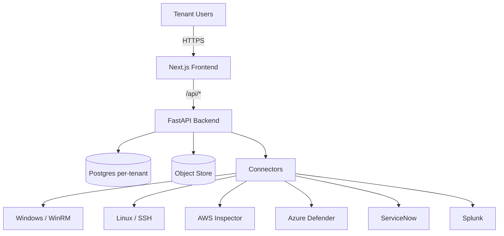
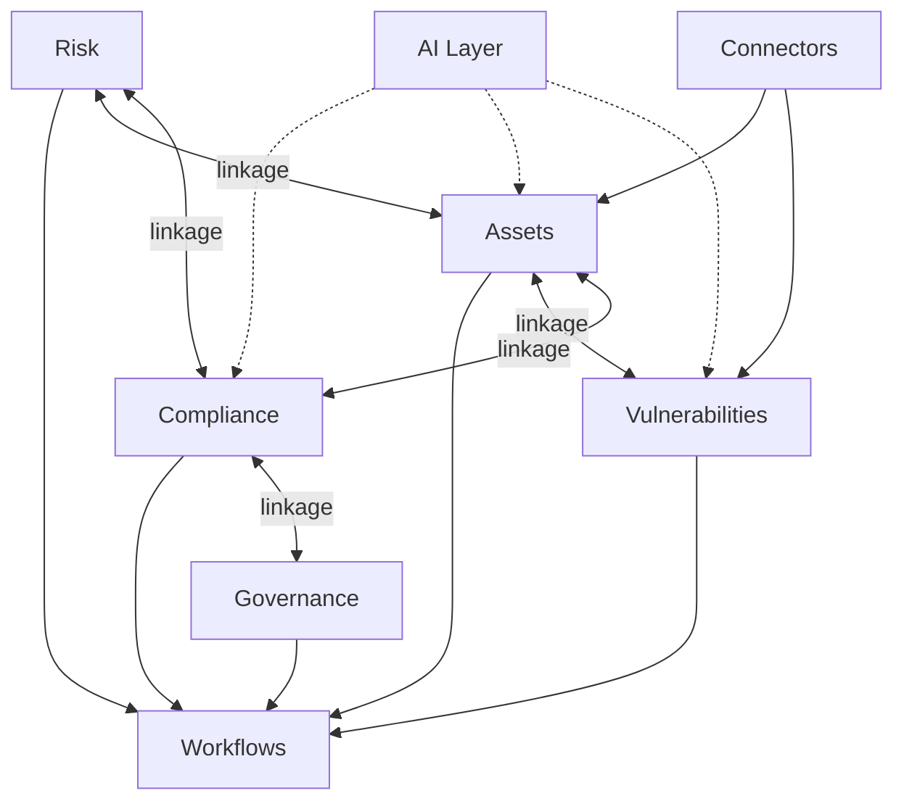

# Architecture Walkthrough — End-to-End

> Reference doc to use while explaining the system on the call. Open this
> on YOUR side, narrate the diagrams. Don't paste them into chat.

---

## 1. The 30-second pitch

A multi-tenant Governance / Risk / Compliance platform for regulated industries (banking, healthcare, energy). Built on FastAPI + Next.js + Postgres, **database-per-tenant** for hard isolation. Eight integrated modules that all link to each other so an auditor can trace `Risk → Asset → Vulnerability → Control → Evidence → Framework` in three clicks.

---

## 2. High-level system topology

```
                       ┌─────────────────────────────────────────┐
                       │           Customer Org (Tenant)         │
                       │  CISOs · Risk owners · Auditors · Ops   │
                       └────────────────────┬────────────────────┘
                                            │ HTTPS
                       ┌────────────────────▼────────────────────┐
                       │     Next.js Frontend (App Router)       │
                       │  · Server components for heavy dashboards│
                       │  · Client components for interactivity   │
                       │  · TanStack Query for caching            │
                       │  · Tailwind + Recharts                   │
                       └────────────────────┬────────────────────┘
                                            │ /api/* (Next rewrites → backend)
                       ┌────────────────────▼────────────────────┐
                       │           FastAPI Backend               │
                       │  · JWT auth + per-tenant RBAC           │
                       │  · 80+ routers across 8 modules         │
                       │  · Pydantic schema validation           │
                       │  · SQLAlchemy ORM, async where it pays  │
                       └────────────────────┬────────────────────┘
                                            │
              ┌─────────────────────────────┼─────────────────────────────┐
              │                             │                             │
       ┌──────▼──────┐              ┌───────▼───────┐             ┌───────▼───────┐
       │  Postgres   │              │  Object Store │             │  Connectors   │
       │  (per-tenant│              │  S3 / Azure   │             │  · WinRM/SSH  │
       │   databases)│              │  Blob         │             │  · AWS / Azure│
       │             │              │  for evidence │             │  · ServiceNow │
       │ + registry  │              │  files        │             │  · Splunk     │
       │   DB        │              │               │             │  · Teams      │
       └─────────────┘              └───────────────┘             └───────────────┘
```

### Mermaid version (copy into mermaid.live to render)



---

## 3. Why database-per-tenant

There are three multi-tenancy patterns. We picked the strongest isolation:

| Pattern | Isolation | Operational cost | When to use |
|---|---|---|---|
| Shared schema + `tenant_id` column | Weakest — every query needs a filter, a missed one leaks data | Cheapest | Cheap SaaS, low compliance bar |
| Schema-per-tenant | Moderate — search_path can be set wrong | Medium | Mid-tier SaaS |
| **Database-per-tenant** | **Strongest — separate DB = separate connection** | Slightly higher migration cost | **Regulated industries** (banking, healthcare) |

For a GRC tool that auditors will inspect, database-per-tenant pays for itself the first time someone asks "how do you ensure customer A's risk register can't appear in customer B's audit report?"

### How it works in this codebase

```
┌──────────────────────────────────────────────────────────────┐
│              Master "Registry" Postgres DB                   │
│  · grc_tenants:    id, slug, hostname, db_connection_string  │
│  · grc_users:      id, email, password_hash, role            │
│  · grc_tenant_users: many-to-many                            │
└────────────────────────────┬─────────────────────────────────┘
                             │ on every request:
                             │  1. Resolve tenant slug from
                             │     subdomain or header
                             │  2. Look up DB connection
                             │  3. Open session against the
                             │     tenant's own database
                             ▼
┌──────────────────────────────────────────────────────────────┐
│  Tenant DB 1 (e.g. acme-bank)                                │
│  · grc_it_assets, grc_risks, grc_framework_controls,         │
│    grc_evidence, grc_compliance_plugins, …                   │
└──────────────────────────────────────────────────────────────┘

┌──────────────────────────────────────────────────────────────┐
│  Tenant DB 2 (e.g. saudi-healthcare-co)                      │
│  ·  (independent schema, independent data)                   │
└──────────────────────────────────────────────────────────────┘
```

**Trade-offs to mention if asked**:
- Migrations: a deploy runs migrations across every tenant DB. We built an orchestrator script for this.
- Connection pooling: one pool per tenant. SQLAlchemy handles this with `create_engine` per-tenant.
- Cost: on managed Postgres (RDS / Cloud SQL) you pay for ONE instance with N databases — same cost as schema-per-tenant.

---

## 4. The eight modules

```
                       ┌─────────────────┐
                       │   Governance    │
                       │ Documents,      │
                       │ Policies,       │
                       │ Attestations,   │
                       │ Approvals       │
                       └────────┬────────┘
                                │
   ┌───────────┐                │                ┌─────────────┐
   │   Risk    │                │                │ Compliance  │
   │ Register, │                │                │ Frameworks, │
   │ KRIs,     │◄───────────────┼───────────────►│ Controls,   │
   │ Incidents │                │                │ Evidence    │
   │ COSO wheel│                │                │ library     │
   └─────┬─────┘                │                └──────┬──────┘
         │                      │                       │
         │                ┌─────▼─────┐                 │
         │                │ Platform  │                 │
         │                │ Linkage   │                 │
         │                │  (the     │                 │
         │                │  glue)    │                 │
         │                └─────┬─────┘                 │
         │                      │                       │
   ┌─────▼──────┐               │                ┌──────▼──────┐
   │   Assets   │               │                │   Vulns     │
   │ Inventory, │◄──────────────┼───────────────►│ Register,   │
   │ Criticality│               │                │ KEV/EPSS,   │
   │ Lifecycle  │               │                │ SLA, NCA    │
   └─────┬──────┘               │                └──────┬──────┘
         │                      │                       │
         │                ┌─────▼─────┐                 │
         │                │   AI      │                 │
         │                │ ComplyChat│                 │
         └────────────────│ Mapping   │─────────────────┘
                          │ recommnd. │
                          └─────┬─────┘
                                │
                       ┌────────▼────────┐
                       │   Workflows     │
                       │ Approvals,      │
                       │ Sign-offs,      │
                       │ Escalations,    │
                       │ Audit log       │
                       └─────────────────┘
                                ▲
                                │
                       ┌────────┴────────┐
                       │   Connectors    │
                       │ Agents, Cloud,  │
                       │ Agentless,      │
                       │ External (SNOW) │
                       └─────────────────┘
```

### Mermaid version



---

## 5. The platform-linkage story (the differentiator)

> "This is what most GRC tools fail at, and what an auditor cares about most."

### The data graph

```
                    ┌──────────────┐
                    │   Framework  │ NIST CSF, ISO 27001, PCI DSS, …
                    └──────┬───────┘
                           │ contains
                    ┌──────▼───────┐
                    │   Control    │ "PR.AC-1: Identities are managed"
                    └──┬───────────┘
                       │ implemented by      mapped to
                       │                     ───────────┐
                ┌──────▼─────┐         ┌───────────────▼────┐
                │  Evidence  │         │   Internal Control │
                │ "AD Audit  │         │  "MFA enabled on   │
                │  Logs Q3"  │         │   admin accounts"  │
                └──────┬─────┘         └──────────┬─────────┘
                       │ supports                 │ tested against
                       │                          ▼
                       │                   ┌──────────────┐
                       │                   │ IT Asset     │
                       │                   │ "DC-PRD-01"  │
                       │                   └──────┬───────┘
                       │                          │ has
                       │                          ▼
                       │                   ┌──────────────┐
                       │                   │Vulnerability │
                       │                   │ "CVE-2024-…" │
                       │                   └──────┬───────┘
                       │                          │ raises
                       │                          ▼
                       │                   ┌──────────────┐
                       └───────────────────► Risk         │
                                           │ "Privileged  │
                                           │  access leak"│
                                           └──────────────┘
```

### Why this matters

**Without linkage** (typical competitor):
- Auditor: "Show me how you've mitigated the ransomware risk."
- You: "Open the risk tool, find the risk… then the controls tool, find the controls… then the evidence tool, find the documents… then the asset tool, find the systems…"
- Auditor: writes a finding.

**With linkage** (this platform):
- Auditor: "Show me how you've mitigated the ransomware risk."
- You: click the risk → tab shows linked controls → click a control → tab shows assets it covers + evidence attached + linked frameworks → done.
- Auditor: writes a green checkmark.

### How it's implemented

```
grc_risks
   │
   ├── grc_risk_asset_links       (risk_id, asset_id)
   ├── grc_risk_control_links     (risk_id, internal_control_id)
   ├── grc_risk_framework_control_links (risk_id, framework_control_id)
   │
grc_it_assets
   │
   ├── grc_asset_control_links            (asset_id, internal_control_id)
   ├── grc_asset_framework_control_links  (asset_id, framework_control_id)
   ├── grc_asset_evidence_links           (asset_id, evidence_id)
   ├── grc_vulnerability_asset_links      (vuln_id, asset_id)
   │
grc_framework_controls
   │
   └── grc_control_mappings   (control ↔ control across frameworks)
```

Cross-tab navigation in the UI uses these link tables to populate the "where is this referenced" panels on every detail page.

---

## 6. The workflow engine

```
   ┌──────────────────────────────────────────────────────────┐
   │                  Trigger Dispatcher                       │
   │  · "risk.created" · "evidence.uploaded" · "user.added"   │
   │  · "vulnerability.severity_changed_to_critical"           │
   └────────────────────────┬─────────────────────────────────┘
                            │
                            ▼
   ┌──────────────────────────────────────────────────────────┐
   │              Workflow Definition (per tenant)             │
   │                                                           │
   │   Step 1: Assessor reviews    →  Approve / Return         │
   │   Step 2: Business owner      →  Approve / Return         │
   │   Step 3: CISO / Board        →  Approve / Reject         │
   │                                                           │
   │   With: timeouts, escalations, parallel branches,         │
   │   conditional routing (severity-based, dollar-based)      │
   └────────────────────────┬─────────────────────────────────┘
                            │
                            ▼
   ┌──────────────────────────────────────────────────────────┐
   │                  Activity / Audit Log                     │
   │  Every action: who · when · what · before → after diff    │
   │  Immutable. Queryable. Exportable to CSV / JSON.          │
   └──────────────────────────────────────────────────────────┘
```

The same engine powers:
- Document approvals (Governance)
- Risk treatment plan sign-offs (ERM)
- Vulnerability exception requests (Vuln Mgmt)
- Asset criticality assessment sign-offs
- Evidence review cycles
- Incident response escalations

---

## 7. Connectors — how data gets in

```
       ┌────────────────────────────────────────────────────────┐
       │                  Real-world assets                     │
       │   Windows servers · Linux boxes · Cisco devices ·      │
       │   Databases · AWS / Azure / GCP accounts ·             │
       │   Kubernetes clusters · ServiceNow · Splunk · Teams    │
       └───────────────────────────┬────────────────────────────┘
                                   │
              ┌────────────────────┼────────────────────┐
              │                    │                    │
       ┌──────▼──────┐      ┌──────▼──────┐      ┌──────▼──────┐
       │  Agentless  │      │   Agents    │      │ Cloud API   │
       │  WinRM/SSH  │      │ Endpoint    │      │ AWS Inspect │
       │ (Connect    │      │ Collector   │      │ Azure Def.  │
       │  Wizard)    │      │ (Python)    │      │ GCP SCC     │
       └──────┬──────┘      └──────┬──────┘      └──────┬──────┘
              │                    │                    │
              └────────────────────┼────────────────────┘
                                   │
                                   ▼
                       ┌───────────────────────┐
                       │  Normalized ingestion │
                       │  · Asset upsert       │
                       │  · Vuln upsert        │
                       │  · CVE enrichment     │
                       │    (KEV + EPSS)       │
                       └───────────┬───────────┘
                                   │
                                   ▼
                       ┌───────────────────────┐
                       │   GRC platform tables │
                       └───────────────────────┘
```

**Two scan modes** for the same asset:
- **Agentless** — the platform pushes a probe (WinRM Get-CimInstance, SSH `uname/apt list`) and parses the response. Good for one-off scans, on-demand audits.
- **Agent** — a small Python binary installed on the box pulls jobs from the platform and pushes results back. Good for fleets behind NAT, continuous scanning.

Both end up at the same `IT_Asset` + `Vulnerability` tables. The user never thinks about "agent vs agentless" after the initial connection.

---

## 8. AI layer — three places, deliberately scoped

> "I'm allergic to AI features that don't pay for themselves. Here's where we use it."

### (a) ComplyChat — natural-language Q&A
LLM-backed assistant. "Show me all critical vulnerabilities on assets owned by the Payments team that don't have a compensating control." Compiled to SQL via tool-use. Read-only — never executes writes without explicit confirmation.

### (b) Asset auto-classification
When a new asset connects via the Connect Wizard, we read the OS probe data and classify: family (Windows/Linux/macOS), version (Windows 11 23H2, Ubuntu 22.04, etc.), edition (Pro / Enterprise / Server). Then the CIS benchmark strict-matcher picks the right ruleset. No LLM cost here — a deterministic lookup table generated from CIS metadata.

### (c) Control-mapping recommendations
Given an asset, score every framework control against it and surface "controls most likely to apply". **Pure regex, no LLM** — 8 weighted signal dimensions (OS, asset-type, network exposure, data sensitivity, business function, vendor, criticality, universal). Confidence buckets (High ≥ 8, Medium ≥ 4, Low ≥ 1). Operator one-clicks to link suggested controls. Saves hours of manual mapping.

---

## 9. Tech stack — what runs where

| Layer | Choice | Why |
|---|---|---|
| Backend language | **Python 3.11** | Mature ecosystem for compliance / scanning (paramiko, boto3, openpyxl), readable code for handover |
| Backend framework | **FastAPI** | Async support for connector polling, automatic OpenAPI docs, Pydantic validation |
| ORM | **SQLAlchemy 2.x** | Battle-tested, handles per-tenant connection pooling cleanly |
| Database | **Postgres 15+** | Battle-tested, great JSON support for flexible config blobs, full-text search built-in |
| Frontend framework | **Next.js 15 (App Router)** | Server components for heavy dashboards, fast HMR for solo dev, large community |
| UI library | **React 19 + Tailwind + Lucide icons** | Familiar, accessible, no design-system lock-in |
| Charts | **Recharts** | Declarative, handles 90% of needs without escape hatches |
| Data fetching | **TanStack Query** | Caching, optimistic updates, no Redux ceremony |
| Auth | **JWT (HS256) + bcrypt** | Pluggable to SSO (SAML / OIDC) later |
| File storage | **S3 / Azure Blob / local FS** | Pluggable interface; local for dev, cloud for prod |
| Deployment | **Docker + docker-compose** for dev, **Kubernetes / ECS / Azure App Service** for prod | Standard, portable |
| AI | **Anthropic Claude API** (ComplyChat) + **regex matchers** (rest) | Hybrid — LLM where the value pays for the token cost, deterministic everywhere else |

---

## 10. Production readiness items already done

If they ask "is this hardened or a prototype?"

- ✅ Multi-tenant data isolation (database-per-tenant)
- ✅ RBAC with per-action permissions (140+ permissions across the modules)
- ✅ Audit log with before/after diffs
- ✅ JWT auth + bcrypt password hashing + session timeout config
- ✅ Configurable password policy (complexity, lockout, idle timeout)
- ✅ SSO support (SAML + OIDC via Entra ID / Okta / Keycloak)
- ✅ Evidence file encryption at rest (Fernet) with per-tenant keys
- ✅ Tenant slug + hostname routing for white-label deployments
- ✅ Workflow engine with timeout / escalation handling
- ✅ Backups (per-tenant Postgres `pg_dump` orchestrator)
- ✅ Health-check + readiness endpoints for Kubernetes
- ✅ Connection-pool tuning for SQLAlchemy
- ✅ Error tracking hooks (Sentry-compatible)
